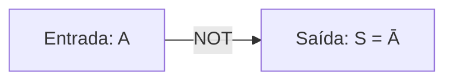
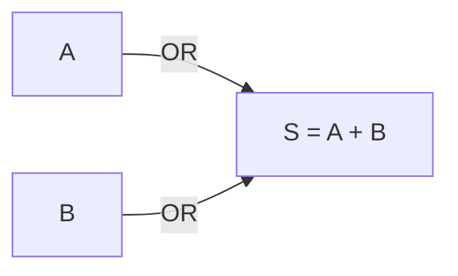
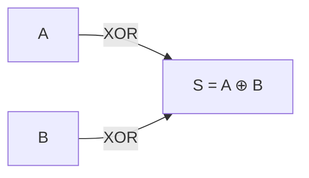
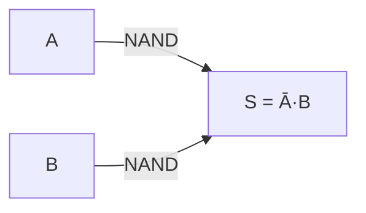
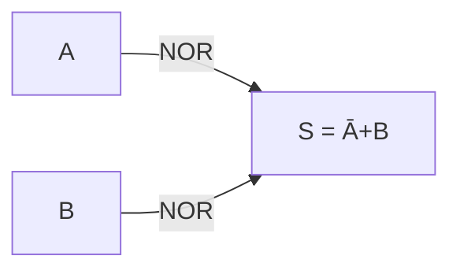
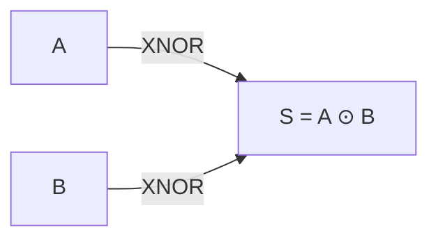
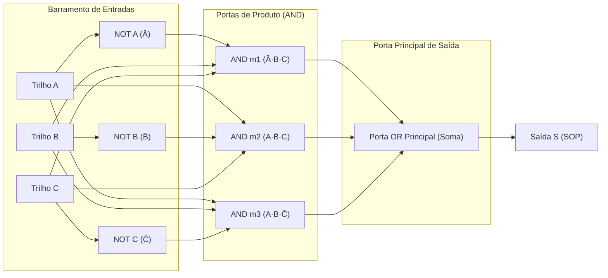
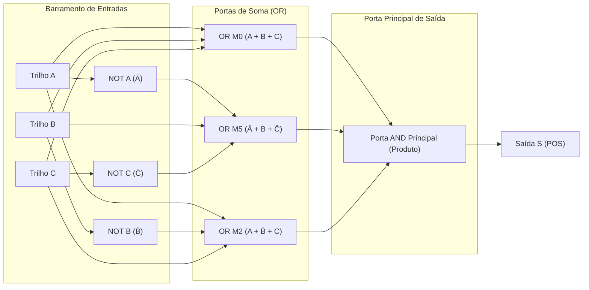
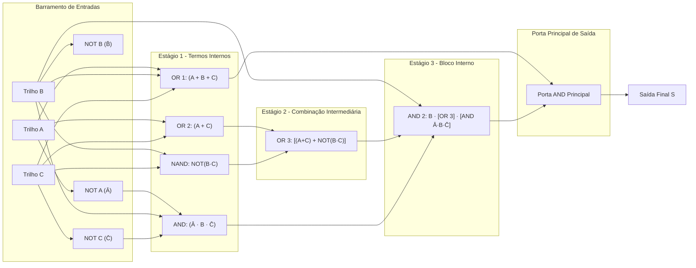

  
Progresso das Aulas da Disciplina

  

    

  

# Aula 01 - Portas Lógicas

> [!info]- Informações & Checklist da Aula
> - **Docente:** Fabrício Barros Gonçalves
> - **Data da Aula:** 24/08/2026
> - **Status de Revisão:**
>   - [x] Anotações em sala de aula
>   - [x] Revisão e fixação de conceitos
>   - [x] Resolução de exercícios recomendados
>   - [ ] Destilação para [[07-permanente/notas-permanentes|Notas Permanentes]]

---

## Anotações do Quadro & Conteúdo

### Revisão de Lógica para Computação & Fundamentação Teórica

Nesta aula de **Eletrônica Digital**, estudamos a transição da lógica matemática/proposicional para o ambiente de hardware por meio dos blocos lógicos fundamentais (portas lógicas).

---

### . NÃO (NOT - Inversor)

A porta **NOT** realiza a operação lógica de inversão ou complemento.

**Expressão Booleana:**
$$S = \bar{A}$$

**Tabela-Verdade:**

| A | S |
| :---: | :---: |
| 0 | 1 |
| 1 | 0 |

---

### . E (AND - Conjunção)

A porta **AND** gera saída alta ($1$) se e somente se todas as suas entradas forem altas ($1$).

**Expressão Booleana:**
$$S = A \cdot B$$

**Tabela-Verdade:**

|  A  |  B  |  S  |     |
| :-: | :-: | :-: | --- |
|  0  |  0  |  0  |     |
|  0  |  1  |  0  |     |
|  1  |  0  |  0  |     |
|  1  |  1  |  1  |     |

---

### . OU (OR - Disjunção)

A porta **OR** gera saída alta ($1$) quando pelo menos uma das suas entradas for alta ($1$).

**Expressão Booleana:**
$$S = A + B$$

**Tabela-Verdade:**

| A | B | S |
| :---: | :---: | :---: |
| 0 | 0 | 0 |
| 0 | 1 | 1 |
| 1 | 0 | 1 |
| 1 | 1 | 1 |

---

### . OU EXCLUSIVO (XOR)

A porta **XOR** (Ou-Exclusivo) produz saída alta ($1$) se e somente se as entradas forem **diferentes**.

**Expressão Booleana:**
$$S = A \oplus B = \bar{A}B + A\bar{B}$$

**Tabela-Verdade:**

| A | B | S |
| :---: | :---: | :---: |
| 0 | 0 | 0 |
| 0 | 1 | 1 |
| 1 | 0 | 1 |
| 1 | 1 | 0 |

---

### . NÃO E (NAND - Porta Universal)

A porta **NAND** é a negação da saída da porta AND. É uma porta **universal**, pois qualquer circuito combinacional pode ser construído apenas com portas NAND.

**Expressão Booleana:**
$$S = \overline{A \cdot B}$$

**Tabela-Verdade:**

| A | B | S |
| :---: | :---: | :---: |
| 0 | 0 | 1 |
| 0 | 1 | 1 |
| 1 | 0 | 1 |
| 1 | 1 | 0 |

---

### . NÃO OU (NOR - Porta Universal)

A porta **NOR** é a negação da porta OR. Também possui caráter de **universalidade**.

**Expressão Booleana:**
$$S = \overline{A + B}$$

**Tabela-Verdade:**

| A | B | S |
| :---: | :---: | :---: |
| 0 | 0 | 1 |
| 0 | 1 | 0 |
| 1 | 0 | 0 |
| 1 | 1 | 0 |

---

### . NÃO OU EXCLUSIVO (XNOR - Coincidência)

A porta **XNOR** gera saída alta ($1$) quando as entradas forem **iguais** (coincidência).

**Expressão Booleana:**
$$S = \overline{A \oplus B} = A B + \bar{A}\bar{B}$$

**Tabela-Verdade:**

| A | B | S |
| :---: | :---: | :---: |
| 0 | 0 | 1 |
| 0 | 1 | 0 |
| 1 | 0 | 0 |
| 1 | 1 | 1 |

---

### Mintermos e Maxtermos

1. **Mintermos (Soma de Produtos - SOP):**
   - Correspondem às combinações da tabela-verdade onde a saída do circuito é $1$.
   - Representados pela notação $\sum m$.
   - ==Na forma de mintermos, a variável direta vale $1$ e a variável complementada/barrada vale $0$.==

2. **Maxtermos (Produto de Somas - POS):**
   - Correspondem às combinações da tabela-verdade onde a saída do circuito é $0$.
   - Representados pela notação $\prod M$.
   - Na forma de maxtermos, a variável direta vale $0$ e a variável complementada/barrada vale $1$.

---

### Exemplo do Quadro: Diagrama de Trilhos e Portas Lógicas para ABC

Abaixo está o circuito completo com barramento/trilhos de sinal ($A, B, C$) e seus respectivos inversores (NOT), alimentando os mintermos e maxtermos e conectando à porta principal de saída ao final da expressão:

### . Circuito Mintermo (SOP): $S = \bar{A} B C + A \bar{B} C + A B \bar{C}$

---

### . Circuito Maxtermo (POS): $S = (A + B + C) \cdot (\bar{A} + B + \bar{C}) \cdot (A + \bar{B} + C)$

---

### . Leitura e Síntese de Expressão Complexa do Quadro

$$S = (A + B + C) \cdot \left\{ B \left[ (A + C) + \overline{B \cdot C} \right] \cdot (\bar{A} \cdot B \cdot \bar{C}) \right\}$$

---

## Esquemas & Anotações Visuais (excalidraw)
<!-- No iPad: insira desenhos com 'excalidraw: Create and embed new drawing' para desenhar com Apple Pencil -->

---

> [!question]- Dúvidas & Exercícios Recomendados
> - [x] Testar os circuitos das 7 portas no simulador LogiSim
> - [ ] Resolver a Lista de Exercícios de Notação Correta
> - [ ] Desenhar o circuito de mintermos para a função $S(A,B,C) = \sum m(1, 4, 7)$ utilizando os trilhos A, B, C
