# Bacharelado em Engenharia de Computação — IFF

Bem-vindo ao portal completo da matriz curricular, ementário, fluxo de períodos e mapeamento de dependências (*trancas*) do curso de **Bacharelado em Engenharia de Computação** do **Instituto Federal Fluminense (IFF) — Campus Bom Jesus do Itabapoana**.

---

> [!note]  Ranking da Matriz Curricular (Top 5 Disciplinas)
> 

>   
> 

> **TOP 5 MELHORES DISCIPLINAS**
> -  **1. Equações Diferenciais** — *Cálculo diferencial avançado e modelagem matemática.*
> -  **2. Cálculo 1** — *Limites, derivadas, integrais e fundamentação em análise.*
> -  **3. Cálculo 4 \*** — *Séries numéricas, equações diferenciais parciais e transformadas.*
> -  **4. Engenharia de Software** — *Arquitetura de sistemas, metodologias ágeis e qualidade.*
> -  **5. Matemática Discreta** — *Relações de Recorrência, Indução.*

---

> [!info]  Sistema Acadêmico IFF & Recursos Centrais
> **Plataforma Integrada de Gestão Curricular**
> -  **[[-mapeamento-completo-de-trancas-e-dependências-curriculares|Mapeamento de Trancas Diretas & Recursivas]]** — *Fluxogramas visuais em Mermaid, cadeias críticas e fecho transitivo.*
> -  **[[-matriz-curricular-geral-90-disciplinas|Matriz Curricular dos 10 Períodos]]** — *Grade completa com cargas horárias e componentes obrigatórios/eletivos.*
> -  **[[-fontes-documentos-oficiais--materiais-de-apoio|Documentos Oficiais & Ementário Completo]]** — *PPC Completo, relatórios e ementas originais arquivados em materiais.*
> -  **[Repositório no GitHub (Sistema Acadêmico)](https://github.com/pedroiff0/sistema-academico)** — *Código-fonte, APIs e scripts de extração.*
> -  **[Aplicação Online em Produção](https://planck.dwelf-bull.ts.net)** — *Acesse o sistema em execução no servidor `planck.dwelf-bull.ts.net`.*

---

## Carrossel de Períodos Letivos

Navegue interativamente por cada um dos 10 períodos e disciplinas eletivas da grade curricular:

  <a href="/pt-br/resource/engenharia-de-computação/1-periodo" class="carousel-slide">
    
    
1º Período

  </a>
  <a href="/pt-br/resource/engenharia-de-computação/2-periodo" class="carousel-slide">
    
    
2º Período

  </a>
  <a href="/pt-br/resource/engenharia-de-computação/3-periodo" class="carousel-slide">
    
    
3º Período

  </a>
  <a href="/pt-br/resource/engenharia-de-computação/4-periodo" class="carousel-slide">
    
    
4º Período

  </a>
  <a href="/pt-br/resource/engenharia-de-computação/5-periodo" class="carousel-slide">
    
    
5º Período

  </a>
  <a href="/pt-br/resource/engenharia-de-computação/6-periodo" class="carousel-slide">
    
    
6º Período

  </a>
  <a href="/pt-br/resource/engenharia-de-computação/7-periodo" class="carousel-slide">
    
    
7º Período

  </a>
  <a href="/pt-br/resource/engenharia-de-computação/8-periodo" class="carousel-slide">
    
    
8º Período

  </a>
  <a href="/pt-br/resource/engenharia-de-computação/9-periodo" class="carousel-slide">
    
    
9º Período

  </a>
  <a href="/pt-br/resource/engenharia-de-computação/10-periodo" class="carousel-slide">
    
    
10º Período

  </a>
  <a href="/pt-br/resource/engenharia-de-computação/eletivas" class="carousel-slide">
    
    
Eletivas (optativas)

  </a>

---

# Matriz Curricular Geral ( Disciplinas)

Estrutura completa das **90 disciplinas** do curso de **Bacharelado em Engenharia de Computação** do **Instituto Federal Fluminense (IFF) — Campus Bom Jesus do Itabapoana**.

> [!info]  Resumo da Estrutura Curricular
> - **Carga Horária Total:** Mais de 3.600 horas
> - **Duração Padrão:** 10 períodos letivos (5 anos)
> - **Grau Acadêmico:** Bacharel em Engenharia de Computação
> - **Atos de Regulação:** Autorizado e reconhecido pelo Ministério da Educação (MEC) / IFF.

---

## º Período Letivo ( horas)

| Código      | Componente Curricular                                                                                                                         |                    CH                    | Pré-Requisitos | Observações         |             |
| :---------- | :-------------------------------------------------------------------------------------------------------------------------------------------- | :--------------------------------------: | :------------- | :------------------ | ----------- |
| `CSECBJI.1` | [Fundamentos de Computação](02-areas/academico/iff-engenharia-de-computacao/1-periodo/fundamentos-da-computacao/fundamentos-de-computacao)        | 40h            | *Sem pré-requisito* | Obrigatória |
| `CSECBJI.2` | [Introdução à Engenharia](02-areas/academico/iff-engenharia-de-computacao/1-periodo/introducao-a-engenharia/introducao-a-engenharia)         | 40h            | *Sem pré-requisito* | Obrigatória |
| `CSECBJI.3` | [Lógica para Computação](02-areas/academico/iff-engenharia-de-computacao/1-periodo/logica-para-computacao/logica-para-computacao)         | 60h            | *Sem pré-requisito* | Obrigatória |
| `CSECBJI.4` | [Cálculo I](02-areas/academico/iff-engenharia-de-computacao/1-periodo/calculo-i/calculo-i)                | 120h           | *Sem pré-requisito* | Obrigatória |
| `CSECBJI.5` | [Álgebra Linear e Geometria Analítica I](02-areas/academico/iff-engenharia-de-computacao/1-periodo/algebra-linear-e-geometria-analitica-i/algebra-linear-e-geometria-analitica-i) | 80h            | *Sem pré-requisito* | Obrigatória |
| `CSECBJI.6` | [Teoria Geral da Administração](02-areas/academico/iff-engenharia-de-computacao/1-periodo/teoria-geral-da-administracao/teoria-geral-da-administracao)      | 60h            | *Sem pré-requisito* | Obrigatória |
| `CSECBJI.7` | [Desenho Técnico para Engenharia](02-areas/academico/iff-engenharia-de-computacao/1-periodo/desenho-tecnico-para-engenharia/desenho-tecnico-para-engenharia)     | 80h            | *Sem pré-requisito* | Obrigatória |
| `CSECBJI.8` | [Expressão Oral e Escrita](02-areas/academico/iff-engenharia-de-computacao/1-periodo/expressao-oral-e-escrita/expressao-oral-e-escrita)        | 40h            | *Sem pré-requisito* | Obrigatória |

---

## º Período Letivo ( horas)

| Código | Componente Curricular | CH | Pré-Requisitos | Observações |
| :--- | :--- | :---: | :--- | :--- |
| `CSECBJI.9` | [Cálculo II](02-areas/academico/iff-engenharia-de-computacao/2-periodo/calculo-ii-2/calculo-ii) | 80h | [Cálculo I](02-areas/academico/iff-engenharia-de-computacao/1-periodo/calculo-i/calculo-i) | Obrigatória |
| `CSECBJI.10` | [Álgebra Linear e Geometria Analítica II](02-areas/academico/iff-engenharia-de-computacao/2-periodo/algebra-linear-e-geometria-analitica-ii/algebra-linear-e-geometria-analitica-ii) | 80h | [Álgebra Linear e Geometria Analítica I](02-areas/academico/iff-engenharia-de-computacao/1-periodo/algebra-linear-e-geometria-analitica-i/algebra-linear-e-geometria-analitica-i) | Obrigatória |
| `CSECBJI.11` | [Física I](02-areas/academico/iff-engenharia-de-computacao/2-periodo/fisica-i/fisica-i) | 80h | [Cálculo I](02-areas/academico/iff-engenharia-de-computacao/1-periodo/calculo-i/calculo-i), [Álgebra Linear e Geometria Analítica I](02-areas/academico/iff-engenharia-de-computacao/1-periodo/algebra-linear-e-geometria-analitica-i/algebra-linear-e-geometria-analitica-i) | Obrigatória |
| `CSECBJI.12` | [Física Experimental I](02-areas/academico/iff-engenharia-de-computacao/2-periodo/fisica-experimental-i/fisica-experimental-i) | 40h | *Sem pré-requisito* | Obrigatória |
| `CSECBJI.13` | [Algoritmos e Técnicas de Programação](02-areas/academico/iff-engenharia-de-computacao/2-periodo/algoritmos-e-tecnicas-de-programacao/algoritmos-e-tecnicas-de-programacao) | 60h | *Sem pré-requisito* | Obrigatória |
| `CSECBJI.14` | [Matemática Discreta](02-areas/academico/iff-engenharia-de-computacao/2-periodo/matematica-discreta/matematica-discreta) | 60h | [Lógica para Computação](02-areas/academico/iff-engenharia-de-computacao/1-periodo/logica-para-computacao/logica-para-computacao) | Obrigatória |
| `CSECBJI.15` | [Química](02-areas/academico/iff-engenharia-de-computacao/2-periodo/quimica/quimica) | 60h | *Sem pré-requisito* | Obrigatória |
| `CSECBJI.16` | [Química Experimental](02-areas/academico/iff-engenharia-de-computacao/2-periodo/quimica-experimental/quimica-experimental) | 40h | *Sem pré-requisito* | Obrigatória |

---

## º Período Letivo ( horas)

| Código | Componente Curricular | CH | Pré-Requisitos | Observações |
| :--- | :--- | :---: | :--- | :--- |
| `CSECBJI.17` | [Cálculo III](02-areas/academico/iff-engenharia-de-computacao/3-periodo/calculo-iii/calculo-iii) | 80h | [Cálculo II](02-areas/academico/iff-engenharia-de-computacao/2-periodo/calculo-ii-2/calculo-ii) | Obrigatória |
| `CSECBJI.18` | [Equações Diferenciais](02-areas/academico/iff-engenharia-de-computacao/3-periodo/equacoes-diferenciais/equacoes-diferenciais) | 80h | [Cálculo I](02-areas/academico/iff-engenharia-de-computacao/1-periodo/calculo-i/calculo-i), [Álgebra Linear e Geometria Analítica I](02-areas/academico/iff-engenharia-de-computacao/1-periodo/algebra-linear-e-geometria-analitica-i/algebra-linear-e-geometria-analitica-i) | Obrigatória |
| `CSECBJI.19` | [Física II](02-areas/academico/iff-engenharia-de-computacao/3-periodo/fisica-ii/fisica-ii) | 80h | [Cálculo II](02-areas/academico/iff-engenharia-de-computacao/2-periodo/calculo-ii-2/calculo-ii), [Física I](02-areas/academico/iff-engenharia-de-computacao/2-periodo/fisica-i/fisica-i) | Obrigatória |
| `CSECBJI.20` | [Física Experimental II](02-areas/academico/iff-engenharia-de-computacao/3-periodo/fisica-experimental-ii/fisica-experimental-ii) | 40h | *Sem pré-requisito* | Obrigatória |
| `CSECBJI.21` | [Mecânica dos Sólidos](02-areas/academico/iff-engenharia-de-computacao/3-periodo/mecanica-dos-solidos/mecanica-dos-solidos) | 80h | [Física I](02-areas/academico/iff-engenharia-de-computacao/2-periodo/fisica-i/fisica-i) | Obrigatória |
| `CSECBJI.22` | [Algoritmos e Estruturas de Dados I](02-areas/academico/iff-engenharia-de-computacao/3-periodo/algoritmos-e-estruturas-de-dados-i/algoritmos-e-estruturas-de-dados-i) | 60h | [Algoritmos e Técnicas de Programação](02-areas/academico/iff-engenharia-de-computacao/2-periodo/algoritmos-e-tecnicas-de-programacao/algoritmos-e-tecnicas-de-programacao) | Obrigatória |
| `CSECBJI.23` | [Introdução à Ciência dos Materiais](<02-areas/academico/iff-engenharia-de-computacao/3-periodo/introducao-a-ciencia-dos-materiais/Introdução à Ciência dos Materiais>) | 60h | [Química](02-areas/academico/iff-engenharia-de-computacao/2-periodo/quimica/quimica) | Obrigatória |
| `CSECBJI.24` | [Ciências do Ambiente](02-areas/academico/iff-engenharia-de-computacao/3-periodo/ciencias-do-ambiente/ciencias-do-ambiente) | 40h | *Sem pré-requisito* | Obrigatória |

---

## º Período Letivo ( horas)

| Código | Componente Curricular | CH | Pré-Requisitos | Observações |
| :--- | :--- | :---: | :--- | :--- |
| `CSECBJI.25` | [Cálculo Numérico](02-areas/academico/iff-engenharia-de-computacao/4-periodo/calculo-numerico/calculo-numerico) | 80h | [Algoritmos e Técnicas de Programação](02-areas/academico/iff-engenharia-de-computacao/2-periodo/algoritmos-e-tecnicas-de-programacao/algoritmos-e-tecnicas-de-programacao) | Obrigatória |
| `CSECBJI.26` | [Física III](02-areas/academico/iff-engenharia-de-computacao/4-periodo/fisica-iii/fisica-iii) | 80h | [Cálculo III](02-areas/academico/iff-engenharia-de-computacao/3-periodo/calculo-iii/calculo-iii), [Física II](02-areas/academico/iff-engenharia-de-computacao/3-periodo/fisica-ii/fisica-ii) | Obrigatória |
| `CSECBJI.27` | [Física Experimental III](02-areas/academico/iff-engenharia-de-computacao/4-periodo/fisica-experimental-iii/fisica-experimental-iii) | 40h | *Sem pré-requisito* | Obrigatória |
| `CSECBJI.28` | [Fenômenos de Transporte](02-areas/academico/iff-engenharia-de-computacao/4-periodo/fenomenos-de-transporte/fenomenos-de-transporte) | 80h | [Cálculo I](02-areas/academico/iff-engenharia-de-computacao/1-periodo/calculo-i/calculo-i), [Física II](02-areas/academico/iff-engenharia-de-computacao/3-periodo/fisica-ii/fisica-ii) | Obrigatória |
| `CSECBJI.29` | [Probabilidade e Estatística](02-areas/academico/iff-engenharia-de-computacao/4-periodo/probabilidade-e-estatistica/probabilidade-e-estatistica) | 60h | *Sem pré-requisito* | Obrigatória |
| `CSECBJI.30` | [Algoritmos e Estruturas de Dados II](02-areas/academico/iff-engenharia-de-computacao/4-periodo/algoritmos-e-estruturas-de-dados-ii/algoritmos-e-estruturas-de-dados-ii) | 60h | [Algoritmos e Estruturas de Dados I](02-areas/academico/iff-engenharia-de-computacao/3-periodo/algoritmos-e-estruturas-de-dados-i/algoritmos-e-estruturas-de-dados-i) | Obrigatória |
| `CSECBJI.31` | [Cálculo IV](02-areas/academico/iff-engenharia-de-computacao/4-periodo/calculo-iv/calculo-iv) | 80h | [Cálculo III](02-areas/academico/iff-engenharia-de-computacao/3-periodo/calculo-iii/calculo-iii) | Obrigatória |
| `CSECBJI.32` | [Economia](02-areas/academico/iff-engenharia-de-computacao/4-periodo/economia/economia) | 40h | *Sem pré-requisito* | Obrigatória |

---

## º Período Letivo ( horas)

| Código | Componente Curricular | CH | Pré-Requisitos | Observações |
| :--- | :--- | :---: | :--- | :--- |
| `CSECBJI.33` | [Eletricidade Aplicada](02-areas/academico/iff-engenharia-de-computacao/5-periodo/eletricidade-aplicada/eletricidade-aplicada) | 60h | [Física III](02-areas/academico/iff-engenharia-de-computacao/4-periodo/fisica-iii/fisica-iii) | Obrigatória |
| `CSECBJI.34` | [Projeto e Análise de Algoritmos](02-areas/academico/iff-engenharia-de-computacao/5-periodo/projeto-e-analise-de-algoritmos/projeto-e-analise-de-algoritmos) | 60h | [Matemática Discreta](02-areas/academico/iff-engenharia-de-computacao/2-periodo/matematica-discreta/matematica-discreta), [Algoritmos e Estruturas de Dados II](02-areas/academico/iff-engenharia-de-computacao/4-periodo/algoritmos-e-estruturas-de-dados-ii/algoritmos-e-estruturas-de-dados-ii) | Obrigatória |
| `CSECBJI.35` | [Modelagem de Dados](02-areas/academico/iff-engenharia-de-computacao/5-periodo/modelagem-de-dados/modelagem-de-dados) | 40h | [Lógica para Computação](02-areas/academico/iff-engenharia-de-computacao/1-periodo/logica-para-computacao/logica-para-computacao) | Obrigatória |
| `CSECBJI.36` | [Engenharia de Software](02-areas/academico/iff-engenharia-de-computacao/5-periodo/engenharia-de-software/engenharia-de-software) | 60h | *Sem pré-requisito* | Obrigatória |
| `CSECBJI.37` | [Eletrônica Analógica](02-areas/academico/iff-engenharia-de-computacao/5-periodo/eletronica-analogica/eletronica-analogica) | 60h | [Física III](02-areas/academico/iff-engenharia-de-computacao/4-periodo/fisica-iii/fisica-iii) | Obrigatória |
| `CSECBJI.38` | [Paradigmas de Linguagem de Programação](02-areas/academico/iff-engenharia-de-computacao/5-periodo/paradigmas-de-linguagem-de-programacao/paradigmas-de-linguagem-de-programacao) | 60h | [Algoritmos e Técnicas de Programação](02-areas/academico/iff-engenharia-de-computacao/2-periodo/algoritmos-e-tecnicas-de-programacao/algoritmos-e-tecnicas-de-programacao) | Obrigatória |
| `CSECBJI.39` | [Gestão Ambiental](02-areas/academico/iff-engenharia-de-computacao/5-periodo/gestao-ambiental/gestao-ambiental) | 60h | *Sem pré-requisito* | Obrigatória |
| `CSECBJI.40` | [Linguagens Formais e Autômatos](02-areas/academico/iff-engenharia-de-computacao/5-periodo/linguagens-formais-e-automatos/linguagens-formais-e-automatos) | 60h | [Matemática Discreta](02-areas/academico/iff-engenharia-de-computacao/2-periodo/matematica-discreta/matematica-discreta) | Obrigatória |
| `CSECBJI.41` | [Avaliação e Desempenho de Sistemas](02-areas/academico/iff-engenharia-de-computacao/5-periodo/avaliacao-e-desempenho-de-sistemas/avaliacao-e-desempenho-de-sistemas) | 60h | [Probabilidade e Estatística](02-areas/academico/iff-engenharia-de-computacao/4-periodo/probabilidade-e-estatistica/probabilidade-e-estatistica) | Obrigatória |

---

## º Período Letivo ( horas)

| Código | Componente Curricular | CH | Pré-Requisitos | Observações |
| :--- | :--- | :---: | :--- | :--- |
| `CSECBJI.42` | [Análise de Software Orientada a Objetos](02-areas/academico/iff-engenharia-de-computacao/6-periodo/analise-de-software-orientada-a-objetos/analise-de-software-orientada-a-objetos) | 60h | [Engenharia de Software](02-areas/academico/iff-engenharia-de-computacao/5-periodo/engenharia-de-software/engenharia-de-software) | Obrigatória |
| `CSECBJI.43` | [Filosofia da Ciência e Tecnologia](02-areas/academico/iff-engenharia-de-computacao/6-periodo/filosofia-da-ciencia-e-tecnologia/filosofia-da-ciencia-e-tecnologia) | 60h | *Sem pré-requisito* | Obrigatória |
| `CSECBJI.44` | [Banco de Dados](02-areas/academico/iff-engenharia-de-computacao/6-periodo/banco-de-dados/banco-de-dados) | 60h | [Modelagem de Dados](02-areas/academico/iff-engenharia-de-computacao/5-periodo/modelagem-de-dados/modelagem-de-dados) | Obrigatória |
| `CSECBJI.45` | [Programação Orientada a Objetos I](02-areas/academico/iff-engenharia-de-computacao/6-periodo/programacao-orientada-a-objetos-i/programacao-orientada-a-objetos-i) | 60h | [Algoritmos e Técnicas de Programação](02-areas/academico/iff-engenharia-de-computacao/2-periodo/algoritmos-e-tecnicas-de-programacao/algoritmos-e-tecnicas-de-programacao), [Paradigmas de Linguagem de Programação](02-areas/academico/iff-engenharia-de-computacao/5-periodo/paradigmas-de-linguagem-de-programacao/paradigmas-de-linguagem-de-programacao) | Obrigatória |
| `CSECBJI.46` | [Eletrônica Digital](02-areas/academico/iff-engenharia-de-computacao/6-periodo/eletronica-digital/eletronica-digital) | 60h | [Lógica para Computação](02-areas/academico/iff-engenharia-de-computacao/1-periodo/logica-para-computacao/logica-para-computacao), [Eletrônica Analógica](02-areas/academico/iff-engenharia-de-computacao/5-periodo/eletronica-analogica/eletronica-analogica) | Obrigatória |
| `CSECBJI.47` | [Comunicação de Dados](02-areas/academico/iff-engenharia-de-computacao/6-periodo/comunicacao-de-dados/comunicacao-de-dados) | 60h | *Sem pré-requisito* | Obrigatória |
| `CSECBJI.48` | [Compiladores](02-areas/academico/iff-engenharia-de-computacao/6-periodo/compiladores/compiladores) | 60h | [Linguagens Formais e Autômatos](02-areas/academico/iff-engenharia-de-computacao/5-periodo/linguagens-formais-e-automatos/linguagens-formais-e-automatos) | Obrigatória |
| `CSECBJI.49` | [Gestão de Projetos](02-areas/academico/iff-engenharia-de-computacao/6-periodo/gestao-de-projetos/gestao-de-projetos) | 80h | *Sem pré-requisito* | Obrigatória |

---

## º Período Letivo ( horas)

| Código | Componente Curricular | CH | Pré-Requisitos | Observações |
| :--- | :--- | :---: | :--- | :--- |
| `CSECBJI.50` | [Projeto de Software Orientado a Objetos](02-areas/academico/iff-engenharia-de-computacao/7-periodo/projeto-de-software-orientado-a-objetos/projeto-de-software-orientado-a-objetos) | 60h | [Análise de Software Orientada a Objetos](02-areas/academico/iff-engenharia-de-computacao/6-periodo/analise-de-software-orientada-a-objetos/analise-de-software-orientada-a-objetos) | Obrigatória |
| `CSECBJI.51` | [Programação Orientada a Objetos II](02-areas/academico/iff-engenharia-de-computacao/7-periodo/programacao-orientada-a-objetos-ii/programacao-orientada-a-objetos-ii) | 60h | [Programação Orientada a Objetos I](02-areas/academico/iff-engenharia-de-computacao/6-periodo/programacao-orientada-a-objetos-i/programacao-orientada-a-objetos-i) | Obrigatória |
| `CSECBJI.52` | [Organização de Computadores](02-areas/academico/iff-engenharia-de-computacao/7-periodo/organizacao-de-computadores/organizacao-de-computadores) | 60h | [Fundamentos de Computação](02-areas/academico/iff-engenharia-de-computacao/1-periodo/fundamentos-da-computacao/fundamentos-de-computacao) | Obrigatória |
| `CSECBJI.53` | [Sistemas Digitais](02-areas/academico/iff-engenharia-de-computacao/7-periodo/sistemas-digitais/sistemas-digitais) | 60h | [Eletrônica Digital](02-areas/academico/iff-engenharia-de-computacao/6-periodo/eletronica-digital/eletronica-digital) | Obrigatória |
| `CSECBJI.54` | [Computação, Sociedade e Inclusão](02-areas/academico/iff-engenharia-de-computacao/7-periodo/computacao-sociedade-e-inclusao/computacao-sociedade-e-inclusao) | 60h | *Sem pré-requisito* | Obrigatória |
| `CSECBJI.55` | [Redes de Computadores I](02-areas/academico/iff-engenharia-de-computacao/7-periodo/redes-de-computadores-i/redes-de-computadores-i) | 60h | [Comunicação de Dados](02-areas/academico/iff-engenharia-de-computacao/6-periodo/comunicacao-de-dados/comunicacao-de-dados) | Obrigatória |
| `CSECBJI.56` | [Sistemas Operacionais I](02-areas/academico/iff-engenharia-de-computacao/7-periodo/sistemas-operacionais-i/sistemas-operacionais-i) | 60h | [Fundamentos de Computação](02-areas/academico/iff-engenharia-de-computacao/1-periodo/fundamentos-da-computacao/fundamentos-de-computacao) | Obrigatória |
| `CSECBJI.57` | **Eletiva I (`CSECBJI.57`)** | 60h | *Sem pré-requisito* | Obrigatória |
| `CSECBJI.58` | **Eletiva II (`CSECBJI.58`)** | 60h | *Sem pré-requisito* | Obrigatória |

---

## º Período Letivo ( horas)

| Código | Componente Curricular | CH | Pré-Requisitos | Observações |
| :--- | :--- | :---: | :--- | :--- |
| `CSECBJI.59` | [Redes de Computadores II](02-areas/academico/iff-engenharia-de-computacao/8-periodo/redes-de-computadores-ii/redes-de-computadores-ii) | 60h | [Redes de Computadores I](02-areas/academico/iff-engenharia-de-computacao/7-periodo/redes-de-computadores-i/redes-de-computadores-i) | Obrigatória |
| `CSECBJI.60` | [Segurança e Higiene do Trabalho](02-areas/academico/iff-engenharia-de-computacao/8-periodo/seguranca-e-higiene-do-trabalho/seguranca-e-higiene-do-trabalho) | 80h | *Sem pré-requisito* | Obrigatória |
| `CSECBJI.61` | [Arquitetura de Computadores](02-areas/academico/iff-engenharia-de-computacao/8-periodo/arquitetura-de-computadores/arquitetura-de-computadores) | 60h | [Organização de Computadores](02-areas/academico/iff-engenharia-de-computacao/7-periodo/organizacao-de-computadores/organizacao-de-computadores), [Sistemas Digitais](02-areas/academico/iff-engenharia-de-computacao/7-periodo/sistemas-digitais/sistemas-digitais) | Obrigatória |
| `CSECBJI.62` | [Microcontroladores](02-areas/academico/iff-engenharia-de-computacao/8-periodo/microcontroladores/microcontroladores) | 60h | [Organização de Computadores](02-areas/academico/iff-engenharia-de-computacao/7-periodo/organizacao-de-computadores/organizacao-de-computadores) | Obrigatória |
| `CSECBJI.63` | [Sistemas Operacionais II](02-areas/academico/iff-engenharia-de-computacao/8-periodo/sistemas-operacionais-ii/sistemas-operacionais-ii) | 60h | [Sistemas Operacionais I](02-areas/academico/iff-engenharia-de-computacao/7-periodo/sistemas-operacionais-i/sistemas-operacionais-i) | Obrigatória |
| `CSECBJI.64` | [Metodologia Científica e Tecnológica](02-areas/academico/iff-engenharia-de-computacao/8-periodo/metodologia-cientifica-e-tecnologica/metodologia-cientifica-e-tecnologica) | 40h | *Sem pré-requisito* | Obrigatória |
| `CSECBJI.65` | **Eletiva III (`CSECBJI.65`)** | 60h | *Sem pré-requisito* | Obrigatória |
| `CSECBJI.66` | **Eletiva IV (`CSECBJI.66`)** | 60h | *Sem pré-requisito* | Obrigatória |

---

## º Período Letivo ( horas)

| Código | Componente Curricular | CH | Pré-Requisitos | Observações |
| :--- | :--- | :---: | :--- | :--- |
| `CSECBJI.67` | [Projeto Final de Curso I](02-areas/academico/iff-engenharia-de-computacao/9-periodo/projeto-final-de-curso-i/projeto-final-de-curso-i) | 80h | [Metodologia Científica e Tecnológica](02-areas/academico/iff-engenharia-de-computacao/8-periodo/metodologia-cientifica-e-tecnologica/metodologia-cientifica-e-tecnologica) | Obrigatória |
| `CSECBJI.68` | [Empreendedorismo](02-areas/academico/iff-engenharia-de-computacao/9-periodo/empreendedorismo/empreendedorismo) | 40h | *Sem pré-requisito* | Obrigatória |
| `CSECBJI.69` | [Direito, Ética e Cidadania](02-areas/academico/iff-engenharia-de-computacao/9-periodo/direito-etica-e-cidadania/direito-etica-e-cidadania) | 60h | *Sem pré-requisito* | Obrigatória |
| `CSECBJI.70` | [Sistemas Embarcados](02-areas/academico/iff-engenharia-de-computacao/9-periodo/sistemas-embarcados/sistemas-embarcados) | 60h | [Microcontroladores](02-areas/academico/iff-engenharia-de-computacao/8-periodo/microcontroladores/microcontroladores) | Obrigatória |
| `CSECBJI.71` | [Sistemas Distribuídos](02-areas/academico/iff-engenharia-de-computacao/9-periodo/sistemas-distribuidos/sistemas-distribuidos) | 60h | [Redes de Computadores I](02-areas/academico/iff-engenharia-de-computacao/7-periodo/redes-de-computadores-i/redes-de-computadores-i), [Sistemas Operacionais I](02-areas/academico/iff-engenharia-de-computacao/7-periodo/sistemas-operacionais-i/sistemas-operacionais-i) | Obrigatória |
| `CSECBJI.72` | **Eletiva V (`CSECBJI.72`)** | 60h | *Sem pré-requisito* | Obrigatória |
| `CSECBJI.73` | **Eletiva VI (`CSECBJI.73`)** | 60h | *Sem pré-requisito* | Obrigatória |

---

## º Período Letivo ( horas)

| Código | Componente Curricular | CH | Pré-Requisitos | Observações |
| :--- | :--- | :---: | :--- | :--- |
| `CSECBJI.74` | [Projeto Final de Curso II](02-areas/academico/iff-engenharia-de-computacao/10-periodo/projeto-final-de-curso-ii/projeto-final-de-curso-ii) | 80h | [Projeto Final de Curso I](02-areas/academico/iff-engenharia-de-computacao/9-periodo/projeto-final-de-curso-i/projeto-final-de-curso-i) | Obrigatória |

---

## Disciplinas Eletivas e Optativas

O aluno deve integralizar carga horária optativa escolhendo entre o rol de disciplinas eletivas oferecidas a partir do 7º período:

| Código | Componente Curricular | CH | Pré-Requisitos | Área Temática |
| :--- | :--- | :---: | :--- | :--- |
| `CSECBJI.75` | [Libras](02-areas/academico/iff-engenharia-de-computacao/eletivas/libras/libras) | 60h | *Sem pré-requisito* | Eletiva |
| `CSECBJI.76` | [Sociedade e Tecnologia](02-areas/academico/iff-engenharia-de-computacao/eletivas/sociedade-e-tecnologia/sociedade-e-tecnologia) | 60h | *Sem pré-requisito* | Eletiva |
| `CSECBJI.77` | [Computação Gráfica](02-areas/academico/iff-engenharia-de-computacao/eletivas/computacao-grafica/computacao-grafica) | 60h | [Álgebra Linear e Geometria Analítica II](02-areas/academico/iff-engenharia-de-computacao/2-periodo/algebra-linear-e-geometria-analitica-ii/algebra-linear-e-geometria-analitica-ii), [Algoritmos e Estruturas de Dados II](02-areas/academico/iff-engenharia-de-computacao/4-periodo/algoritmos-e-estruturas-de-dados-ii/algoritmos-e-estruturas-de-dados-ii) | Eletiva |
| `CSECBJI.78` | [Processamento de Imagens](02-areas/academico/iff-engenharia-de-computacao/eletivas/processamento-de-imagens/processamento-de-imagens) | 60h | [Computação Gráfica](02-areas/academico/iff-engenharia-de-computacao/eletivas/computacao-grafica/computacao-grafica) | Eletiva |
| `CSECBJI.79` | [Desenvolvimento Web](02-areas/academico/iff-engenharia-de-computacao/eletivas/desenvolvimento-web/desenvolvimento-web) | 60h | [Programação Orientada a Objetos II](02-areas/academico/iff-engenharia-de-computacao/7-periodo/programacao-orientada-a-objetos-ii/programacao-orientada-a-objetos-ii) | Eletiva |
| `CSECBJI.80` | [Interconexão de Redes de Computadores](02-areas/academico/iff-engenharia-de-computacao/eletivas/interconexao-de-redes-de-computadores/interconexao-de-redes-de-computadores) | 60h | *Sem pré-requisito* | Eletiva |
| `CSECBJI.81` | [Dimensionamento de Redes de Computadores](02-areas/academico/iff-engenharia-de-computacao/eletivas/dimensionamento-de-redes-de-computadores/dimensionamento-de-redes-de-computadores) | 60h | *Sem pré-requisito* | Eletiva |
| `CSECBJI.82` | [Energia e Eficiência Energética](02-areas/academico/iff-engenharia-de-computacao/eletivas/energia-e-eficiencia-energetica/energia-e-eficiencia-energetica) | 60h | [Eletricidade Aplicada](02-areas/academico/iff-engenharia-de-computacao/5-periodo/eletricidade-aplicada/eletricidade-aplicada) | Eletiva |
| `CSECBJI.83` | [Processamento de Sinais](02-areas/academico/iff-engenharia-de-computacao/eletivas/processamento-de-sinais/processamento-de-sinais) | 60h | [Cálculo IV](02-areas/academico/iff-engenharia-de-computacao/4-periodo/calculo-iv/calculo-iv), [Comunicação de Dados](02-areas/academico/iff-engenharia-de-computacao/6-periodo/comunicacao-de-dados/comunicacao-de-dados) | Eletiva |
| `CSECBJI.84` | [Geoprocessamento](02-areas/academico/iff-engenharia-de-computacao/eletivas/geoprocessamento/geoprocessamento) | 60h | [Projeto e Análise de Algoritmos](02-areas/academico/iff-engenharia-de-computacao/5-periodo/projeto-e-analise-de-algoritmos/projeto-e-analise-de-algoritmos) | Eletiva |
| `CSECBJI.85` | [Modelagem Ambiental](02-areas/academico/iff-engenharia-de-computacao/eletivas/modelagem-ambiental/modelagem-ambiental) | 60h | [Álgebra Linear e Geometria Analítica II](02-areas/academico/iff-engenharia-de-computacao/2-periodo/algebra-linear-e-geometria-analitica-ii/algebra-linear-e-geometria-analitica-ii), [Equações Diferenciais](02-areas/academico/iff-engenharia-de-computacao/3-periodo/equacoes-diferenciais/equacoes-diferenciais) | Eletiva |
| `CSECBJI.86` | [Algoritmos Distribuídos](02-areas/academico/iff-engenharia-de-computacao/eletivas/algoritmos-distribuidos/algoritmos-distribuidos) | 60h | [Redes de Computadores I](02-areas/academico/iff-engenharia-de-computacao/7-periodo/redes-de-computadores-i/redes-de-computadores-i), [Sistemas Operacionais I](02-areas/academico/iff-engenharia-de-computacao/7-periodo/sistemas-operacionais-i/sistemas-operacionais-i) | Eletiva |
| `CSECBJI.87` | [Computação Paralela e Distribuída](02-areas/academico/iff-engenharia-de-computacao/eletivas/computacao-paralela-e-distribuida/computacao-paralela-e-distribuida) | 60h | [Algoritmos Distribuídos](02-areas/academico/iff-engenharia-de-computacao/eletivas/algoritmos-distribuidos/algoritmos-distribuidos) | Eletiva |
| `CSECBJI.88` | [Pesquisa Operacional I](02-areas/academico/iff-engenharia-de-computacao/eletivas/pesquisa-operacional-i/pesquisa-operacional-i) | 60h | [Álgebra Linear e Geometria Analítica II](02-areas/academico/iff-engenharia-de-computacao/2-periodo/algebra-linear-e-geometria-analitica-ii/algebra-linear-e-geometria-analitica-ii) | Eletiva |
| `CSECBJI.89` | [Pesquisa Operacional II](02-areas/academico/iff-engenharia-de-computacao/eletivas/pesquisa-operacional-ii/pesquisa-operacional-ii) | 60h | [Pesquisa Operacional I](02-areas/academico/iff-engenharia-de-computacao/eletivas/pesquisa-operacional-i/pesquisa-operacional-i) | Eletiva |
| `CSECBJI.90` | [Inteligência Artificial](02-areas/academico/iff-engenharia-de-computacao/eletivas/inteligencia-artificial/inteligencia-artificial) | 60h | [Projeto e Análise de Algoritmos](02-areas/academico/iff-engenharia-de-computacao/5-periodo/projeto-e-analise-de-algoritmos/projeto-e-analise-de-algoritmos) | Eletiva |

---

  <a href="/pt-br/resource/engenharia-de-computação" class="btn btn-primary"> Voltar à Página Principal de Engenharia de Computação</a>

---

# Mapeamento Completo de Trancas e Dependências Curriculares

Este documento apresenta a estrutura formal de **dependências pedagógicas e pré-requisitos (trancas)** do curso de **Engenharia de Computação do IFF (Campus Bom Jesus do Itabapoana)**.

> [!info]  Como Funcionam as Trancas Curriculares?
> - **Pré-Requisito:** Disciplina que deve ter sido **concluída com aprovação** antes da matrícula na disciplina dependente.
> - **Disciplina Trancada:** Disciplina cujo acesso fica bloqueado caso o aluno não tenha sido aprovado em todos os seus pré-requisitos.
> - Manter o fluxo curricular livre de reprovações nas disciplinas-chave (*Lógica, Cálculo I, Algoritmos, Eletricidade*) evita atrasos em cadeia na formatura.

---

## Principais Cadeias Críticas de Dependência (Mermaid)

```mermaid
flowchart TD
    subgraph Cadeia_Dados [Cadeia de Banco de Dados]
        LPC["Lógica para Computação (1ºP)"] --> MD["Modelagem de Dados (5ºP)"]
        MD --> BD["Banco de Dados (6ºP)"]
    end

    subgraph Cadeia_Software [Cadeia de Engenharia de Software]
        ES["Engenharia de Software (5ºP)"] --> ASOO["Análise de Software OO (6ºP)"]
        ASOO --> PSOO["Projeto de Software OO (7ºP)"]
    end

    subgraph Cadeia_Programacao [Cadeia de Programação & IA]
        ATP["Algoritmos e Técnicas (2ºP)"] --> AED1["Algoritmos e Estruturas I (3ºP)"]
        AED1 --> AED2["Algoritmos e Estruturas II (4ºP)"]
        AED2 --> PAA["Projeto e Análise de Algoritmos (5ºP)"]
        MDISC["Matemática Discreta (2ºP)"] --> PAA
        PAA --> IA["Inteligência Artificial (Eletiva)"]
        
        ATP --> PLP["Paradigmas de Linguagens (5ºP)"]
        ATP & PLP --> POO1["Programação OO I (6ºP)"]
        POO1 --> POO2["Programação OO II (7ºP)"]
        POO2 --> DWEB["Desenvolvimento Web (Eletiva)"]
    end

    subgraph Cadeia_Hardware [Cadeia de Hardware & Arquitetura]
        FIS3["Física III (4ºP)"] --> ELA["Eletrônica Analógica (5ºP)"]
        LPC & ELA --> ELD["Eletrônica Digital (6ºP)"]
        ELD --> SD["Sistemas Digitais (7ºP)"]
        FC["Fundamentos da Computação (1ºP)"] --> OC["Organização de Computadores (7ºP)"]
        OC & SD --> AC["Arquitetura de Computadores (8ºP)"]
        OC --> MC["Microcontroladores (8ºP)"]
        MC --> SE["Sistemas Embarcados (9ºP)"]
    end

    subgraph Cadeia_Redes [Cadeia de Redes & Sistemas Distribuídos]
        CD["Comunicação de Dados (6ºP)"] --> R1["Redes de Computadores I (7ºP)"]
        R1 --> R2["Redes de Computadores II (8ºP)"]
        FC --> SO1["Sistemas Operacionais I (7ºP)"]
        SO1 --> SO2["Sistemas Operacionais II (8ºP)"]
        R1 & SO1 --> SDIST["Sistemas Distribuídos (9ºP)"]
        R1 & SO1 --> ADIST["Algoritmos Distribuídos (Eletiva)"]
        ADIST --> CPD["Computação Paralela e Distribuída (Eletiva)"]
    end

    subgraph Cadeia_TCC [Cadeia de Conclusão de Curso]
        MCT["Metodologia Científica (8ºP)"] --> PFC1["Projeto Final de Curso I - TCC 1 (9ºP)"]
        PFC1 --> PFC2["Projeto Final de Curso II - TCC 2 (10ºP)"]
    end
```

---

### Linha do Tempo Cronológica: Encadeamento de Trancas Período a Período (ºP ao ºP)

> [!warning]  Efeito Cascata de Reprovações (Propagação Temporal)
> O diagrama abaixo demonstra a linha do tempo das disciplinas distribuídas pelos **10 períodos acadêmicos**.
> * **Cadeia de Cálculo:** Sem aprovação em **Cálculo I (1ºP)**, o aluno fica impedido de cursar **Cálculo II (2ºP)**, **Cálculo III (3ºP)**, **Cálculo IV (4ºP)**, além de travar **Física I**, **Física II**, **Física III**, **Eletricidade** e **Eletrônica**.
> * **Cadeia de Algoritmos & IA:** Sem **ATP (2ºP)**, trava-se **AED I (3ºP)**, **AED II (4ºP)**, **PAA (5ºP)** e **Inteligência Artificial (Eletiva)**.
> * **Cadeia de Hardware:** Sem **Fundamentos (1ºP)** e **Física III (4ºP)**, trava-se toda a evolução de **Eletrônica Digital**, **Sistemas Digitais**, **Organização**, **Arquitetura**, **Microcontroladores** e **Sistemas Embarcados**.

```mermaid
flowchart TD
    %% ==========================================
    %% CRONOGRAMA DE DEPENDÊNCIAS PERÍODO A PERÍODO
    %% ==========================================

    subgraph P1 [" 1º Período"]
        P1_CALC1["Cálculo I (120h)"]
        P1_ALG1["Álgebra Linear I (80h)"]
        P1_LPC["Lógica para Computação (60h)"]
        P1_FC["Fundamentos da Computação (40h)"]
    end

    subgraph P2 [" 2º Período"]
        P2_CALC2["Cálculo II (100h)"]
        P2_ALG2["Álgebra Linear II (80h)"]
        P2_FIS1["Física I (100h)"]
        P2_ATP["Algoritmos e Técnicas - ATP (100h)"]
        P2_MDISC["Matemática Discreta (60h)"]
        P2_QUI["Química (60h)"]
    end

    subgraph P3 [" 3º Período"]
        P3_CALC3["Cálculo III (100h)"]
        P3_EQDIF["Equações Diferenciais (100h)"]
        P3_FIS2["Física II (100h)"]
        P3_AED1["Algoritmos e Estruturas I (80h)"]
        P3_MEC["Mecânica dos Sólidos (80h)"]
        P3_MAT["Ciência dos Materiais (60h)"]
    end

    subgraph P4 [" 4º Período"]
        P4_CALC4["Cálculo IV (80h)"]
        P4_FIS3["Física III (80h)"]
        P4_AED2["Algoritmos e Estruturas II (60h)"]
        P4_FT["Fenômenos de Transporte (80h)"]
        P4_PROB["Probabilidade e Estatística (60h)"]
    end

    subgraph P5 [" 5º Período"]
        P5_PAA["Projeto e Análise de Algoritmos (60h)"]
        P5_ES["Engenharia de Software (60h)"]
        P5_MD["Modelagem de Dados (40h)"]
        P5_PLP["Paradigmas de Linguagens (60h)"]
        P5_LFA["Linguagens Formais e Autômatos (60h)"]
        P5_ELET["Eletricidade Aplicada (60h)"]
        P5_EA["Eletrônica Analógica (60h)"]
        P5_ADS["Avaliação e Desempenho (60h)"]
    end

    subgraph P6 [" 6º Período"]
        P6_BD["Banco de Dados (60h)"]
        P6_ASOO["Análise de Software OO (60h)"]
        P6_POO1["Programação OO I (60h)"]
        P6_COMP["Compiladores (60h)"]
        P6_ED["Eletrônica Digital (60h)"]
        P6_CD["Comunicação de Dados (60h)"]
    end

    subgraph P7 [" 7º Período"]
        P7_PSOO["Projeto de Software OO (60h)"]
        P7_POO2["Programação OO II (60h)"]
        P7_OC["Organização de Computadores (60h)"]
        P7_SD["Sistemas Digitais (60h)"]
        P7_R1["Redes de Computadores I (60h)"]
        P7_SO1["Sistemas Operacionais I (60h)"]
    end

    subgraph P8 [" 8º Período"]
        P8_AC["Arquitetura de Computadores (60h)"]
        P8_MC["Microcontroladores (60h)"]
        P8_R2["Redes de Computadores II (60h)"]
        P8_SO2["Sistemas Operacionais II (60h)"]
        P8_MCT["Metodologia Científica (40h)"]
    end

    subgraph P9 [" 9º Período"]
        P9_SE["Sistemas Embarcados (60h)"]
        P9_SDIST["Sistemas Distribuídos (60h)"]
        P9_PFC1["Projeto Final de Curso I - TCC 1 (80h)"]
    end

    subgraph P10 [" 10º Período"]
        P10_PFC2["Projeto Final de Curso II - TCC 2 (80h)"]
    end

    subgraph PE [" Disciplinas Eletivas"]
        PE_IA["Inteligência Artificial"]
        PE_CG["Computação Gráfica"]
        PE_PI["Processamento de Imagens"]
        PE_WEB["Desenvolvimento Web"]
        PE_SINAIS["Processamento de Sinais"]
        PE_ADIST["Algoritmos Distribuídos"]
        PE_CPD["Computação Paralela e Distribuída"]
    end

    %% Encadeamento Cronológico - Matemática & Cálculo
    P1_CALC1 --> P2_CALC2
    P2_CALC2 --> P3_CALC3
    P3_CALC3 --> P4_CALC4
    P4_CALC4 --> PE_SINAIS
    P1_CALC1 --> P3_EQDIF
    P1_CALC1 --> P4_FT
    P1_ALG1 --> P2_ALG2

    %% Encadeamento Cronológico - Física & Hardware
    P1_CALC1 & P1_ALG1 --> P2_FIS1
    P2_FIS1 & P2_CALC2 --> P3_FIS2
    P2_FIS1 & P1_ALG1 --> P3_MEC
    P2_QUI --> P3_MAT
    P3_FIS2 & P3_CALC3 --> P4_FIS3
    P4_FIS3 --> P5_ELET
    P4_FIS3 --> P5_EA
    P5_EA & P1_LPC --> P6_ED
    P6_ED --> P7_SD
    P1_FC --> P7_OC
    P7_OC & P7_SD --> P8_AC
    P7_OC --> P8_MC
    P8_MC --> P9_SE

    %% Encadeamento Cronológico - Programação & Algoritmos
    P1_LPC --> P2_MDISC
    P2_ATP --> P3_AED1
    P3_AED1 --> P4_AED2
    P4_AED2 & P2_MDISC --> P5_PAA
    P5_PAA --> PE_IA
    P4_AED2 --> PE_CG
    PE_CG --> PE_PI

    %% Encadeamento Cronológico - Software & Linguagens
    P1_LPC --> P5_MD
    P5_MD --> P6_BD
    P2_ATP --> P5_PLP
    P2_ATP & P5_PLP --> P6_POO1
    P6_POO1 --> P7_POO2
    P7_POO2 --> PE_WEB
    P5_ES --> P6_ASOO
    P6_ASOO --> P7_PSOO
    P5_LFA --> P6_COMP

    %% Encadeamento Cronológico - Redes, SO & Sistemas Distribuídos
    P4_PROB --> P5_ADS
    P6_CD --> P7_R1
    P7_R1 --> P8_R2
    P1_FC --> P7_SO1
    P7_SO1 --> P8_SO2
    P7_R1 & P7_SO1 --> P9_SDIST
    P7_R1 & P7_SO1 --> PE_ADIST
    PE_ADIST --> PE_CPD

    %% Encadeamento Cronológico - Conclusão de Curso (TCC)
    P8_MCT --> P9_PFC1
    P9_PFC1 --> P10_PFC2

    %% Estilos de destaque para raízes e formatura
    style P1_CALC1 fill:f97316,stroke:ea580c,stroke-width:2px,color:fff
    style P1_ALG1 fill:f97316,stroke:ea580c,stroke-width:2px,color:fff
    style P1_LPC fill:f97316,stroke:ea580c,stroke-width:2px,color:fff
    style P1_FC fill:f97316,stroke:ea580c,stroke-width:2px,color:fff
    style P10_PFC2 fill:10b981,stroke:059669,stroke-width:2px,color:fff
```

---

## Relação Completa de Disciplinas e o que Elas Trancam

A tabela abaixo lista todas as disciplinas que bloqueiam outras disciplinas posteriores:

| Disciplina de Origem | Período | Carga | Disciplinas que Ficam Trancadas (Dependentes) |
| :--- | :---: | :---: | :--- |
| [Fundamentos de Computação (CSECBJI.1)](02-areas/academico/iff-engenharia-de-computacao/1-periodo/fundamentos-da-computacao/fundamentos-de-computacao) | 1º | 40h | • [Organização de Computadores (CSECBJI.52)](02-areas/academico/iff-engenharia-de-computacao/7-periodo/organizacao-de-computadores/organizacao-de-computadores) • [Sistemas Operacionais I (CSECBJI.56)](02-areas/academico/iff-engenharia-de-computacao/7-periodo/sistemas-operacionais-i/sistemas-operacionais-i) |
| [Lógica para Computação (CSECBJI.3)](02-areas/academico/iff-engenharia-de-computacao/1-periodo/logica-para-computacao/logica-para-computacao) | 1º | 60h | • [Matemática Discreta (CSECBJI.14)](02-areas/academico/iff-engenharia-de-computacao/2-periodo/matematica-discreta/matematica-discreta) • [Modelagem de Dados (CSECBJI.35)](02-areas/academico/iff-engenharia-de-computacao/5-periodo/modelagem-de-dados/modelagem-de-dados) • [Eletrônica Digital (CSECBJI.46)](02-areas/academico/iff-engenharia-de-computacao/6-periodo/eletronica-digital/eletronica-digital) |
| [Cálculo I (CSECBJI.4)](02-areas/academico/iff-engenharia-de-computacao/1-periodo/calculo-i/calculo-i) | 1º | 120h | • [Física I (CSECBJI.11)](02-areas/academico/iff-engenharia-de-computacao/2-periodo/fisica-i/fisica-i) • [Cálculo II (CSECBJI.9)](02-areas/academico/iff-engenharia-de-computacao/2-periodo/calculo-ii-2/calculo-ii) • [Equações Diferenciais (CSECBJI.18)](02-areas/academico/iff-engenharia-de-computacao/3-periodo/equacoes-diferenciais/equacoes-diferenciais) • [Fenômenos de Transporte (CSECBJI.28)](02-areas/academico/iff-engenharia-de-computacao/4-periodo/fenomenos-de-transporte/fenomenos-de-transporte) |
| [Álgebra Linear e Geometria Analítica I (CSECBJI.5)](02-areas/academico/iff-engenharia-de-computacao/1-periodo/algebra-linear-e-geometria-analitica-i/algebra-linear-e-geometria-analitica-i) | 1º | 80h | • [Álgebra Linear e Geometria Analítica II (CSECBJI.10)](02-areas/academico/iff-engenharia-de-computacao/2-periodo/algebra-linear-e-geometria-analitica-ii/algebra-linear-e-geometria-analitica-ii) • [Física I (CSECBJI.11)](02-areas/academico/iff-engenharia-de-computacao/2-periodo/fisica-i/fisica-i) • [Equações Diferenciais (CSECBJI.18)](02-areas/academico/iff-engenharia-de-computacao/3-periodo/equacoes-diferenciais/equacoes-diferenciais) |
| [Cálculo II (CSECBJI.9)](02-areas/academico/iff-engenharia-de-computacao/2-periodo/calculo-ii-2/calculo-ii) | 2º | 80h | • [Cálculo III (CSECBJI.17)](02-areas/academico/iff-engenharia-de-computacao/3-periodo/calculo-iii/calculo-iii) • [Física II (CSECBJI.19)](02-areas/academico/iff-engenharia-de-computacao/3-periodo/fisica-ii/fisica-ii) |
| [Álgebra Linear e Geometria Analítica II (CSECBJI.10)](02-areas/academico/iff-engenharia-de-computacao/2-periodo/algebra-linear-e-geometria-analitica-ii/algebra-linear-e-geometria-analitica-ii) | 2º | 80h | • [Computação Gráfica (CSECBJI.77)](02-areas/academico/iff-engenharia-de-computacao/eletivas/computacao-grafica/computacao-grafica) • [Modelagem Ambiental (CSECBJI.85)](02-areas/academico/iff-engenharia-de-computacao/eletivas/modelagem-ambiental/modelagem-ambiental) • [Pesquisa Operacional I (CSECBJI.88)](02-areas/academico/iff-engenharia-de-computacao/eletivas/pesquisa-operacional-i/pesquisa-operacional-i) |
| [Física I (CSECBJI.11)](02-areas/academico/iff-engenharia-de-computacao/2-periodo/fisica-i/fisica-i) | 2º | 80h | • [Física II (CSECBJI.19)](02-areas/academico/iff-engenharia-de-computacao/3-periodo/fisica-ii/fisica-ii) • [Mecânica dos Sólidos (CSECBJI.21)](02-areas/academico/iff-engenharia-de-computacao/3-periodo/mecanica-dos-solidos/mecanica-dos-solidos) |
| [Algoritmos e Técnicas de Programação (CSECBJI.13)](02-areas/academico/iff-engenharia-de-computacao/2-periodo/algoritmos-e-tecnicas-de-programacao/algoritmos-e-tecnicas-de-programacao) | 2º | 60h | • [Algoritmos e Estruturas de Dados I (CSECBJI.22)](02-areas/academico/iff-engenharia-de-computacao/3-periodo/algoritmos-e-estruturas-de-dados-i/algoritmos-e-estruturas-de-dados-i) • [Cálculo Numérico (CSECBJI.25)](02-areas/academico/iff-engenharia-de-computacao/4-periodo/calculo-numerico/calculo-numerico) • [Paradigmas de Linguagem de Programação (CSECBJI.38)](02-areas/academico/iff-engenharia-de-computacao/5-periodo/paradigmas-de-linguagem-de-programacao/paradigmas-de-linguagem-de-programacao) • [Programação Orientada a Objetos I (CSECBJI.45)](02-areas/academico/iff-engenharia-de-computacao/6-periodo/programacao-orientada-a-objetos-i/programacao-orientada-a-objetos-i) |
| [Matemática Discreta (CSECBJI.14)](02-areas/academico/iff-engenharia-de-computacao/2-periodo/matematica-discreta/matematica-discreta) | 2º | 60h | • [Projeto e Análise de Algoritmos (CSECBJI.34)](02-areas/academico/iff-engenharia-de-computacao/5-periodo/projeto-e-analise-de-algoritmos/projeto-e-analise-de-algoritmos) • [Linguagens Formais e Autômatos (CSECBJI.40)](02-areas/academico/iff-engenharia-de-computacao/5-periodo/linguagens-formais-e-automatos/linguagens-formais-e-automatos) |
| [Química (CSECBJI.15)](02-areas/academico/iff-engenharia-de-computacao/2-periodo/quimica/quimica) | 2º | 60h | • [Introdução à Ciência dos Materiais (CSECBJI.23)](<02-areas/academico/iff-engenharia-de-computacao/3-periodo/introducao-a-ciencia-dos-materiais/Introdução à Ciência dos Materiais>) |
| [Cálculo III (CSECBJI.17)](02-areas/academico/iff-engenharia-de-computacao/3-periodo/calculo-iii/calculo-iii) | 3º | 80h | • [Física III (CSECBJI.26)](02-areas/academico/iff-engenharia-de-computacao/4-periodo/fisica-iii/fisica-iii) • [Cálculo IV (CSECBJI.31)](02-areas/academico/iff-engenharia-de-computacao/4-periodo/calculo-iv/calculo-iv) |
| [Equações Diferenciais (CSECBJI.18)](02-areas/academico/iff-engenharia-de-computacao/3-periodo/equacoes-diferenciais/equacoes-diferenciais) | 3º | 80h | • [Modelagem Ambiental (CSECBJI.85)](02-areas/academico/iff-engenharia-de-computacao/eletivas/modelagem-ambiental/modelagem-ambiental) |
| [Física II (CSECBJI.19)](02-areas/academico/iff-engenharia-de-computacao/3-periodo/fisica-ii/fisica-ii) | 3º | 80h | • [Física III (CSECBJI.26)](02-areas/academico/iff-engenharia-de-computacao/4-periodo/fisica-iii/fisica-iii) • [Fenômenos de Transporte (CSECBJI.28)](02-areas/academico/iff-engenharia-de-computacao/4-periodo/fenomenos-de-transporte/fenomenos-de-transporte) |
| [Algoritmos e Estruturas de Dados I (CSECBJI.22)](02-areas/academico/iff-engenharia-de-computacao/3-periodo/algoritmos-e-estruturas-de-dados-i/algoritmos-e-estruturas-de-dados-i) | 3º | 60h | • [Algoritmos e Estruturas de Dados II (CSECBJI.30)](02-areas/academico/iff-engenharia-de-computacao/4-periodo/algoritmos-e-estruturas-de-dados-ii/algoritmos-e-estruturas-de-dados-ii) |
| [Física III (CSECBJI.26)](02-areas/academico/iff-engenharia-de-computacao/4-periodo/fisica-iii/fisica-iii) | 4º | 80h | • [Eletricidade Aplicada (CSECBJI.33)](02-areas/academico/iff-engenharia-de-computacao/5-periodo/eletricidade-aplicada/eletricidade-aplicada) • [Eletrônica Analógica (CSECBJI.37)](02-areas/academico/iff-engenharia-de-computacao/5-periodo/eletronica-analogica/eletronica-analogica) |
| [Probabilidade e Estatística (CSECBJI.29)](02-areas/academico/iff-engenharia-de-computacao/4-periodo/probabilidade-e-estatistica/probabilidade-e-estatistica) | 4º | 60h | • [Avaliação e Desempenho de Sistemas (CSECBJI.41)](02-areas/academico/iff-engenharia-de-computacao/5-periodo/avaliacao-e-desempenho-de-sistemas/avaliacao-e-desempenho-de-sistemas) |
| [Algoritmos e Estruturas de Dados II (CSECBJI.30)](02-areas/academico/iff-engenharia-de-computacao/4-periodo/algoritmos-e-estruturas-de-dados-ii/algoritmos-e-estruturas-de-dados-ii) | 4º | 60h | • [Projeto e Análise de Algoritmos (CSECBJI.34)](02-areas/academico/iff-engenharia-de-computacao/5-periodo/projeto-e-analise-de-algoritmos/projeto-e-analise-de-algoritmos) • [Computação Gráfica (CSECBJI.77)](02-areas/academico/iff-engenharia-de-computacao/eletivas/computacao-grafica/computacao-grafica) |
| [Cálculo IV (CSECBJI.31)](02-areas/academico/iff-engenharia-de-computacao/4-periodo/calculo-iv/calculo-iv) | 4º | 80h | • [Processamento de Sinais (CSECBJI.83)](02-areas/academico/iff-engenharia-de-computacao/eletivas/processamento-de-sinais/processamento-de-sinais) |
| [Eletricidade Aplicada (CSECBJI.33)](02-areas/academico/iff-engenharia-de-computacao/5-periodo/eletricidade-aplicada/eletricidade-aplicada) | 5º | 60h | • [Energia e Eficiência Energética (CSECBJI.82)](02-areas/academico/iff-engenharia-de-computacao/eletivas/energia-e-eficiencia-energetica/energia-e-eficiencia-energetica) |
| [Projeto e Análise de Algoritmos (CSECBJI.34)](02-areas/academico/iff-engenharia-de-computacao/5-periodo/projeto-e-analise-de-algoritmos/projeto-e-analise-de-algoritmos) | 5º | 60h | • [Geoprocessamento (CSECBJI.84)](02-areas/academico/iff-engenharia-de-computacao/eletivas/geoprocessamento/geoprocessamento) • [Inteligência Artificial (CSECBJI.90)](02-areas/academico/iff-engenharia-de-computacao/eletivas/inteligencia-artificial/inteligencia-artificial) |
| [Modelagem de Dados (CSECBJI.35)](02-areas/academico/iff-engenharia-de-computacao/5-periodo/modelagem-de-dados/modelagem-de-dados) | 5º | 40h | • [Banco de Dados (CSECBJI.44)](02-areas/academico/iff-engenharia-de-computacao/6-periodo/banco-de-dados/banco-de-dados) |
| [Engenharia de Software (CSECBJI.36)](02-areas/academico/iff-engenharia-de-computacao/5-periodo/engenharia-de-software/engenharia-de-software) | 5º | 60h | • [Análise de Software Orientada a Objetos (CSECBJI.42)](02-areas/academico/iff-engenharia-de-computacao/6-periodo/analise-de-software-orientada-a-objetos/analise-de-software-orientada-a-objetos) |
| [Eletrônica Analógica (CSECBJI.37)](02-areas/academico/iff-engenharia-de-computacao/5-periodo/eletronica-analogica/eletronica-analogica) | 5º | 60h | • [Eletrônica Digital (CSECBJI.46)](02-areas/academico/iff-engenharia-de-computacao/6-periodo/eletronica-digital/eletronica-digital) |
| [Paradigmas de Linguagem de Programação (CSECBJI.38)](02-areas/academico/iff-engenharia-de-computacao/5-periodo/paradigmas-de-linguagem-de-programacao/paradigmas-de-linguagem-de-programacao) | 5º | 60h | • [Programação Orientada a Objetos I (CSECBJI.45)](02-areas/academico/iff-engenharia-de-computacao/6-periodo/programacao-orientada-a-objetos-i/programacao-orientada-a-objetos-i) |
| [Linguagens Formais e Autômatos (CSECBJI.40)](02-areas/academico/iff-engenharia-de-computacao/5-periodo/linguagens-formais-e-automatos/linguagens-formais-e-automatos) | 5º | 60h | • [Compiladores (CSECBJI.48)](02-areas/academico/iff-engenharia-de-computacao/6-periodo/compiladores/compiladores) |
| [Análise de Software Orientada a Objetos (CSECBJI.42)](02-areas/academico/iff-engenharia-de-computacao/6-periodo/analise-de-software-orientada-a-objetos/analise-de-software-orientada-a-objetos) | 6º | 60h | • [Projeto de Software Orientado a Objetos (CSECBJI.50)](02-areas/academico/iff-engenharia-de-computacao/7-periodo/projeto-de-software-orientado-a-objetos/projeto-de-software-orientado-a-objetos) |
| [Programação Orientada a Objetos I (CSECBJI.45)](02-areas/academico/iff-engenharia-de-computacao/6-periodo/programacao-orientada-a-objetos-i/programacao-orientada-a-objetos-i) | 6º | 60h | • [Programação Orientada a Objetos II (CSECBJI.51)](02-areas/academico/iff-engenharia-de-computacao/7-periodo/programacao-orientada-a-objetos-ii/programacao-orientada-a-objetos-ii) |
| [Eletrônica Digital (CSECBJI.46)](02-areas/academico/iff-engenharia-de-computacao/6-periodo/eletronica-digital/eletronica-digital) | 6º | 60h | • [Sistemas Digitais (CSECBJI.53)](02-areas/academico/iff-engenharia-de-computacao/7-periodo/sistemas-digitais/sistemas-digitais) |
| [Comunicação de Dados (CSECBJI.47)](02-areas/academico/iff-engenharia-de-computacao/6-periodo/comunicacao-de-dados/comunicacao-de-dados) | 6º | 60h | • [Redes de Computadores I (CSECBJI.55)](02-areas/academico/iff-engenharia-de-computacao/7-periodo/redes-de-computadores-i/redes-de-computadores-i) • [Processamento de Sinais (CSECBJI.83)](02-areas/academico/iff-engenharia-de-computacao/eletivas/processamento-de-sinais/processamento-de-sinais) |
| [Programação Orientada a Objetos II (CSECBJI.51)](02-areas/academico/iff-engenharia-de-computacao/7-periodo/programacao-orientada-a-objetos-ii/programacao-orientada-a-objetos-ii) | 7º | 60h | • [Desenvolvimento Web (CSECBJI.79)](02-areas/academico/iff-engenharia-de-computacao/eletivas/desenvolvimento-web/desenvolvimento-web) |
| [Organização de Computadores (CSECBJI.52)](02-areas/academico/iff-engenharia-de-computacao/7-periodo/organizacao-de-computadores/organizacao-de-computadores) | 7º | 60h | • [Arquitetura de Computadores (CSECBJI.61)](02-areas/academico/iff-engenharia-de-computacao/8-periodo/arquitetura-de-computadores/arquitetura-de-computadores) • [Microcontroladores (CSECBJI.62)](02-areas/academico/iff-engenharia-de-computacao/8-periodo/microcontroladores/microcontroladores) |
| [Sistemas Digitais (CSECBJI.53)](02-areas/academico/iff-engenharia-de-computacao/7-periodo/sistemas-digitais/sistemas-digitais) | 7º | 60h | • [Arquitetura de Computadores (CSECBJI.61)](02-areas/academico/iff-engenharia-de-computacao/8-periodo/arquitetura-de-computadores/arquitetura-de-computadores) |
| [Redes de Computadores I (CSECBJI.55)](02-areas/academico/iff-engenharia-de-computacao/7-periodo/redes-de-computadores-i/redes-de-computadores-i) | 7º | 60h | • [Redes de Computadores II (CSECBJI.59)](02-areas/academico/iff-engenharia-de-computacao/8-periodo/redes-de-computadores-ii/redes-de-computadores-ii) • [Algoritmos Distribuídos (CSECBJI.86)](02-areas/academico/iff-engenharia-de-computacao/eletivas/algoritmos-distribuidos/algoritmos-distribuidos) • [Sistemas Distribuídos (CSECBJI.71)](02-areas/academico/iff-engenharia-de-computacao/9-periodo/sistemas-distribuidos/sistemas-distribuidos) |
| [Sistemas Operacionais I (CSECBJI.56)](02-areas/academico/iff-engenharia-de-computacao/7-periodo/sistemas-operacionais-i/sistemas-operacionais-i) | 7º | 60h | • [Sistemas Operacionais II (CSECBJI.63)](02-areas/academico/iff-engenharia-de-computacao/8-periodo/sistemas-operacionais-ii/sistemas-operacionais-ii) • [Algoritmos Distribuídos (CSECBJI.86)](02-areas/academico/iff-engenharia-de-computacao/eletivas/algoritmos-distribuidos/algoritmos-distribuidos) • [Sistemas Distribuídos (CSECBJI.71)](02-areas/academico/iff-engenharia-de-computacao/9-periodo/sistemas-distribuidos/sistemas-distribuidos) |
| [Computação Gráfica (CSECBJI.77)](02-areas/academico/iff-engenharia-de-computacao/eletivas/computacao-grafica/computacao-grafica) | 7º | 60h | • [Processamento de Imagens (CSECBJI.78)](02-areas/academico/iff-engenharia-de-computacao/eletivas/processamento-de-imagens/processamento-de-imagens) |
| [Microcontroladores (CSECBJI.62)](02-areas/academico/iff-engenharia-de-computacao/8-periodo/microcontroladores/microcontroladores) | 8º | 60h | • [Sistemas Embarcados (CSECBJI.70)](02-areas/academico/iff-engenharia-de-computacao/9-periodo/sistemas-embarcados/sistemas-embarcados) |
| [Metodologia Científica e Tecnológica (CSECBJI.64)](02-areas/academico/iff-engenharia-de-computacao/8-periodo/metodologia-cientifica-e-tecnologica/metodologia-cientifica-e-tecnologica) | 8º | 40h | • [Projeto Final de Curso I (CSECBJI.67)](02-areas/academico/iff-engenharia-de-computacao/9-periodo/projeto-final-de-curso-i/projeto-final-de-curso-i) |
| [Algoritmos Distribuídos (CSECBJI.86)](02-areas/academico/iff-engenharia-de-computacao/eletivas/algoritmos-distribuidos/algoritmos-distribuidos) | 8º | 60h | • [Computação Paralela e Distribuída (CSECBJI.87)](02-areas/academico/iff-engenharia-de-computacao/eletivas/computacao-paralela-e-distribuida/computacao-paralela-e-distribuida) |
| [Pesquisa Operacional I (CSECBJI.88)](02-areas/academico/iff-engenharia-de-computacao/eletivas/pesquisa-operacional-i/pesquisa-operacional-i) | 8º | 60h | • [Pesquisa Operacional II (CSECBJI.89)](02-areas/academico/iff-engenharia-de-computacao/eletivas/pesquisa-operacional-ii/pesquisa-operacional-ii) |
| [Projeto Final de Curso I (CSECBJI.67)](02-areas/academico/iff-engenharia-de-computacao/9-periodo/projeto-final-de-curso-i/projeto-final-de-curso-i) | 9º | 80h | • [Projeto Final de Curso II (CSECBJI.74)](02-areas/academico/iff-engenharia-de-computacao/10-periodo/projeto-final-de-curso-ii/projeto-final-de-curso-ii) |

---

## Visão Reversa: Disciplinas e seus Pré-Requisitos Exigidos

Abaixo, todas as disciplinas que exigem pré-requisitos para matrícula:

| Disciplina | Período | Carga | Pré-Requisitos Obrigatórios para Cursar |
| :--- | :---: | :---: | :--- |
| [Cálculo II (CSECBJI.9)](02-areas/academico/iff-engenharia-de-computacao/2-periodo/calculo-ii-2/calculo-ii) | 2º | 80h | • [Cálculo I (CSECBJI.4)](02-areas/academico/iff-engenharia-de-computacao/1-periodo/calculo-i/calculo-i) |
| [Álgebra Linear e Geometria Analítica II (CSECBJI.10)](02-areas/academico/iff-engenharia-de-computacao/2-periodo/algebra-linear-e-geometria-analitica-ii/algebra-linear-e-geometria-analitica-ii) | 2º | 80h | • [Álgebra Linear e Geometria Analítica I (CSECBJI.5)](02-areas/academico/iff-engenharia-de-computacao/1-periodo/algebra-linear-e-geometria-analitica-i/algebra-linear-e-geometria-analitica-i) |
| [Física I (CSECBJI.11)](02-areas/academico/iff-engenharia-de-computacao/2-periodo/fisica-i/fisica-i) | 2º | 80h | • [Cálculo I (CSECBJI.4)](02-areas/academico/iff-engenharia-de-computacao/1-periodo/calculo-i/calculo-i) • [Álgebra Linear e Geometria Analítica I (CSECBJI.5)](02-areas/academico/iff-engenharia-de-computacao/1-periodo/algebra-linear-e-geometria-analitica-i/algebra-linear-e-geometria-analitica-i) |
| [Matemática Discreta (CSECBJI.14)](02-areas/academico/iff-engenharia-de-computacao/2-periodo/matematica-discreta/matematica-discreta) | 2º | 60h | • [Lógica para Computação (CSECBJI.3)](02-areas/academico/iff-engenharia-de-computacao/1-periodo/logica-para-computacao/logica-para-computacao) |
| [Cálculo III (CSECBJI.17)](02-areas/academico/iff-engenharia-de-computacao/3-periodo/calculo-iii/calculo-iii) | 3º | 80h | • [Cálculo II (CSECBJI.9)](02-areas/academico/iff-engenharia-de-computacao/2-periodo/calculo-ii-2/calculo-ii) |
| [Equações Diferenciais (CSECBJI.18)](02-areas/academico/iff-engenharia-de-computacao/3-periodo/equacoes-diferenciais/equacoes-diferenciais) | 3º | 80h | • [Cálculo I (CSECBJI.4)](02-areas/academico/iff-engenharia-de-computacao/1-periodo/calculo-i/calculo-i) • [Álgebra Linear e Geometria Analítica I (CSECBJI.5)](02-areas/academico/iff-engenharia-de-computacao/1-periodo/algebra-linear-e-geometria-analitica-i/algebra-linear-e-geometria-analitica-i) |
| [Física II (CSECBJI.19)](02-areas/academico/iff-engenharia-de-computacao/3-periodo/fisica-ii/fisica-ii) | 3º | 80h | • [Cálculo II (CSECBJI.9)](02-areas/academico/iff-engenharia-de-computacao/2-periodo/calculo-ii-2/calculo-ii) • [Física I (CSECBJI.11)](02-areas/academico/iff-engenharia-de-computacao/2-periodo/fisica-i/fisica-i) |
| [Mecânica dos Sólidos (CSECBJI.21)](02-areas/academico/iff-engenharia-de-computacao/3-periodo/mecanica-dos-solidos/mecanica-dos-solidos) | 3º | 80h | • [Física I (CSECBJI.11)](02-areas/academico/iff-engenharia-de-computacao/2-periodo/fisica-i/fisica-i) |
| [Algoritmos e Estruturas de Dados I (CSECBJI.22)](02-areas/academico/iff-engenharia-de-computacao/3-periodo/algoritmos-e-estruturas-de-dados-i/algoritmos-e-estruturas-de-dados-i) | 3º | 60h | • [Algoritmos e Técnicas de Programação (CSECBJI.13)](02-areas/academico/iff-engenharia-de-computacao/2-periodo/algoritmos-e-tecnicas-de-programacao/algoritmos-e-tecnicas-de-programacao) |
| [Introdução à Ciência dos Materiais (CSECBJI.23)](<02-areas/academico/iff-engenharia-de-computacao/3-periodo/introducao-a-ciencia-dos-materiais/Introdução à Ciência dos Materiais>) | 3º | 60h | • [Química (CSECBJI.15)](02-areas/academico/iff-engenharia-de-computacao/2-periodo/quimica/quimica) |
| [Cálculo Numérico (CSECBJI.25)](02-areas/academico/iff-engenharia-de-computacao/4-periodo/calculo-numerico/calculo-numerico) | 4º | 80h | • [Algoritmos e Técnicas de Programação (CSECBJI.13)](02-areas/academico/iff-engenharia-de-computacao/2-periodo/algoritmos-e-tecnicas-de-programacao/algoritmos-e-tecnicas-de-programacao) |
| [Física III (CSECBJI.26)](02-areas/academico/iff-engenharia-de-computacao/4-periodo/fisica-iii/fisica-iii) | 4º | 80h | • [Cálculo III (CSECBJI.17)](02-areas/academico/iff-engenharia-de-computacao/3-periodo/calculo-iii/calculo-iii) • [Física II (CSECBJI.19)](02-areas/academico/iff-engenharia-de-computacao/3-periodo/fisica-ii/fisica-ii) |
| [Fenômenos de Transporte (CSECBJI.28)](02-areas/academico/iff-engenharia-de-computacao/4-periodo/fenomenos-de-transporte/fenomenos-de-transporte) | 4º | 80h | • [Cálculo I (CSECBJI.4)](02-areas/academico/iff-engenharia-de-computacao/1-periodo/calculo-i/calculo-i) • [Física II (CSECBJI.19)](02-areas/academico/iff-engenharia-de-computacao/3-periodo/fisica-ii/fisica-ii) |
| [Algoritmos e Estruturas de Dados II (CSECBJI.30)](02-areas/academico/iff-engenharia-de-computacao/4-periodo/algoritmos-e-estruturas-de-dados-ii/algoritmos-e-estruturas-de-dados-ii) | 4º | 60h | • [Algoritmos e Estruturas de Dados I (CSECBJI.22)](02-areas/academico/iff-engenharia-de-computacao/3-periodo/algoritmos-e-estruturas-de-dados-i/algoritmos-e-estruturas-de-dados-i) |
| [Cálculo IV (CSECBJI.31)](02-areas/academico/iff-engenharia-de-computacao/4-periodo/calculo-iv/calculo-iv) | 4º | 80h | • [Cálculo III (CSECBJI.17)](02-areas/academico/iff-engenharia-de-computacao/3-periodo/calculo-iii/calculo-iii) |
| [Eletricidade Aplicada (CSECBJI.33)](02-areas/academico/iff-engenharia-de-computacao/5-periodo/eletricidade-aplicada/eletricidade-aplicada) | 5º | 60h | • [Física III (CSECBJI.26)](02-areas/academico/iff-engenharia-de-computacao/4-periodo/fisica-iii/fisica-iii) |
| [Projeto e Análise de Algoritmos (CSECBJI.34)](02-areas/academico/iff-engenharia-de-computacao/5-periodo/projeto-e-analise-de-algoritmos/projeto-e-analise-de-algoritmos) | 5º | 60h | • [Matemática Discreta (CSECBJI.14)](02-areas/academico/iff-engenharia-de-computacao/2-periodo/matematica-discreta/matematica-discreta) • [Algoritmos e Estruturas de Dados II (CSECBJI.30)](02-areas/academico/iff-engenharia-de-computacao/4-periodo/algoritmos-e-estruturas-de-dados-ii/algoritmos-e-estruturas-de-dados-ii) |
| [Modelagem de Dados (CSECBJI.35)](02-areas/academico/iff-engenharia-de-computacao/5-periodo/modelagem-de-dados/modelagem-de-dados) | 5º | 40h | • [Lógica para Computação (CSECBJI.3)](02-areas/academico/iff-engenharia-de-computacao/1-periodo/logica-para-computacao/logica-para-computacao) |
| [Eletrônica Analógica (CSECBJI.37)](02-areas/academico/iff-engenharia-de-computacao/5-periodo/eletronica-analogica/eletronica-analogica) | 5º | 60h | • [Física III (CSECBJI.26)](02-areas/academico/iff-engenharia-de-computacao/4-periodo/fisica-iii/fisica-iii) |
| [Paradigmas de Linguagem de Programação (CSECBJI.38)](02-areas/academico/iff-engenharia-de-computacao/5-periodo/paradigmas-de-linguagem-de-programacao/paradigmas-de-linguagem-de-programacao) | 5º | 60h | • [Algoritmos e Técnicas de Programação (CSECBJI.13)](02-areas/academico/iff-engenharia-de-computacao/2-periodo/algoritmos-e-tecnicas-de-programacao/algoritmos-e-tecnicas-de-programacao) |
| [Linguagens Formais e Autômatos (CSECBJI.40)](02-areas/academico/iff-engenharia-de-computacao/5-periodo/linguagens-formais-e-automatos/linguagens-formais-e-automatos) | 5º | 60h | • [Matemática Discreta (CSECBJI.14)](02-areas/academico/iff-engenharia-de-computacao/2-periodo/matematica-discreta/matematica-discreta) |
| [Avaliação e Desempenho de Sistemas (CSECBJI.41)](02-areas/academico/iff-engenharia-de-computacao/5-periodo/avaliacao-e-desempenho-de-sistemas/avaliacao-e-desempenho-de-sistemas) | 5º | 60h | • [Probabilidade e Estatística (CSECBJI.29)](02-areas/academico/iff-engenharia-de-computacao/4-periodo/probabilidade-e-estatistica/probabilidade-e-estatistica) |
| [Análise de Software Orientada a Objetos (CSECBJI.42)](02-areas/academico/iff-engenharia-de-computacao/6-periodo/analise-de-software-orientada-a-objetos/analise-de-software-orientada-a-objetos) | 6º | 60h | • [Engenharia de Software (CSECBJI.36)](02-areas/academico/iff-engenharia-de-computacao/5-periodo/engenharia-de-software/engenharia-de-software) |
| [Banco de Dados (CSECBJI.44)](02-areas/academico/iff-engenharia-de-computacao/6-periodo/banco-de-dados/banco-de-dados) | 6º | 60h | • [Modelagem de Dados (CSECBJI.35)](02-areas/academico/iff-engenharia-de-computacao/5-periodo/modelagem-de-dados/modelagem-de-dados) |
| [Programação Orientada a Objetos I (CSECBJI.45)](02-areas/academico/iff-engenharia-de-computacao/6-periodo/programacao-orientada-a-objetos-i/programacao-orientada-a-objetos-i) | 6º | 60h | • [Algoritmos e Técnicas de Programação (CSECBJI.13)](02-areas/academico/iff-engenharia-de-computacao/2-periodo/algoritmos-e-tecnicas-de-programacao/algoritmos-e-tecnicas-de-programacao) • [Paradigmas de Linguagem de Programação (CSECBJI.38)](02-areas/academico/iff-engenharia-de-computacao/5-periodo/paradigmas-de-linguagem-de-programacao/paradigmas-de-linguagem-de-programacao) |
| [Eletrônica Digital (CSECBJI.46)](02-areas/academico/iff-engenharia-de-computacao/6-periodo/eletronica-digital/eletronica-digital) | 6º | 60h | • [Lógica para Computação (CSECBJI.3)](02-areas/academico/iff-engenharia-de-computacao/1-periodo/logica-para-computacao/logica-para-computacao) • [Eletrônica Analógica (CSECBJI.37)](02-areas/academico/iff-engenharia-de-computacao/5-periodo/eletronica-analogica/eletronica-analogica) |
| [Compiladores (CSECBJI.48)](02-areas/academico/iff-engenharia-de-computacao/6-periodo/compiladores/compiladores) | 6º | 60h | • [Linguagens Formais e Autômatos (CSECBJI.40)](02-areas/academico/iff-engenharia-de-computacao/5-periodo/linguagens-formais-e-automatos/linguagens-formais-e-automatos) |
| [Projeto de Software Orientado a Objetos (CSECBJI.50)](02-areas/academico/iff-engenharia-de-computacao/7-periodo/projeto-de-software-orientado-a-objetos/projeto-de-software-orientado-a-objetos) | 7º | 60h | • [Análise de Software Orientada a Objetos (CSECBJI.42)](02-areas/academico/iff-engenharia-de-computacao/6-periodo/analise-de-software-orientada-a-objetos/analise-de-software-orientada-a-objetos) |
| [Programação Orientada a Objetos II (CSECBJI.51)](02-areas/academico/iff-engenharia-de-computacao/7-periodo/programacao-orientada-a-objetos-ii/programacao-orientada-a-objetos-ii) | 7º | 60h | • [Programação Orientada a Objetos I (CSECBJI.45)](02-areas/academico/iff-engenharia-de-computacao/6-periodo/programacao-orientada-a-objetos-i/programacao-orientada-a-objetos-i) |
| [Organização de Computadores (CSECBJI.52)](02-areas/academico/iff-engenharia-de-computacao/7-periodo/organizacao-de-computadores/organizacao-de-computadores) | 7º | 60h | • [Fundamentos de Computação (CSECBJI.1)](02-areas/academico/iff-engenharia-de-computacao/1-periodo/fundamentos-da-computacao/fundamentos-de-computacao) |
| [Sistemas Digitais (CSECBJI.53)](02-areas/academico/iff-engenharia-de-computacao/7-periodo/sistemas-digitais/sistemas-digitais) | 7º | 60h | • [Eletrônica Digital (CSECBJI.46)](02-areas/academico/iff-engenharia-de-computacao/6-periodo/eletronica-digital/eletronica-digital) |
| [Redes de Computadores I (CSECBJI.55)](02-areas/academico/iff-engenharia-de-computacao/7-periodo/redes-de-computadores-i/redes-de-computadores-i) | 7º | 60h | • [Comunicação de Dados (CSECBJI.47)](02-areas/academico/iff-engenharia-de-computacao/6-periodo/comunicacao-de-dados/comunicacao-de-dados) |
| [Sistemas Operacionais I (CSECBJI.56)](02-areas/academico/iff-engenharia-de-computacao/7-periodo/sistemas-operacionais-i/sistemas-operacionais-i) | 7º | 60h | • [Fundamentos de Computação (CSECBJI.1)](02-areas/academico/iff-engenharia-de-computacao/1-periodo/fundamentos-da-computacao/fundamentos-de-computacao) |
| [Computação Gráfica (CSECBJI.77)](02-areas/academico/iff-engenharia-de-computacao/eletivas/computacao-grafica/computacao-grafica) | 7º | 60h | • [Álgebra Linear e Geometria Analítica II (CSECBJI.10)](02-areas/academico/iff-engenharia-de-computacao/2-periodo/algebra-linear-e-geometria-analitica-ii/algebra-linear-e-geometria-analitica-ii) • [Algoritmos e Estruturas de Dados II (CSECBJI.30)](02-areas/academico/iff-engenharia-de-computacao/4-periodo/algoritmos-e-estruturas-de-dados-ii/algoritmos-e-estruturas-de-dados-ii) |
| [Energia e Eficiência Energética (CSECBJI.82)](02-areas/academico/iff-engenharia-de-computacao/eletivas/energia-e-eficiencia-energetica/energia-e-eficiencia-energetica) | 7º | 60h | • [Eletricidade Aplicada (CSECBJI.33)](02-areas/academico/iff-engenharia-de-computacao/5-periodo/eletricidade-aplicada/eletricidade-aplicada) |
| [Processamento de Sinais (CSECBJI.83)](02-areas/academico/iff-engenharia-de-computacao/eletivas/processamento-de-sinais/processamento-de-sinais) | 7º | 60h | • [Cálculo IV (CSECBJI.31)](02-areas/academico/iff-engenharia-de-computacao/4-periodo/calculo-iv/calculo-iv) • [Comunicação de Dados (CSECBJI.47)](02-areas/academico/iff-engenharia-de-computacao/6-periodo/comunicacao-de-dados/comunicacao-de-dados) |
| [Geoprocessamento (CSECBJI.84)](02-areas/academico/iff-engenharia-de-computacao/eletivas/geoprocessamento/geoprocessamento) | 7º | 60h | • [Projeto e Análise de Algoritmos (CSECBJI.34)](02-areas/academico/iff-engenharia-de-computacao/5-periodo/projeto-e-analise-de-algoritmos/projeto-e-analise-de-algoritmos) |
| [Redes de Computadores II (CSECBJI.59)](02-areas/academico/iff-engenharia-de-computacao/8-periodo/redes-de-computadores-ii/redes-de-computadores-ii) | 8º | 60h | • [Redes de Computadores I (CSECBJI.55)](02-areas/academico/iff-engenharia-de-computacao/7-periodo/redes-de-computadores-i/redes-de-computadores-i) |
| [Arquitetura de Computadores (CSECBJI.61)](02-areas/academico/iff-engenharia-de-computacao/8-periodo/arquitetura-de-computadores/arquitetura-de-computadores) | 8º | 60h | • [Organização de Computadores (CSECBJI.52)](02-areas/academico/iff-engenharia-de-computacao/7-periodo/organizacao-de-computadores/organizacao-de-computadores) • [Sistemas Digitais (CSECBJI.53)](02-areas/academico/iff-engenharia-de-computacao/7-periodo/sistemas-digitais/sistemas-digitais) |
| [Microcontroladores (CSECBJI.62)](02-areas/academico/iff-engenharia-de-computacao/8-periodo/microcontroladores/microcontroladores) | 8º | 60h | • [Organização de Computadores (CSECBJI.52)](02-areas/academico/iff-engenharia-de-computacao/7-periodo/organizacao-de-computadores/organizacao-de-computadores) |
| [Sistemas Operacionais II (CSECBJI.63)](02-areas/academico/iff-engenharia-de-computacao/8-periodo/sistemas-operacionais-ii/sistemas-operacionais-ii) | 8º | 60h | • [Sistemas Operacionais I (CSECBJI.56)](02-areas/academico/iff-engenharia-de-computacao/7-periodo/sistemas-operacionais-i/sistemas-operacionais-i) |
| [Processamento de Imagens (CSECBJI.78)](02-areas/academico/iff-engenharia-de-computacao/eletivas/processamento-de-imagens/processamento-de-imagens) | 8º | 60h | • [Computação Gráfica (CSECBJI.77)](02-areas/academico/iff-engenharia-de-computacao/eletivas/computacao-grafica/computacao-grafica) |
| [Modelagem Ambiental (CSECBJI.85)](02-areas/academico/iff-engenharia-de-computacao/eletivas/modelagem-ambiental/modelagem-ambiental) | 8º | 60h | • [Álgebra Linear e Geometria Analítica II (CSECBJI.10)](02-areas/academico/iff-engenharia-de-computacao/2-periodo/algebra-linear-e-geometria-analitica-ii/algebra-linear-e-geometria-analitica-ii) • [Equações Diferenciais (CSECBJI.18)](02-areas/academico/iff-engenharia-de-computacao/3-periodo/equacoes-diferenciais/equacoes-diferenciais) |
| [Algoritmos Distribuídos (CSECBJI.86)](02-areas/academico/iff-engenharia-de-computacao/eletivas/algoritmos-distribuidos/algoritmos-distribuidos) | 8º | 60h | • [Redes de Computadores I (CSECBJI.55)](02-areas/academico/iff-engenharia-de-computacao/7-periodo/redes-de-computadores-i/redes-de-computadores-i) • [Sistemas Operacionais I (CSECBJI.56)](02-areas/academico/iff-engenharia-de-computacao/7-periodo/sistemas-operacionais-i/sistemas-operacionais-i) |
| [Pesquisa Operacional I (CSECBJI.88)](02-areas/academico/iff-engenharia-de-computacao/eletivas/pesquisa-operacional-i/pesquisa-operacional-i) | 8º | 60h | • [Álgebra Linear e Geometria Analítica II (CSECBJI.10)](02-areas/academico/iff-engenharia-de-computacao/2-periodo/algebra-linear-e-geometria-analitica-ii/algebra-linear-e-geometria-analitica-ii) |
| [Projeto Final de Curso I (CSECBJI.67)](02-areas/academico/iff-engenharia-de-computacao/9-periodo/projeto-final-de-curso-i/projeto-final-de-curso-i) | 9º | 80h | • [Metodologia Científica e Tecnológica (CSECBJI.64)](02-areas/academico/iff-engenharia-de-computacao/8-periodo/metodologia-cientifica-e-tecnologica/metodologia-cientifica-e-tecnologica) |
| [Sistemas Embarcados (CSECBJI.70)](02-areas/academico/iff-engenharia-de-computacao/9-periodo/sistemas-embarcados/sistemas-embarcados) | 9º | 60h | • [Microcontroladores (CSECBJI.62)](02-areas/academico/iff-engenharia-de-computacao/8-periodo/microcontroladores/microcontroladores) |
| [Sistemas Distribuídos (CSECBJI.71)](02-areas/academico/iff-engenharia-de-computacao/9-periodo/sistemas-distribuidos/sistemas-distribuidos) | 9º | 60h | • [Redes de Computadores I (CSECBJI.55)](02-areas/academico/iff-engenharia-de-computacao/7-periodo/redes-de-computadores-i/redes-de-computadores-i) • [Sistemas Operacionais I (CSECBJI.56)](02-areas/academico/iff-engenharia-de-computacao/7-periodo/sistemas-operacionais-i/sistemas-operacionais-i) |
| [Desenvolvimento Web (CSECBJI.79)](02-areas/academico/iff-engenharia-de-computacao/eletivas/desenvolvimento-web/desenvolvimento-web) | 9º | 60h | • [Programação Orientada a Objetos II (CSECBJI.51)](02-areas/academico/iff-engenharia-de-computacao/7-periodo/programacao-orientada-a-objetos-ii/programacao-orientada-a-objetos-ii) |
| [Computação Paralela e Distribuída (CSECBJI.87)](02-areas/academico/iff-engenharia-de-computacao/eletivas/computacao-paralela-e-distribuida/computacao-paralela-e-distribuida) | 9º | 60h | • [Algoritmos Distribuídos (CSECBJI.86)](02-areas/academico/iff-engenharia-de-computacao/eletivas/algoritmos-distribuidos/algoritmos-distribuidos) |
| [Pesquisa Operacional II (CSECBJI.89)](02-areas/academico/iff-engenharia-de-computacao/eletivas/pesquisa-operacional-ii/pesquisa-operacional-ii) | 9º | 60h | • [Pesquisa Operacional I (CSECBJI.88)](02-areas/academico/iff-engenharia-de-computacao/eletivas/pesquisa-operacional-i/pesquisa-operacional-i) |
| [Inteligência Artificial (CSECBJI.90)](02-areas/academico/iff-engenharia-de-computacao/eletivas/inteligencia-artificial/inteligencia-artificial) | 9º | 60h | • [Projeto e Análise de Algoritmos (CSECBJI.34)](02-areas/academico/iff-engenharia-de-computacao/5-periodo/projeto-e-analise-de-algoritmos/projeto-e-analise-de-algoritmos) |
| [Projeto Final de Curso II (CSECBJI.74)](02-areas/academico/iff-engenharia-de-computacao/10-periodo/projeto-final-de-curso-ii/projeto-final-de-curso-ii) | 10º | 80h | • [Projeto Final de Curso I (CSECBJI.67)](02-areas/academico/iff-engenharia-de-computacao/9-periodo/projeto-final-de-curso-i/projeto-final-de-curso-i) |

---

## Ranking das Disciplinas Mais Bloqueantes (Maior Impacto de Tranca)

As disciplinas abaixo são as mais críticas do curso em termos de dependências diretas geradas:

| Posição | Disciplina | Período | Total de Disciplinas Trancadas Diretamente |
| :---: | :--- | :---: | :---: |
| 1º | [Cálculo I (CSECBJI.4)](02-areas/academico/iff-engenharia-de-computacao/1-periodo/calculo-i/calculo-i) | 1º | **4 disciplinas** |
| 2º | [Algoritmos e Técnicas de Programação (CSECBJI.13)](02-areas/academico/iff-engenharia-de-computacao/2-periodo/algoritmos-e-tecnicas-de-programacao/algoritmos-e-tecnicas-de-programacao) | 2º | **4 disciplinas** |
| 3º | [Lógica para Computação (CSECBJI.3)](02-areas/academico/iff-engenharia-de-computacao/1-periodo/logica-para-computacao/logica-para-computacao) | 1º | **3 disciplinas** |
| 4º | [Álgebra Linear e Geometria Analítica I (CSECBJI.5)](02-areas/academico/iff-engenharia-de-computacao/1-periodo/algebra-linear-e-geometria-analitica-i/algebra-linear-e-geometria-analitica-i) | 1º | **3 disciplinas** |
| 5º | [Álgebra Linear e Geometria Analítica II (CSECBJI.10)](02-areas/academico/iff-engenharia-de-computacao/2-periodo/algebra-linear-e-geometria-analitica-ii/algebra-linear-e-geometria-analitica-ii) | 2º | **3 disciplinas** |
| 6º | [Redes de Computadores I (CSECBJI.55)](02-areas/academico/iff-engenharia-de-computacao/7-periodo/redes-de-computadores-i/redes-de-computadores-i) | 7º | **3 disciplinas** |
| 7º | [Sistemas Operacionais I (CSECBJI.56)](02-areas/academico/iff-engenharia-de-computacao/7-periodo/sistemas-operacionais-i/sistemas-operacionais-i) | 7º | **3 disciplinas** |
| 8º | [Fundamentos de Computação (CSECBJI.1)](02-areas/academico/iff-engenharia-de-computacao/1-periodo/fundamentos-da-computacao/fundamentos-de-computacao) | 1º | **2 disciplinas** |
| 9º | [Física I (CSECBJI.11)](02-areas/academico/iff-engenharia-de-computacao/2-periodo/fisica-i/fisica-i) | 2º | **2 disciplinas** |
| 10º | [Matemática Discreta (CSECBJI.14)](02-areas/academico/iff-engenharia-de-computacao/2-periodo/matematica-discreta/matematica-discreta) | 2º | **2 disciplinas** |
| 11º | [Cálculo II (CSECBJI.9)](02-areas/academico/iff-engenharia-de-computacao/2-periodo/calculo-ii-2/calculo-ii) | 2º | **2 disciplinas** |
| 12º | [Cálculo III (CSECBJI.17)](02-areas/academico/iff-engenharia-de-computacao/3-periodo/calculo-iii/calculo-iii) | 3º | **2 disciplinas** |
| 13º | [Física II (CSECBJI.19)](02-areas/academico/iff-engenharia-de-computacao/3-periodo/fisica-ii/fisica-ii) | 3º | **2 disciplinas** |
| 14º | [Física III (CSECBJI.26)](02-areas/academico/iff-engenharia-de-computacao/4-periodo/fisica-iii/fisica-iii) | 4º | **2 disciplinas** |
| 15º | [Algoritmos e Estruturas de Dados II (CSECBJI.30)](02-areas/academico/iff-engenharia-de-computacao/4-periodo/algoritmos-e-estruturas-de-dados-ii/algoritmos-e-estruturas-de-dados-ii) | 4º | **2 disciplinas** |
| 16º | [Projeto e Análise de Algoritmos (CSECBJI.34)](02-areas/academico/iff-engenharia-de-computacao/5-periodo/projeto-e-analise-de-algoritmos/projeto-e-analise-de-algoritmos) | 5º | **2 disciplinas** |
| 17º | [Comunicação de Dados (CSECBJI.47)](02-areas/academico/iff-engenharia-de-computacao/6-periodo/comunicacao-de-dados/comunicacao-de-dados) | 6º | **2 disciplinas** |
| 18º | [Organização de Computadores (CSECBJI.52)](02-areas/academico/iff-engenharia-de-computacao/7-periodo/organizacao-de-computadores/organizacao-de-computadores) | 7º | **2 disciplinas** |
| 19º | [Química (CSECBJI.15)](02-areas/academico/iff-engenharia-de-computacao/2-periodo/quimica/quimica) | 2º | **1 disciplinas** |
| 20º | [Equações Diferenciais (CSECBJI.18)](02-areas/academico/iff-engenharia-de-computacao/3-periodo/equacoes-diferenciais/equacoes-diferenciais) | 3º | **1 disciplinas** |
| 21º | [Algoritmos e Estruturas de Dados I (CSECBJI.22)](02-areas/academico/iff-engenharia-de-computacao/3-periodo/algoritmos-e-estruturas-de-dados-i/algoritmos-e-estruturas-de-dados-i) | 3º | **1 disciplinas** |
| 22º | [Probabilidade e Estatística (CSECBJI.29)](02-areas/academico/iff-engenharia-de-computacao/4-periodo/probabilidade-e-estatistica/probabilidade-e-estatistica) | 4º | **1 disciplinas** |
| 23º | [Cálculo IV (CSECBJI.31)](02-areas/academico/iff-engenharia-de-computacao/4-periodo/calculo-iv/calculo-iv) | 4º | **1 disciplinas** |
| 24º | [Eletricidade Aplicada (CSECBJI.33)](02-areas/academico/iff-engenharia-de-computacao/5-periodo/eletricidade-aplicada/eletricidade-aplicada) | 5º | **1 disciplinas** |
| 25º | [Modelagem de Dados (CSECBJI.35)](02-areas/academico/iff-engenharia-de-computacao/5-periodo/modelagem-de-dados/modelagem-de-dados) | 5º | **1 disciplinas** |
| 26º | [Engenharia de Software (CSECBJI.36)](02-areas/academico/iff-engenharia-de-computacao/5-periodo/engenharia-de-software/engenharia-de-software) | 5º | **1 disciplinas** |
| 27º | [Eletrônica Analógica (CSECBJI.37)](02-areas/academico/iff-engenharia-de-computacao/5-periodo/eletronica-analogica/eletronica-analogica) | 5º | **1 disciplinas** |
| 28º | [Paradigmas de Linguagem de Programação (CSECBJI.38)](02-areas/academico/iff-engenharia-de-computacao/5-periodo/paradigmas-de-linguagem-de-programacao/paradigmas-de-linguagem-de-programacao) | 5º | **1 disciplinas** |
| 29º | [Linguagens Formais e Autômatos (CSECBJI.40)](02-areas/academico/iff-engenharia-de-computacao/5-periodo/linguagens-formais-e-automatos/linguagens-formais-e-automatos) | 5º | **1 disciplinas** |
| 30º | [Análise de Software Orientada a Objetos (CSECBJI.42)](02-areas/academico/iff-engenharia-de-computacao/6-periodo/analise-de-software-orientada-a-objetos/analise-de-software-orientada-a-objetos) | 6º | **1 disciplinas** |
| 31º | [Programação Orientada a Objetos I (CSECBJI.45)](02-areas/academico/iff-engenharia-de-computacao/6-periodo/programacao-orientada-a-objetos-i/programacao-orientada-a-objetos-i) | 6º | **1 disciplinas** |
| 32º | [Eletrônica Digital (CSECBJI.46)](02-areas/academico/iff-engenharia-de-computacao/6-periodo/eletronica-digital/eletronica-digital) | 6º | **1 disciplinas** |
| 33º | [Programação Orientada a Objetos II (CSECBJI.51)](02-areas/academico/iff-engenharia-de-computacao/7-periodo/programacao-orientada-a-objetos-ii/programacao-orientada-a-objetos-ii) | 7º | **1 disciplinas** |
| 34º | [Sistemas Digitais (CSECBJI.53)](02-areas/academico/iff-engenharia-de-computacao/7-periodo/sistemas-digitais/sistemas-digitais) | 7º | **1 disciplinas** |
| 35º | [Computação Gráfica (CSECBJI.77)](02-areas/academico/iff-engenharia-de-computacao/eletivas/computacao-grafica/computacao-grafica) | 7º | **1 disciplinas** |
| 36º | [Microcontroladores (CSECBJI.62)](02-areas/academico/iff-engenharia-de-computacao/8-periodo/microcontroladores/microcontroladores) | 8º | **1 disciplinas** |
| 37º | [Metodologia Científica e Tecnológica (CSECBJI.64)](02-areas/academico/iff-engenharia-de-computacao/8-periodo/metodologia-cientifica-e-tecnologica/metodologia-cientifica-e-tecnologica) | 8º | **1 disciplinas** |
| 38º | [Algoritmos Distribuídos (CSECBJI.86)](02-areas/academico/iff-engenharia-de-computacao/eletivas/algoritmos-distribuidos/algoritmos-distribuidos) | 8º | **1 disciplinas** |
| 39º | [Pesquisa Operacional I (CSECBJI.88)](02-areas/academico/iff-engenharia-de-computacao/eletivas/pesquisa-operacional-i/pesquisa-operacional-i) | 8º | **1 disciplinas** |
| 40º | [Projeto Final de Curso I (CSECBJI.67)](02-areas/academico/iff-engenharia-de-computacao/9-periodo/projeto-final-de-curso-i/projeto-final-de-curso-i) | 9º | **1 disciplinas** |

---

  <a href="/pt-br/resource/engenharia-de-computação" class="btn btn-primary"> Voltar à Página Principal de Engenharia de Computação</a>

---

# Relatório de Trancas Recursivas (Fecho Transitivo)

O relatório a seguir mapeia o **impacto acumulado em cascata** de cada disciplina. Quando uma matéria é reprovada ou não cursada, ela tranca não apenas os seus dependentes imediatos, mas todas as disciplinas subsequentes ao longo dos 10 períodos da graduação:

Relatório gerado automaticamente: para cada disciplina, lista as disciplinas que ela tranca direta ou indiretamente (fecho transitivo).

- **`1 - Fundamentos da Computação (CSECBJI.1)`** tranca recursivamente: `52 - Organização de Computadores (CSECBJI.52)`, `56 - Sistemas Operacionais I (CSECBJI.56)`, `61 - Arquitetura de Computadores (CSECBJI.61)`, `62 - Microcontroladores (CSECBJI.62)`, `63 - Sistemas Operacionais II (CSECBJI.63)`, `70 - Sistemas Embarcados (CSECBJI.70)`, `71 - Sistemas Distribuídos (CSECBJI.71)`, `86 - Algoritmos Distribuídos (CSECBJI.86)`, `87 - Computação Paralela e Distribuída (CSECBJI.87)`
- **`3 - Lógica para Computação (CSECBJI.3)`** tranca recursivamente: `14 - Matemática Discreta (CSECBJI.14)`, `34 - Projeto e Análise de Algoritmos (CSECBJI.34)`, `35 - Modelagem de Dados (CSECBJI.35)`, `40 - Linguagens Formais e Autômatos (CSECBJI.40)`, `44 - Banco de Dados (CSECBJI.44)`, `46 - Eletrônica Digital (CSECBJI.46)`, `48 - Compiladores (CSECBJI.48)`, `53 - Sistemas Digitais (CSECBJI.53)`, `61 - Arquitetura de Computadores (CSECBJI.61)`, `84 - Geoprocessamento (CSECBJI.84)`, `90 - Inteligência Artificial (CSECBJI.90)`
- **`4 - Cálculo I (CSECBJI.4)`** tranca recursivamente: `9 - Cálculo II (CSECBJI.9)`, `11 - Física I (CSECBJI.11)`, `17 - Cálculo III (CSECBJI.17)`, `18 - Equações Diferenciais (CSECBJI.18)`, `19 - Física II (CSECBJI.19)`, `21 - Mecânica dos Sólidos (CSECBJI.21)`, `26 - Física III (CSECBJI.26)`, `28 - Fenômenos de Transporte (CSECBJI.28)`, `31 - Cálculo IV (CSECBJI.31)`, `33 - Eletricidade Aplicada (CSECBJI.33)`, `37 - Eletrônica Analógica (CSECBJI.37)`, `46 - Eletrônica Digital (CSECBJI.46)`, `53 - Sistemas Digitais (CSECBJI.53)`, `61 - Arquitetura de Computadores (CSECBJI.61)`, `82 - Energia e Eficiência Energética (CSECBJI.82)`, `83 - Processamento de Sinais (CSECBJI.83)`, `85 - Modelagem Ambiental (CSECBJI.85)`
- **`5 - Álgebra Linear e Geometria Analítica I (CSECBJI.5)`** tranca recursivamente: `10 - Álgebra Linear e Geometria Analítica II (CSECBJI.10)`, `11 - Física I (CSECBJI.11)`, `18 - Equações Diferenciais (CSECBJI.18)`, `19 - Física II (CSECBJI.19)`, `21 - Mecânica dos Sólidos (CSECBJI.21)`, `26 - Física III (CSECBJI.26)`, `28 - Fenômenos de Transporte (CSECBJI.28)`, `33 - Eletricidade Aplicada (CSECBJI.33)`, `37 - Eletrônica Analógica (CSECBJI.37)`, `46 - Eletrônica Digital (CSECBJI.46)`, `53 - Sistemas Digitais (CSECBJI.53)`, `61 - Arquitetura de Computadores (CSECBJI.61)`, `77 - Computação Gráfica (CSECBJI.77)`, `78 - Processamento de Imagens (CSECBJI.78)`, `82 - Energia e Eficiência Energética (CSECBJI.82)`, `85 - Modelagem Ambiental (CSECBJI.85)`, `88 - Pesquisa Operacional I (CSECBJI.88)`, `89 - Pesquisa Operacional II (CSECBJI.89)`
- **`9 - Cálculo II (CSECBJI.9)`** tranca recursivamente: `17 - Cálculo III (CSECBJI.17)`, `19 - Física II (CSECBJI.19)`, `26 - Física III (CSECBJI.26)`, `28 - Fenômenos de Transporte (CSECBJI.28)`, `31 - Cálculo IV (CSECBJI.31)`, `33 - Eletricidade Aplicada (CSECBJI.33)`, `37 - Eletrônica Analógica (CSECBJI.37)`, `46 - Eletrônica Digital (CSECBJI.46)`, `53 - Sistemas Digitais (CSECBJI.53)`, `61 - Arquitetura de Computadores (CSECBJI.61)`, `82 - Energia e Eficiência Energética (CSECBJI.82)`, `83 - Processamento de Sinais (CSECBJI.83)`
- **`10 - Álgebra Linear e Geometria Analítica II (CSECBJI.10)`** tranca recursivamente: `77 - Computação Gráfica (CSECBJI.77)`, `78 - Processamento de Imagens (CSECBJI.78)`, `85 - Modelagem Ambiental (CSECBJI.85)`, `88 - Pesquisa Operacional I (CSECBJI.88)`, `89 - Pesquisa Operacional II (CSECBJI.89)`
- **`11 - Física I (CSECBJI.11)`** tranca recursivamente: `19 - Física II (CSECBJI.19)`, `21 - Mecânica dos Sólidos (CSECBJI.21)`, `26 - Física III (CSECBJI.26)`, `28 - Fenômenos de Transporte (CSECBJI.28)`, `33 - Eletricidade Aplicada (CSECBJI.33)`, `37 - Eletrônica Analógica (CSECBJI.37)`, `46 - Eletrônica Digital (CSECBJI.46)`, `53 - Sistemas Digitais (CSECBJI.53)`, `61 - Arquitetura de Computadores (CSECBJI.61)`, `82 - Energia e Eficiência Energética (CSECBJI.82)`
- **`13 - Algoritmos e Técnicas de Programação (CSECBJI.13)`** tranca recursivamente: `22 - Algoritmos e Estruturas de Dados I (CSECBJI.22)`, `25 - Cálculo Numérico (CSECBJI.25)`, `30 - Algoritmos e Estruturas de Dados II (CSECBJI.30)`, `34 - Projeto e Análise de Algoritmos (CSECBJI.34)`, `38 - Paradigmas de Linguagem de Programação (CSECBJI.38)`, `45 - Programação Orientada a Objetos I (CSECBJI.45)`, `51 - Programação Orientada a Objetos II (CSECBJI.51)`, `77 - Computação Gráfica (CSECBJI.77)`, `78 - Processamento de Imagens (CSECBJI.78)`, `79 - Desenvolvimento Web (CSECBJI.79)`, `84 - Geoprocessamento (CSECBJI.84)`, `90 - Inteligência Artificial (CSECBJI.90)`
- **`14 - Matemática Discreta (CSECBJI.14)`** tranca recursivamente: `34 - Projeto e Análise de Algoritmos (CSECBJI.34)`, `40 - Linguagens Formais e Autômatos (CSECBJI.40)`, `48 - Compiladores (CSECBJI.48)`, `84 - Geoprocessamento (CSECBJI.84)`, `90 - Inteligência Artificial (CSECBJI.90)`
- **`15 - Química (CSECBJI.15)`** tranca recursivamente: `23 - Introdução à Ciência dos Materiais (CSECBJI.23)`
- **`17 - Cálculo III (CSECBJI.17)`** tranca recursivamente: `26 - Física III (CSECBJI.26)`, `31 - Cálculo IV (CSECBJI.31)`, `33 - Eletricidade Aplicada (CSECBJI.33)`, `37 - Eletrônica Analógica (CSECBJI.37)`, `46 - Eletrônica Digital (CSECBJI.46)`, `53 - Sistemas Digitais (CSECBJI.53)`, `61 - Arquitetura de Computadores (CSECBJI.61)`, `82 - Energia e Eficiência Energética (CSECBJI.82)`, `83 - Processamento de Sinais (CSECBJI.83)`
- **`18 - Equações Diferenciais (CSECBJI.18)`** tranca recursivamente: `85 - Modelagem Ambiental (CSECBJI.85)`
- **`19 - Física II (CSECBJI.19)`** tranca recursivamente: `26 - Física III (CSECBJI.26)`, `28 - Fenômenos de Transporte (CSECBJI.28)`, `33 - Eletricidade Aplicada (CSECBJI.33)`, `37 - Eletrônica Analógica (CSECBJI.37)`, `46 - Eletrônica Digital (CSECBJI.46)`, `53 - Sistemas Digitais (CSECBJI.53)`, `61 - Arquitetura de Computadores (CSECBJI.61)`, `82 - Energia e Eficiência Energética (CSECBJI.82)`
- **`21 - Mecânica dos Sólidos (CSECBJI.21)`** não tranca nada.
- **`22 - Algoritmos e Estruturas de Dados I (CSECBJI.22)`** tranca recursivamente: `30 - Algoritmos e Estruturas de Dados II (CSECBJI.30)`, `34 - Projeto e Análise de Algoritmos (CSECBJI.34)`, `77 - Computação Gráfica (CSECBJI.77)`, `78 - Processamento de Imagens (CSECBJI.78)`, `84 - Geoprocessamento (CSECBJI.84)`, `90 - Inteligência Artificial (CSECBJI.90)`
- **`23 - Introdução à Ciência dos Materiais (CSECBJI.23)`** não tranca nada.
- **`25 - Cálculo Numérico (CSECBJI.25)`** não tranca nada.
- **`26 - Física III (CSECBJI.26)`** tranca recursivamente: `33 - Eletricidade Aplicada (CSECBJI.33)`, `37 - Eletrônica Analógica (CSECBJI.37)`, `46 - Eletrônica Digital (CSECBJI.46)`, `53 - Sistemas Digitais (CSECBJI.53)`, `61 - Arquitetura de Computadores (CSECBJI.61)`, `82 - Energia e Eficiência Energética (CSECBJI.82)`
- **`28 - Fenômenos de Transporte (CSECBJI.28)`** não tranca nada.
- **`29 - Probabilidade e Estatística (CSECBJI.29)`** tranca recursivamente: `41 - Avaliação e Desempenho de Sistemas (CSECBJI.41)`
- **`30 - Algoritmos e Estruturas de Dados II (CSECBJI.30)`** tranca recursivamente: `34 - Projeto e Análise de Algoritmos (CSECBJI.34)`, `77 - Computação Gráfica (CSECBJI.77)`, `78 - Processamento de Imagens (CSECBJI.78)`, `84 - Geoprocessamento (CSECBJI.84)`, `90 - Inteligência Artificial (CSECBJI.90)`
- **`31 - Cálculo IV (CSECBJI.31)`** tranca recursivamente: `83 - Processamento de Sinais (CSECBJI.83)`
- **`33 - Eletricidade Aplicada (CSECBJI.33)`** tranca recursivamente: `82 - Energia e Eficiência Energética (CSECBJI.82)`
- **`34 - Projeto e Análise de Algoritmos (CSECBJI.34)`** tranca recursivamente: `84 - Geoprocessamento (CSECBJI.84)`, `90 - Inteligência Artificial (CSECBJI.90)`
- **`35 - Modelagem de Dados (CSECBJI.35)`** tranca recursivamente: `44 - Banco de Dados (CSECBJI.44)`
- **`36 - Engenharia de Software (CSECBJI.36)`** tranca recursivamente: `42 - Análise de Software Orientado a Objetos (CSECBJI.42)`, `50 - Projeto de Software Orientado a Objetos (CSECBJI.50)`
- **`37 - Eletrônica Analógica (CSECBJI.37)`** tranca recursivamente: `46 - Eletrônica Digital (CSECBJI.46)`, `53 - Sistemas Digitais (CSECBJI.53)`, `61 - Arquitetura de Computadores (CSECBJI.61)`
- **`38 - Paradigmas de Linguagem de Programação (CSECBJI.38)`** tranca recursivamente: `45 - Programação Orientada a Objetos I (CSECBJI.45)`, `51 - Programação Orientada a Objetos II (CSECBJI.51)`, `79 - Desenvolvimento Web (CSECBJI.79)`
- **`40 - Linguagens Formais e Autômatos (CSECBJI.40)`** tranca recursivamente: `48 - Compiladores (CSECBJI.48)`
- **`41 - Avaliação e Desempenho de Sistemas (CSECBJI.41)`** não tranca nada.
- **`42 - Análise de Software Orientado a Objetos (CSECBJI.42)`** tranca recursivamente: `50 - Projeto de Software Orientado a Objetos (CSECBJI.50)`
- **`44 - Banco de Dados (CSECBJI.44)`** não tranca nada.
- **`45 - Programação Orientada a Objetos I (CSECBJI.45)`** tranca recursivamente: `51 - Programação Orientada a Objetos II (CSECBJI.51)`, `79 - Desenvolvimento Web (CSECBJI.79)`
- **`46 - Eletrônica Digital (CSECBJI.46)`** tranca recursivamente: `53 - Sistemas Digitais (CSECBJI.53)`, `61 - Arquitetura de Computadores (CSECBJI.61)`
- **`47 - Comunicação de Dados (CSECBJI.47)`** tranca recursivamente: `55 - Redes de Computadores I (CSECBJI.55)`, `59 - Redes de Computadores II (CSECBJI.59)`, `71 - Sistemas Distribuídos (CSECBJI.71)`, `83 - Processamento de Sinais (CSECBJI.83)`, `86 - Algoritmos Distribuídos (CSECBJI.86)`, `87 - Computação Paralela e Distribuída (CSECBJI.87)`
- **`48 - Compiladores (CSECBJI.48)`** não tranca nada.
- **`50 - Projeto de Software Orientado a Objetos (CSECBJI.50)`** não tranca nada.
- **`51 - Programação Orientada a Objetos II (CSECBJI.51)`** tranca recursivamente: `79 - Desenvolvimento Web (CSECBJI.79)`
- **`52 - Organização de Computadores (CSECBJI.52)`** tranca recursivamente: `61 - Arquitetura de Computadores (CSECBJI.61)`, `62 - Microcontroladores (CSECBJI.62)`, `70 - Sistemas Embarcados (CSECBJI.70)`
- **`53 - Sistemas Digitais (CSECBJI.53)`** tranca recursivamente: `61 - Arquitetura de Computadores (CSECBJI.61)`
- **`55 - Redes de Computadores I (CSECBJI.55)`** tranca recursivamente: `59 - Redes de Computadores II (CSECBJI.59)`, `71 - Sistemas Distribuídos (CSECBJI.71)`, `86 - Algoritmos Distribuídos (CSECBJI.86)`, `87 - Computação Paralela e Distribuída (CSECBJI.87)`
- **`56 - Sistemas Operacionais I (CSECBJI.56)`** tranca recursivamente: `63 - Sistemas Operacionais II (CSECBJI.63)`, `71 - Sistemas Distribuídos (CSECBJI.71)`, `86 - Algoritmos Distribuídos (CSECBJI.86)`, `87 - Computação Paralela e Distribuída (CSECBJI.87)`
- **`59 - Redes de Computadores II (CSECBJI.59)`** não tranca nada.
- **`61 - Arquitetura de Computadores (CSECBJI.61)`** não tranca nada.
- **`62 - Microcontroladores (CSECBJI.62)`** tranca recursivamente: `70 - Sistemas Embarcados (CSECBJI.70)`
- **`63 - Sistemas Operacionais II (CSECBJI.63)`** não tranca nada.
- **`64 - Metodologia Cientifica e Tecnológica (CSECBJI.64)`** tranca recursivamente: `67 - Projeto Final de Curso I (CSECBJI.67)`, `74 - Projeto Final de Curso II (CSECBJI.74)`
- **`67 - Projeto Final de Curso I (CSECBJI.67)`** tranca recursivamente: `74 - Projeto Final de Curso II (CSECBJI.74)`
- **`70 - Sistemas Embarcados (CSECBJI.70)`** não tranca nada.
- **`71 - Sistemas Distribuídos (CSECBJI.71)`** não tranca nada.
- **`74 - Projeto Final de Curso II (CSECBJI.74)`** não tranca nada.
- **`77 - Computação Gráfica (CSECBJI.77)`** tranca recursivamente: `78 - Processamento de Imagens (CSECBJI.78)`
- **`78 - Processamento de Imagens (CSECBJI.78)`** não tranca nada.
- **`79 - Desenvolvimento Web (CSECBJI.79)`** não tranca nada.
- **`82 - Energia e Eficiência Energética (CSECBJI.82)`** não tranca nada.
- **`83 - Processamento de Sinais (CSECBJI.83)`** não tranca nada.
- **`84 - Geoprocessamento (CSECBJI.84)`** não tranca nada.
- **`85 - Modelagem Ambiental (CSECBJI.85)`** não tranca nada.
- **`86 - Algoritmos Distribuídos (CSECBJI.86)`** tranca recursivamente: `87 - Computação Paralela e Distribuída (CSECBJI.87)`
- **`87 - Computação Paralela e Distribuída (CSECBJI.87)`** não tranca nada.
- **`88 - Pesquisa Operacional I (CSECBJI.88)`** tranca recursivamente: `89 - Pesquisa Operacional II (CSECBJI.89)`
- **`89 - Pesquisa Operacional II (CSECBJI.89)`** não tranca nada.
- **`90 - Inteligência Artificial (CSECBJI.90)`** não tranca nada.

---

# Fontes, Documentos Oficiais & Materiais de Apoio

Todos os arquivos fonte, projeto pedagógico do curso (PPC), matrizes brutas e certificados estão organizados de forma não-pública na pasta de materiais:

-  **[[_materiais/documentos/PPC_EngComp_Completo_Ementario|PPC Completo de Engenharia de Computação & Ementário]]** — *Documento oficial de criação e reconhecimento do curso.*
-  **[[_materiais/documentos/trancas_professores_map|Mapeamento de Docentes e Disciplinas]]**
-  **[[_materiais/documentos/trancas_relatorio_detalhado|Relatório Detalhado de Dependências]]**
-  **[[_materiais/documentos/Certificados|Certificados e Documentos Históricos]]**
