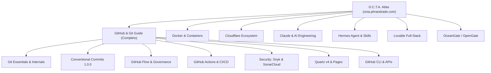

- Origem: [[01-projetos/site-publico/site-publico-hub|Site Público]]

# O.C.T.A. — Omni Clarified Technical Atlas
### *The Ultimate Engineering, DevOps Second Brain & Re-explained Documentation Hub*

<p align="center">
  <a href="https://github.com/pedroiff0/devops-guide/blob/main/LICENSE"></a>
  <a href="https://quartz.jzhao.xyz/"></a>
  <a href="https://nodejs.org/"></a>
  <a href="https://octa.phrandrade.com"></a>
  <a href="https://www.conventionalcommits.org/"></a>
  
</p>

<p align="center">
  <strong> <a href="https://octa.phrandrade.com">Acesse a Plataforma Online / Access Live Digital Garden: octa.phrandrade.com</a></strong>
</p>

---

## Sobre o Projeto / About The Project

Documentações técnicas oficiais costumam ser densas, dispersas ou puramente descritivas. O **O.C.T.A. (Omni Clarified Technical Atlas)** é um **Segundo Cérebro aberto (Digital Garden)** concebido para ser o "atlas unificado de todos os outros guias": estruturado em tópicos, subtópicos e subsubtópicos aprofundados, ricamente exemplificados com casos reais de engenharia, referências cruzadas no grafo, links externos e suporte bilíngue nativo.

### Principais Destaques:
- /  **100% Bilíngue**: Navegação completa espelhada em **Português (PT-BR)** e **Inglês (EN-US)** com alternância instantânea de idioma sem quebra de rota.
- **Grafo de Conhecimento Interativo**: Visualização em rede D3 mapeando interconexões conceituais entre ferramentas, protocolos e padrões.
- **Módulo GitHub Completo**: De comandos atômicos do Git a pipelines de CI/CD, governança de PRs, SonarCloud, Snyk e GitHub Pages.
- **Ecossistemas em Expansão**: Hubs dedicados na barra lateral para Docker, Cloudflare, Claude (Anthropic), Hermes Agent, Lovable e OceanGate / OpenGate.
- **Agentic Skills Nativas**: Diretório de skills padronizadas para agentes autônomos (Antigravity, Claude Code, Hermes).

---

## Pilares do Conhecimento / Knowledge Pillars



| Pilar | Descrição & Escopo | Status |
| :--- | :--- | :--- |
| ** GitHub & Git** | Commits semânticos, fluxos de PR, CI/CD Actions, Snyk, SonarCloud, CLI e Quartz. | [Completo] **Completo** |
| ** Docker** | Virtualização de processos, Dockerfile multi-stage, Docker Compose, redes e volumes. | [Em expansão] *Em Expansão* |
| ** Cloudflare** | Workers V8 Isolates, Pages, Zero Trust, Tunnels (`cloudflared`), R2 Storage e DNS. | [Em expansão] *Em Expansão* |
| ** Claude & IA** | Prompt Engineering estruturado, context windows de 200k+ tokens, Claude Code e MCP. | [Em expansão] *Em Expansão* |
| ** Hermes Agent** | Criação de skills modulares, automação de repositórios e integração de ferramentas. | [Em expansão] *Em Expansão* |
| ** Lovable** | Prototipagem full-stack acelerada, arquitetura React + Supabase e sincronização Git. | [Em expansão] *Em Expansão* |
| ** OceanGate** | API Gateways de alta vazão, roteamento de borda, rate limiting e resiliência. | [Em expansão] *Em Expansão* |

---

## Início Rápido / Quick Start

### Pré-requisitos
- **Node.js**: Versão `>= 22`
- **npm**: Versão `>= 10`

### 1. Clonar o Repositório
```bash
git clone https://github.com/pedroiff0/devops-guide.git
cd devops-guide
```

### 2. Instalar Dependências & Plugins
```bash
npm install
npx quartz plugin install
```

### 3. Iniciar Servidor de Desenvolvimento Local
```bash
npm run serve
```
Abra `http://localhost:8080` no navegador para explorar o jardim digital com recarregamento em tempo real (*live reload*).

### 4. Compilar para Produção
```bash
npm run build
```
Os arquivos estáticos otimizados serão gerados na pasta `public/`, incluindo o arquivo `CNAME` para `octa.phrandrade.com`.

---

## Estrutura do Repositório / Directory Tree

```text
devops-guide/
 .github/
    workflows/
       deploy-gh-pages.yaml # Deploy contínuo no GitHub Pages / Custom Domain
       ci.yml               # Verificação de build e linter
    ISSUE_TEMPLATE/          # Templates padronizados de Issues
    PULL_REQUEST_TEMPLATE.md # Template para Pull Requests
 content/                     # Vault de Conteúdo Markdown
    index.md                 # Portal / Landing Page raiz
    pt-br/                   # Documentações em Português do Brasil
       index.md             # Hub central PT-BR
       github/              # Módulo completo do Guia GitHub
       docker/              # Hub Docker & Containers
       cloudflare/          # Hub Cloudflare
       claude/              # Hub Claude & IA
       hermes/              # Hub Hermes Agent
       lovable/             # Hub Lovable
       oceangate/           # Hub OceanGate
    en/                      # 100% Mirrored English Content
 local-plugins/               # Plugins locais personalizados do Quartz
    page-title-i18n/         # Título com relógio UTC-3 em tempo real
 quartz/                      # Código do motor Quartz v4 (Preact/TS/SCSS)
 skills/                      # Skills do repositório para devs e agentes IA
    doc-authoring/           # Padrões de escrita e frontmatter
    second-brain-graph/      # Curadoria de topologia e wikilinks
    quartz-management/       # Operação do Quartz v4
    git-flow-conventional-commits/ # Fluxos Git e validação
    ci-cd-github-pages/      # Manutenção de CI/CD
    re-explained-doc-engine/ # Expansão de novos pilares
 scripts/
    validate-commit-msg.sh   # Validador local de Conventional Commits
    check-i18n-mirror.py     # Verificador de simetria de slugs bilíngue
 static/
    CNAME                    # Apontamento para octa.phrandrade.com
 quartz.config.yaml           # Configuração de plugins, tema e grafo
 package.json
 README.md
```

---

## Repository Skills para Agentes & Contribuidores

Este repositório adota a especificação de **Skills** autocontidas para guiar agentes de IA e desenvolvedores:

- [[./skills/doc-authoring/SKILL|`skills/doc-authoring/SKILL.md`]]: Guia de autoria de notas, diagramas Mermaid e alertas.
- [[./skills/second-brain-graph/SKILL|`skills/second-brain-graph/SKILL.md`]]: Regras de interconexão e curadoria do grafo.
- [[./skills/quartz-management/SKILL|`skills/quartz-management/SKILL.md`]]: Manutenção do motor Quartz v4.
- [[./skills/git-flow-conventional-commits/SKILL|`skills/git-flow-conventional-commits/SKILL.md`]]: Padrões de commits e branches.
- [[./skills/ci-cd-github-pages/SKILL|`skills/ci-cd-github-pages/SKILL.md`]]: Manutenção de CI/CD e Pages.
- [[./skills/re-explained-doc-engine/SKILL|`skills/re-explained-doc-engine/SKILL.md`]]: Criação e expansão de novos módulos.

---

## Como Contribuir / Contributing

Contribuições são muito bem-vindas! Seja corrigindo um erro de digitação, adicionando novos exemplos ou expandindo um pilar:

1. Faça um Fork do repositório.
2. Crie uma branch para sua modificação: `git checkout -b feat/meu-novo-guia`.
3. Siga o padrão [[skills/git-flow-conventional-commits/SKILL|Conventional Commits]]: `feat(docker): adicionar exemplo de volume`.
4. Valide a compilação localmente com `npm run build`.
5. Envie um Pull Request detalhado.

Consulte [[./CONTRIBUTING|`CONTRIBUTING.md`]] e [[./CODE_OF_CONDUCT|`CODE_OF_CONDUCT.md`]] para mais detalhes.

---

## Autores & Contribuidores / Authors & Contributors

<div align="center">
  <table>
    <tr>
      <td align="center" width="50%">
        <a href="https://github.com/pedroiff0">
          <br />
          <sub><b>Pedro Henrique Rocha de Andrade</b></sub>
        </a><br />
        <sub> Idealizador & Mantenedor Principal</sub><br />
        <a href="https://phrandrade.com"> phrandrade.com</a> · <a href="mailto:pedroiff0@gmail.com"> Email</a>
      </td>
      <td align="center" width="50%">
        <a href="https://github.com/evertonpje">
          <br />
          <sub><b>Everton</b></sub>
        </a><br />
        <sub> Contribuidor Principal & Co-Mantenedor</sub><br />
        <a href="https://github.com/evertonpje"> @evertonpje</a>
      </td>
    </tr>
  </table>
</div>

---

## Licença / License

Distribuído sob a licença **MIT**. Consulte [[./LICENSE|`LICENSE`]] para mais informações.

---

## Autor e Contato

- **Autor:** Pedro Henrique Rocha de Andrade
- **GitHub:** [pedroiff0](https://github.com/pedroiff0)
- **LinkedIn:** [Pedro Henrique Rocha de Andrade](https://linkedin.com/in/pedro-andrade-iff)

---

## Links e Referências

- **Repositório no GitHub:** [pedroiff0/devops-guide](https://github.com/pedroiff0/devops-guide)
- **Índice de Projetos:** [[01-projetos/site-publico/projetos-publicos|Projetos Públicos]]

---

<p align=center>
  <a href="https://github.com/pedroiff0" target="_blank"></a>
  <a href="https://linkedin.com/in/pedro-andrade-iff" target="_blank"></a>
  <a href="https://instagram.com/pedroiff0" target="_blank"></a>
  <a href="mailto:pedro.andrade@iff.edu.br"></a>
  <a href="https://pedroiff.com" target="_blank"></a>
</p>

<p align=center>
  <sub>© 2026 <b><a href="https://pedroiff.com">Pedro Rocha</a></b> — Computer Engineering &amp; Computational Astrophysics</sub><br />
  <sub>Made with <path d='M10 2v2'/><path d='M14 2v2'/><path d='M16 8a1 1 0 0 1 1 1v8a4 4 0 0 1-4 4H7a4 4 0 0 1-4-4V9a1 1 0 0 1 1-1h14a4 4 0 1 1 0 8h-1'/><path d='M6 2v2'/></svg>" width="16" height="16" valign="middle" alt="coffee" />, <path d='m16 18 6-6-6-6'/><path d='m8 6-6 6 6 6'/></svg>" width="16" height="16" valign="middle" alt="code" /> and <circle cx='12' cy='12' r='3'/><path d='M3 12a9 9 0 0 1 9-9 9 9 0 0 1 9 9 9 9 0 0 1-9 9 9 9 0 0 1-9-9'/><path d='M5.5 5.5a13 13 0 0 0 13 13'/><path d='M18.5 5.5a13 13 0 0 1-13 13'/></svg>" width="16" height="16" valign="middle" alt="astrophysics" /> by <b><a href="https://github.com/pedroiff0">Pedro Henrique Rocha de Andrade</a></b></sub>
</p>
