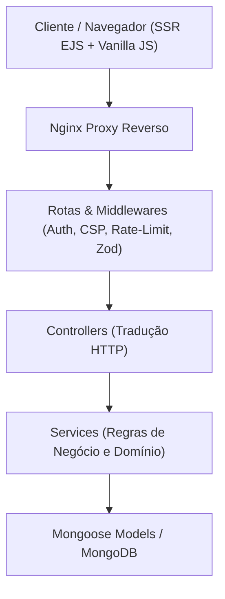

- Origem: [[pt-br/projects/site-publico-hub|Site Público]]

# Projeto Profissional — Template Mestre Canônico

<p align="center">
  <a href="https://github.com/pedroiff0/projeto-profissional/actions"></a>
  <a href="https://github.com/pedroiff0/projeto-profissional/issues"></a>
  <a href="https://github.com/pedroiff0/projeto-profissional/pulls"></a>
  <a href="https://github.com/pedroiff0/projeto-profissional/commits/main"></a>
  <a href="https://github.com/pedroiff0/projeto-profissional"></a>
  <a href="LICENSE"></a>
</p>

<p align="center">
  
  
  
  
  
  
</p>

> [!abstract] Brief do Projeto
> Template base canônico ("Golden Starter") para aplicações web completas: autenticação JWT segura, controle de papéis (`admin`/`user`), validação estrita por Zod, renderização SSR em EJS sem etapa de build, Docker Compose duplo (`dev` e `prod`) e suíte completa de testes Jest em memória desde o primeiro commit.

---

<details open>
  <summary><b>Índice / Sumário</b></summary>

  - [Visão Geral e Arquitetura](#visão-geral-e-arquitetura)
  - [Tecnologias e Stack](#tecnologias-e-stack)
  - [Como Usar este Template](#como-usar-este-template)
  - [Execução Local](#execução-local)
  - [Comandos Disponíveis](#comandos-disponíveis)
  - [Contribuição](#contribuição)
  - [Segurança](#segurança)
  - [Licença](#licença)
  - [Autor e Contato](#autor-e-contato)
</details>

---

## Visão Geral e Arquitetura

O projeto adota uma arquitetura limpa em camadas desacopladas, sem frameworks reativos pesados no frontend, priorizando entrega estável, carregamento instantâneo e conformidade com CSP (Content Security Policy).



---

## Tecnologias e Stack

- **Runtime & Servidor:** Node.js 22 LTS, Express 4.
- **Frontend / Renderização:** EJS Server-Side Rendering, CSS modular com variáveis de tema (claro/escuro) e JS Vanilla.
- **Persistência:** MongoDB 7 com Mongoose 8.
- **Segurança:** Helmet, Cookie-Parser (`httpOnly`), JSON Web Tokens (JWT), Rate-Limiter, proteção contra injeções.
- **Qualidade & Testes:** Jest + Supertest com `mongodb-memory-server` isolado.
- **Infraestrutura:** Docker Compose com profiles de desenvolvimento e produção com isolamento de segredos.

---

## Como Usar este Template

Para criar um novo projeto a partir deste template:

```bash
# Via GitHub CLI:
gh repo create meu-novo-app --template pedroiff0/projeto-profissional --private --clone

# Ou clonando manualmente:
git clone https://github.com/pedroiff0/projeto-profissional.git meu-novo-app
cd meu-novo-app
git remote remove origin
```

---

## Execução Local

```bash
# 1. Instalar dependências
cd app && npm install

# 2. Executar suíte de testes em memória
npm test

# 3. Subir ambiente de desenvolvimento via Docker
make dev
```

---

## Comandos Disponíveis

| Comando | Descrição |
| :--- | :--- |
| `make dev` | Sobe a stack local com live-reload na porta 4429 |
| `make down` | Para e remove containers de desenvolvimento |
| `make test` | Roda suíte completa de testes Jest em memória |
| `make lint` | Executa verificações de linter e sintaxe |
| `make prod` | Executa deploy da stack de produção (porta 4430) |
| `make health` | Checa a saúde e status HTTP das portas do app |

---

## Contribuição

Consulte [CONTRIBUTING.md](CONTRIBUTING.md) para diretrizes de desenvolvimento, branches e commits convencionais.

---

## Segurança

Consulte [SECURITY.md](SECURITY.md) para política de suporte e reporte confidencial de vulnerabilidades.

---

## Licença

Este projeto está sob a licença **MIT** — veja o arquivo [LICENSE](LICENSE) para mais detalhes.

---

## Autor e Contato

- **Autor:** Pedro Henrique Rocha de Andrade
- **GitHub:** [pedroiff0](https://github.com/pedroiff0)
- **LinkedIn:** [Pedro Henrique Rocha de Andrade](https://linkedin.com/in/pedro-andrade-iff)
- **Website:** [pedroiff.com](https://pedroiff.com)

---

## Autor e Contato

- **Autor:** Pedro Henrique Rocha de Andrade
- **GitHub:** [pedroiff0](https://github.com/pedroiff0)
- **LinkedIn:** [Pedro Henrique Rocha de Andrade](https://linkedin.com/in/pedro-andrade-iff)

---

## Links e Referências

- **Repositório no GitHub:** [pedroiff0/projeto-profissional](https://github.com/pedroiff0/projeto-profissional)
- **Índice de Projetos:** [[pt-br/projects/projetos-publicos|Projetos Públicos]]

---

<p align=center>
  <a href="https://github.com/pedroiff0" target="_blank"></a>
  <a href="https://linkedin.com/in/pedro-andrade-iff" target="_blank"></a>
  <a href="https://instagram.com/pedroiff0" target="_blank"></a>
  <a href="mailto:pedro.andrade@iff.edu.br"></a>
  <a href="https://pedroiff.com" target="_blank"></a>
</p>

<p align=center>
  <sub>© 2026 <b><a href="https://pedroiff.com">Pedro Rocha</a></b> — Computer Engineering &amp; Computational Astrophysics</sub><br />
  <sub>Made with <path d='M10 2v2'/><path d='M14 2v2'/><path d='M16 8a1 1 0 0 1 1 1v8a4 4 0 0 1-4 4H7a4 4 0 0 1-4-4V9a1 1 0 0 1 1-1h14a4 4 0 1 1 0 8h-1'/><path d='M6 2v2'/></svg>" width="16" height="16" valign="middle" alt="coffee" />, <path d='m16 18 6-6-6-6'/><path d='m8 6-6 6 6 6'/></svg>" width="16" height="16" valign="middle" alt="code" /> and <circle cx='12' cy='12' r='3'/><path d='M3 12a9 9 0 0 1 9-9 9 9 0 0 1 9 9 9 9 0 0 1-9 9 9 9 0 0 1-9-9'/><path d='M5.5 5.5a13 13 0 0 0 13 13'/><path d='M18.5 5.5a13 13 0 0 1-13 13'/></svg>" width="16" height="16" valign="middle" alt="astrophysics" /> by <b><a href="https://github.com/pedroiff0">Pedro Henrique Rocha de Andrade</a></b></sub>
</p>
