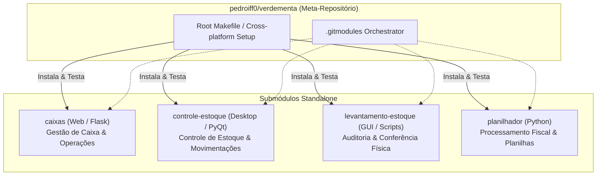

- Origem: [[pt-br/projects/site-publico-hub|Site Público]]

<div align="center">

# VerdeMenta — Meta-Repositório

[](https://github.com/pedroiff0/verdementa/actions/workflows/ci.yml)
[](LICENSE)
[](https://www.python.org/)
[](#-subprojetos)

**Meta-repositório orquestrador que agrega e unifica os subsistemas do ecossistema VerdeMenta via Git Submodules e Make cross-platform.**

[Visão Geral](#-visão-geral) • [Arquitetura](#-arquitetura) • [Subprojetos](#-subprojetos) • [Comandos](#-comandos-principais) • [Governança](#-governança)

</div>

---

## Visão Geral

O ecossistema **VerdeMenta** é composto por quatro aplicações autônomas e complementares para gestão comercial e operacional:
1. **`caixas`**: Aplicação web Flask para controle financeiro e conferência de caixas.
2. **`controle-estoque`**: Aplicação desktop PyQt para controle e contagem de itens de estoque.
3. **`levantamento-estoque`**: Utilitários e interface de auditoria de inventário.
4. **`planilhador`**: Automação e processamento de documentos fiscais e relatórios.

Este repositório atua como o orquestrador central unificado, gerenciando ambientes locais, scripts de inicialização e sincronização de versões.

## Arquitetura



## Subprojetos

| Subprojeto | Repositório | Descrição | Stack |
| :--- | :--- | :--- | :--- |
| **`caixas`** | [pedroiff0/caixas](https://github.com/pedroiff0/caixas) | Gestão financeira e controle de caixas | Python / Flask |
| **`controle-estoque`** | [pedroiff0/controle-estoque](https://github.com/pedroiff0/controle-estoque) | Aplicação desktop para controle de estoque | Python / PyQt |
| **`levantamento-estoque`** | [pedroiff0/levantamento-estoque](https://github.com/pedroiff0/levantamento-estoque) | Utilitários e GUI para conferência física | Python |
| **`planilhador`** | [pedroiff0/planilhador](https://github.com/pedroiff0/planilhador) | Utilitários de manipulação de NFCe e planilhas | Python / Pandas |

## Começando

### 1. Clonar com Submódulos

```bash
git clone --recurse-submodules https://github.com/pedroiff0/verdementa.git
cd verdementa
```

Se o repositório já foi clonado sem `--recurse-submodules`:
```bash
make submodules-init
```

### 2. Comandos Principais

| Comando | Descrição |
| :--- | :--- |
| `make help` | Exibe o menu interativo com os comandos disponíveis |
| `make submodules-init` | Inicializa recursivamente todos os submódulos Git |
| `make submodules-update` | Atualiza os submódulos para os commits remotos mais recentes |
| `make install-<modulo>` | Instala dependências e ambiente de um módulo específico (`caixas`, etc.) |
| `make install-all` | Prepara e instala os ambientes virtuais de todos os 4 submódulos |
| `make test-<modulo>` | Executa a suíte de testes de um módulo específico |
| `make test-all` | Executa os testes de todos os módulos |
| `make ci` | Valida a integridade global e suíte de testes |

## Governança

- [Diretrizes de Agentes (AGENTS.md)](AGENTS.md)
- [Regras de Arquitetura e Design (DESIGN.md)](DESIGN.md)
- [Registro de Continuidade (HANDOFF.md)](HANDOFF.md)
- [Guia de Contribuição (CONTRIBUTING.md)](CONTRIBUTING.md)
- [Código de Conduta (CODE_OF_CONDUCT.md)](CODE_OF_CONDUCT.md)
- [Política de Segurança (SECURITY.md)](SECURITY.md)

## Licença

Distribuído sob a licença [MIT](LICENSE).

---

## Autor e Contato

- **Autor:** Pedro Henrique Rocha de Andrade
- **GitHub:** [pedroiff0](https://github.com/pedroiff0)
- **LinkedIn:** [Pedro Henrique Rocha de Andrade](https://linkedin.com/in/pedro-andrade-iff)

---

## Links e Referências

- **Repositório no GitHub:** [pedroiff0/verdementa](https://github.com/pedroiff0/verdementa)
- **Índice de Projetos:** [[pt-br/projects/projetos-publicos|Projetos Públicos]]

---

<p align=center>
  <a href="https://github.com/pedroiff0" target="_blank"></a>
  <a href="https://linkedin.com/in/pedro-andrade-iff" target="_blank"></a>
  <a href="https://instagram.com/pedroiff0" target="_blank"></a>
  <a href="mailto:pedro.andrade@iff.edu.br"></a>
  <a href="https://pedroiff.com" target="_blank"></a>
</p>

<p align=center>
  <sub>© 2026 <b><a href="https://pedroiff.com">Pedro Rocha</a></b> — Computer Engineering &amp; Computational Astrophysics</sub><br />
  <sub>Made with <path d='M10 2v2'/><path d='M14 2v2'/><path d='M16 8a1 1 0 0 1 1 1v8a4 4 0 0 1-4 4H7a4 4 0 0 1-4-4V9a1 1 0 0 1 1-1h14a4 4 0 1 1 0 8h-1'/><path d='M6 2v2'/></svg>" width="16" height="16" valign="middle" alt="coffee" />, <path d='m16 18 6-6-6-6'/><path d='m8 6-6 6 6 6'/></svg>" width="16" height="16" valign="middle" alt="code" /> and <circle cx='12' cy='12' r='3'/><path d='M3 12a9 9 0 0 1 9-9 9 9 0 0 1 9 9 9 9 0 0 1-9 9 9 9 0 0 1-9-9'/><path d='M5.5 5.5a13 13 0 0 0 13 13'/><path d='M18.5 5.5a13 13 0 0 1-13 13'/></svg>" width="16" height="16" valign="middle" alt="astrophysics" /> by <b><a href="https://github.com/pedroiff0">Pedro Henrique Rocha de Andrade</a></b></sub>
</p>
