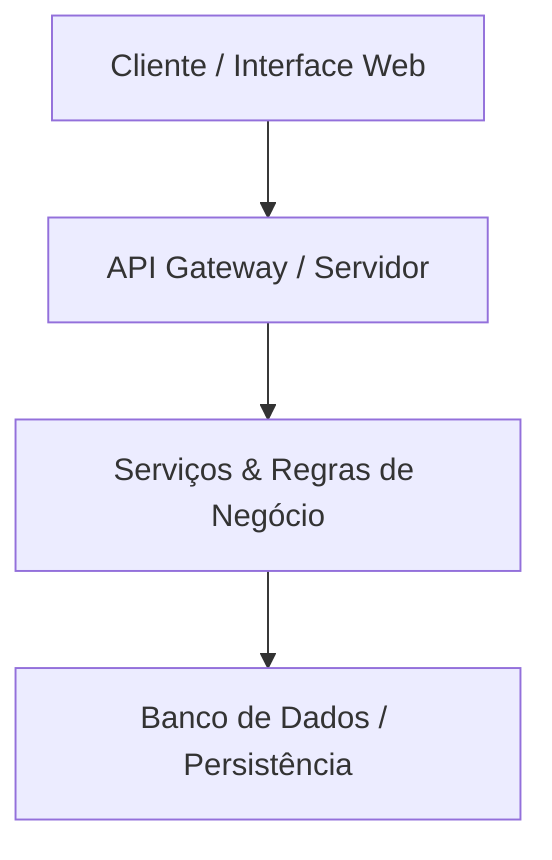

# SpectraViewer — Visualizador Espectral

<p align="center">
  <a href="https://github.com/pedroiff0/spectraviewer/actions"></a>
  <a href="https://github.com/pedroiff0/spectraviewer/issues"></a>
  <a href="https://github.com/pedroiff0/spectraviewer/pulls"></a>
  <a href="https://github.com/pedroiff0/spectraviewer/commits/main"></a>
  <a href="https://github.com/pedroiff0/spectraviewer"></a>
  <a href="LICENSE"></a>
</p>

<p align="center">
   
</p>

> [!abstract] Brief do Projeto
> Interface web interativa de inspeção e ajuste contínuo de espectros estelares FITS do GALAH DR4.

---

<details open>
  <summary><b>Índice / Sumário</b></summary>

  - [Visão Geral e Arquitetura](#visão-geral-e-arquitetura)
  - [Tecnologias e Stack](#tecnologias-e-stack)
  - [Pré-requisitos e Configuração](#pré-requisitos-e-configuração)
  - [Como Executar Localmente](#como-executar-localmente)
  - [Comandos e Scripts Disponíveis](#comandos-e-scripts-disponíveis)
  - [Principais Funcionalidades](#principais-funcionalidades)
  - [Contribuição](#contribuição)
  - [Segurança](#segurança)
  - [Licença](#licença)
  - [Autor e Contato](#autor-e-contato)
  - [Links e Referências](#links-e-referências)
</details>

---

## Visão Geral e Arquitetura

Descrição da visão geral da solução, modelo de arquitetura de software, fluxo de dados e integração de componentes.



---

## Tecnologias e Stack

- **Python**
- **Streamlit**
- **Plotly**
- **Astropy**

---

## Pré-requisitos e Configuração

### Pré-requisitos
- Node.js (versão 18.x ou superior) / Python 3.11+
- Gerenciador de pacotes: `npm` ou `pip`
- Git instalado

---

## Como Executar Localmente

```bash
# 1. Clonar o repositório
git clone https://github.com/pedroiff0/spectraviewer.git

# 2. Acessar o diretório do projeto
cd spectraviewer

# 3. Instalar as dependências
npm install

# 4. Executar a aplicação
npm run dev
```

---

## Comandos e Scripts Disponíveis

| Comando | Descrição |
| :--- | :--- |
| `npm run dev` | Inicia a aplicação em ambiente local |
| `npm run build` | Compila o projeto para produção |
| `npm run test` | Executa a suíte de testes |

---

## Principais Funcionalidades

- **Recurso Principal:** Solução estruturada para o domínio do projeto.
- **Interface e Usabilidade:** Design responsivo e navegação fluida.
- **Integração:** Comunicação com APIs e armazenamento persistente.

---

## Contribuição

Contribuições são muito bem-vindas! Caso deseje contribuir com correções, melhorias ou novas funcionalidades:

1. Faça um Fork do repositório.
2. Crie uma branch para a sua funcionalidade (`git checkout -b feature/nova-funcionalidade`).
3. Commit suas alterações (`git commit -m 'feat: adiciona nova funcionalidade'`).
4. Envie para a branch (`git push origin feature/nova-funcionalidade`).
5. Abra um Pull Request detalhado.

---

## Segurança

Caso você descubra alguma vulnerabilidade de segurança, por favor não abra uma issue pública. Reporte o problema enviando um e-mail diretamente ao mantenedor do projeto.

---

## Licença

Este projeto está licenciado sob os termos da licença **MIT**. Consulte o arquivo [LICENSE](https://github.com/pedroiff0/spectraviewer/blob/main/LICENSE) para obter mais detalhes.

---

## Autor e Contato

- **Autor:** Pedro Henrique Rocha de Andrade
- **GitHub:** [pedroiff0](https://github.com/pedroiff0)
- **LinkedIn:** [Pedro Henrique Rocha de Andrade](https://linkedin.com/in/pedro-andrade-iff)

---

## Links e Referências

- **Repositório no GitHub:** [spectraviewer](https://github.com/pedroiff0/spectraviewer)
- **Índice de Projetos:** [[01-projetos/site-publico/projetos-publicos|Projetos Públicos]]

---

<p align="center">
  <a href="https://github.com/pedroiff0" target="_blank"></a>
  <a href="https://linkedin.com/in/pedro-andrade-iff" target="_blank"></a>
  <a href="https://instagram.com/pedroiff0" target="_blank"></a>
  <a href="mailto:pedro.andrade@iff.edu.br"></a>
  <a href="https://pedroiff.com" target="_blank"></a>
</p>

<p align="center">
  <sub>© 2026 <b><a href="https://pedroiff.com">Pedro Rocha</a></b> — Computer Engineering &amp; Computational Astrophysics</sub><br />
  <sub>Made with <path d='M10 2v2'/><path d='M14 2v2'/><path d='M16 8a1 1 0 0 1 1 1v8a4 4 0 0 1-4 4H7a4 4 0 0 1-4-4V9a1 1 0 0 1 1-1h14a4 4 0 1 1 0 8h-1'/><path d='M6 2v2'/></svg>" width="16" height="16" valign="middle" alt="coffee" />, <path d='m16 18 6-6-6-6'/><path d='m8 6-6 6 6 6'/></svg>" width="16" height="16" valign="middle" alt="code" /> and <circle cx='12' cy='12' r='3'/><path d='M3 12a9 9 0 0 1 9-9 9 9 0 0 1 9 9 9 9 0 0 1-9 9 9 9 0 0 1-9-9'/><path d='M5.5 5.5a13 13 0 0 0 13 13'/><path d='M18.5 5.5a13 13 0 0 1-13 13'/></svg>" width="16" height="16" valign="middle" alt="astrophysics" /> by <b><a href="https://github.com/pedroiff0">Pedro Henrique Rocha de Andrade</a></b></sub>
</p>
