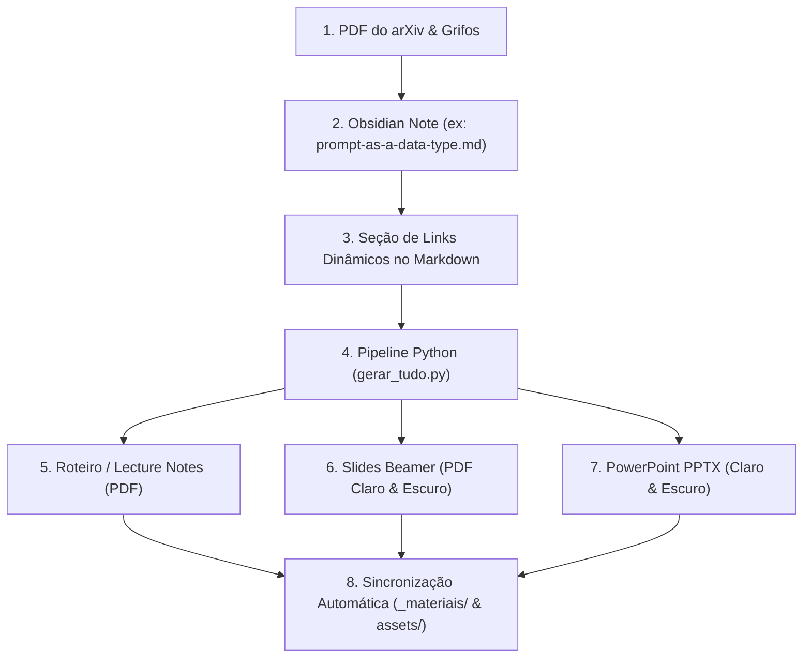

# 🚀 Guia de Uso: Pipeline Unificado de Apresentações ENGCOMP Journal Club

> [!abstract] Visão Geral da Arquitetura
> Manual do pipeline automatizado do **Journal Club de Engenharia de Computação (ENGCOMP)** do IFFluminense. A arquitetura conecta automaticamente as anotações do **Obsidian (.md)** ao **Roteiro/Lecture (.tex/.pdf)**, aos **Slides Beamer 16:9 (.pdf claro/escuro)** e às **Apresentações PowerPoint (.pptx claro/escuro)**, com espelhamento automático para a pasta `_materiais/[arxiv_id]/` e para o Quartz Site.

---

## 🧭 O Fluxo de Trabalho (Do Paper à Apresentação)



---

## 📂 Estrutura do Modelo (`slides-engcomp/`)

O repositório do modelo está localizado em [[file:///home/pedro/Repositorios/latex/modelos/slides-engcomp|`/home/pedro/Repositorios/latex/modelos/slides-engcomp/`]]:

```text
slides-engcomp/
├── lecture/                 # Roteiro de fala, abstract e notas estendidas (A4)
│   ├── roteiro_engcomp.cls  # Classe com cabeçalho fancyhdr, ícones e caixas de passe
│   ├── roteiro_Martins2026.tex # Roteiro canônico do artigo
│   ├── Makefile             # Compila o PDF do roteiro e copia para _materiais/
│   └── img/                 # QR Code, logos institucionais IFF e wallpaper
├── latex/                   # Slides em LaTeX Beamer (Widescreen 16:9)
│   ├── slidesinstitucional.cls # Classe Beamer ENGCOMP (10pt, rodapé compacto)
│   ├── slides_engcomp_artigo.tex # Versão clara (Branco & Verde IFF)
│   ├── slides_engcomp_artigo_preto.tex # Versão escura (Preto & Dourado)
│   ├── Makefile             # Compila ambos os PDFs e espelha para _materiais/
│   └── img/                 # Logos sem borda e QR Code
├── pptx/                    # Gerador de PowerPoint (.pptx 16:9 pixel-perfect)
│   ├── transcrever_slides_pptx.py # Script que gera main_slides_169_branco.pptx e preto.pptx
│   └── img/                 # Imagens e QR Code utilizados no PPTX
└── gerar_tudo.py            # SCRIPT MESTRE que lê a nota Obsidian e executa todo o pipeline!
```

---

## 🔗 A Seção de Links Dinâmicos no Obsidian

Toda nota de artigo do Journal Club ENGCOMP deve conter a seção padronizada abaixo. O script [`gerar_tudo.py`](file:///home/pedro/Repositorios/latex/modelos/slides-engcomp/gerar_tudo.py) lê esses links para montar a caixa de metadados no Roteiro e atualizar os links dos slides:

```markdown
## 📂 Recursos & Materiais do Estudo

> [!tip] 🔗 Links e Materiais Vinculados (Dinâmicos)
> - 📄 **Artigo Original PDF:** [[pt-br/research/Journal-Clubs/engcomp/_materiais/2607.21756/Artigo - Martins2026.pdf|Artigo - Martins2026.pdf]]
> - 📑 **Roteiro de Leitura (Lecture PDF):** [[pt-br/research/Journal-Clubs/engcomp/_materiais/2607.21756/roteiro_Martins2026.pdf|roteiro_Martins2026.pdf]]
> - 📊 **Slides Beamer (LaTeX PDF Claro):** [[pt-br/research/Journal-Clubs/engcomp/_materiais/2607.21756/slides_engcomp_artigo.pdf|slides_engcomp_artigo.pdf]]
> - 📊 **Slides Beamer (LaTeX PDF Escuro):** [[pt-br/research/Journal-Clubs/engcomp/_materiais/2607.21756/slides_engcomp_artigo_preto.pdf|slides_engcomp_artigo_preto.pdf]]
> - 💻 **Slides PowerPoint (PPTX Claro):** [[pt-br/research/Journal-Clubs/engcomp/_materiais/2607.21756/main_slides_169_branco.pptx|main_slides_169_branco.pptx]]
> - 💻 **Slides PowerPoint (PPTX Escuro):** [[pt-br/research/Journal-Clubs/engcomp/_materiais/2607.21756/main_slides_169_preto.pptx|main_slides_169_preto.pptx]]
> - 👥 **Grupo de E-mails do Clube (Google Groups):** [groups.google.com/g/engcompbji](https://groups.google.com/g/engcompbji)
> - 🏠 **Hub ENGCOMP no Site Pessoal:** [phrandrade.com/engcomp](https://www.phrandrade.com/pt-br/research/journal-clubs/engcomp/)
> - 🔗 **Versão Publicada Desta Nota (Web):** [Acessar Nota Publicada Online](https://www.phrandrade.com/pt-br/research/journal-clubs/engcomp/prompt-as-a-data-type)
```

---

## ⚡ Como Executar o Pipeline Mestre

Para compilar a Lecture, os dois PDFs LaTeX, os dois PPTXs e sincronizar tudo automaticamente com o Obsidian e o Quartz Site, execute:

```bash
# Execução padrão (para a nota configurada):
python3 /home/pedro/Repositorios/latex/modelos/slides-engcomp/gerar_tudo.py

# Ou passando o caminho de uma nota específica:
python3 /home/pedro/Repositorios/latex/modelos/slides-engcomp/gerar_tudo.py --note "/caminho/para/nota.md"
```

---

## 🎯 Regras de Design e Padrões Fixados

| Elemento | Tema Branco (Light) | Tema Preto (Dark) |
| :--- | :--- | :--- |
| **Fundo** | Branco puro (`#FFFFFF`) | Preto profundo (`#0F0F0F`) |
| **Texto Principal** | Preto puro (`#000000`) | Branco brilhante (`#F0F0F0`) |
| **Destaques & Títulos**| Verde institucional IFF (`#1E823C`) | Dourado nobre (`#DCB437`) |
| **Subtextos & Fontes** | Cinza escuro (`#5A5A5A`) | Cinza claro (`#B4B4B4`) |
| **Card Lateral** | Fundo `#F5F8F5` / Borda Verde IFF | Fundo `#1C1C1C` / Borda Dourada |
| **Captions** | Topo do card: `Figura X - [Nome]` | Topo do card: `Figura X - [Nome]` |
| **Fontes da Imagem** | Abaixo da foto: `Fonte: [Origem]` | Abaixo da foto: `Fonte: [Origem]` |
| **Página Final** | Wallpaper 16:9 puro em paisagem | Wallpaper 16:9 puro em paisagem |
