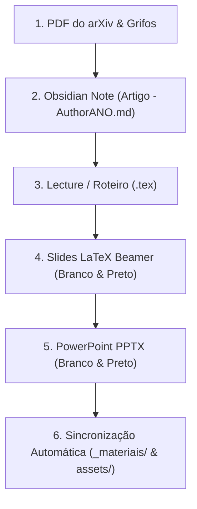

# 🚀 Guia de Uso: Pipeline Unificado de Apresentações MWBR & IFF

> [!abstract] Visão Geral da Arquitetura
> Este documento é o manual interno do pipeline de apresentações e publicações científicas. A arquitetura conecta automaticamente as anotações do **Obsidian** ao **Roteiro/Lecture (.tex)**, aos **Slides Beamer 16:9 (.pdf)** e à apresentação **PowerPoint (.pptx)**, com espelhamento automático para a pasta `_materiais/` do artigo.

---

## 🧭 O Fluxo de Trabalho (Do Paper à Apresentação)



---

## 📂 Estrutura de Diretórios dos Modelos

Existem dois modelos padronizados no sistema:
1. **`slides-mwbr/`** — Especializado para apresentações do Journal Club Milky Way Brazil (MWBR).
2. **`slides-iff/`** — Especializado para aulas, defesas, seminários institucionais do IFFluminense (com suporte a múltiplos autores/apresentadores e iniciais no rodapé).

### Estrutura Interna de Cada Modelo:
```text
slides-mwbr/ (ou slides-iff/)
├── lecture/                 # Roteiro de fala, abstract, palavras-chave e notas estendidas (A4)
│   ├── roteiro_mwbr.cls     # Classe com cabeçalho fancyhdr, ícones e caixas dos 3 passes
│   ├── roteiro_Lu2026.tex   # Texto canônico do roteiro de apresentação
│   ├── Makefile             # Compila o PDF do roteiro e copia para _materiais/
│   ├── bib/                 # Arquivo BibTeX de referências
│   └── img/                 # QR Code, logos e wallpaper astronômico
├── latex/                   # Slides em LaTeX Beamer (Widescreen 16:9)
│   ├── slidesinstitucional.cls # Classe Beamer oficial (10pt, rodapé compacto, caixas mwbrcard)
│   ├── slides_mwbr_artigo.tex  # Versão clara (Branco & Violeta)
│   ├── slides_mwbr_artigo_preto.tex # Versão escura (Preto & Dourado)
│   ├── Makefile             # Compila ambos os PDFs e espelha para _materiais/
│   └── img/                 # Logos sem borda, prints de figuras e QR Code
├── pptx/                    # Gerador de PowerPoint (.pptx 16:9 pixel-perfect)
│   ├── transcrever_slides_pptx.py # Script que gera main_slides_169_branco.pptx e preto.pptx
│   └── img/                 # Imagens e QR Code utilizados no PPTX
└── gerar_tudo.py            # SCRIPT MESTRE que executa todo o pipeline em 1 comando!
```

---

## ⚡ Como Usar no Dia a Dia

### Passo 1: Fazer as anotações no Obsidian
1. Crie a nota com o padrão: `Artigo - [PrimeiroAutor][Ano].md` (ex: `Artigo - Lu2026.md`).
2. Salve o PDF grifado em: `_materiais/[arXiv_ID]/Artigo - [PrimeiroAutor][Ano].pdf`.
3. Preencha os **3 Passes** na nota.

### Passo 2: Ajustar o Roteiro e os Slides
1. Abra o arquivo `lecture/roteiro_Lu2026.tex` e coloque os tópicos de discussão estendidos.
2. Abra `latex/slides_mwbr_artigo.tex` e ajuste os itens de cada slide.

### Passo 3: Executar o Pipeline Mestre
Para compilar a Lecture, os dois PDFs LaTeX, os dois PPTXs e sincronizar tudo automaticamente com o Obsidian, basta abrir o terminal e rodar:

```bash
python3 /home/pedro/Repositorios/latex/modelos/slides-mwbr/gerar_tudo.py
```

*(Ou no modelo institucional)*:
```bash
python3 /home/pedro/Repositorios/latex/modelos/slides-iff/gerar_tudo.py
```

---

## 👥 Tratamento de Múltiplos Autores no Modelo Institucional (`slides-iff`)

No modelo **`slides-iff`**, quando houver mais de um apresentador ou autor, utilize a convenção de iniciais no rodapé:

```latex
% Exemplo com 1 autor:
\author[P. H. R. Andrade]{Pedro Henrique Rocha de Andrade}

% Exemplo com 2 ou mais apresentadores:
\author[P. H. R. Andrade et al.]{Pedro Henrique Rocha de Andrade \and Ana Cecília Soja \and Maria Luiza Dantas}
```

O Beamer e o script de transcrição PPTX utilizam automaticamente a versão entre colchetes `[...]` para exibir no rodapé sem quebrar a linha ou sobrecarregar a barra inferior.

---

## 🎯 Regras de Design e Padrões Fixados

| Elemento | Tema Branco (Light) | Tema Preto (Dark) |
| :--- | :--- | :--- |
| **Fundo** | Branco puro (`#FFFFFF`) | Preto cósmico (`#0F0F0F`) |
| **Texto Principal** | Grafite escuro (`#141414`) | Branco brilhante (`#F0F0F0`) |
| **Destaques & Títulos**| Violeta institucional (`#58187C`) | Dourado (`#DCB437`) |
| **Subtextos & Fontes** | Cinza médio (`#5A5A5A`) | Cinza claro (`#B4B4B4`) |
| **Card Lateral** | Fundo `#F8F6FA` / Borda Violeta | Fundo `#1C1C1C` / Borda Dourada |
| **Captions** | Topo do card: `Figura X - [Nome]` | Topo do card: `Figura X - [Nome]` |
| **Fontes da Imagem** | Abaixo da foto: `Fonte: [Origem]` | Abaixo da foto: `Fonte: [Origem]` |
| **QR Code Cósmico** | Transparente Violeta/Preto | Transparente Dourado/Branco |
| **Página Final** | Wallpaper 16:9 puro em paisagem | Wallpaper 16:9 puro em paisagem |
