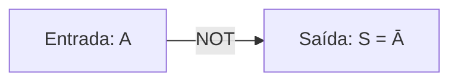
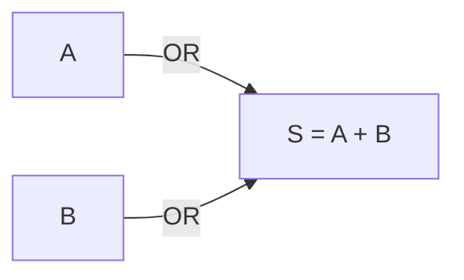
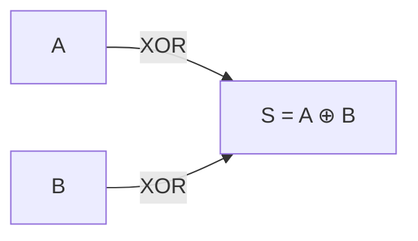
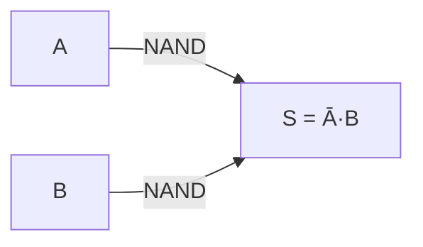
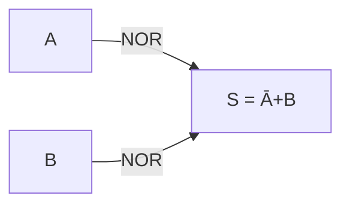
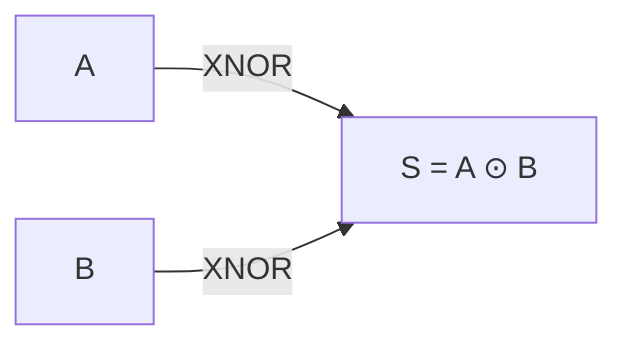
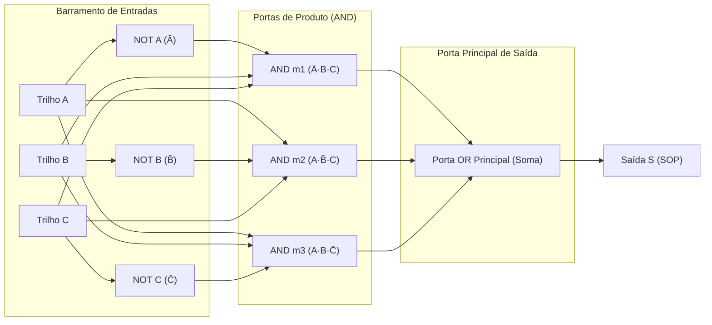
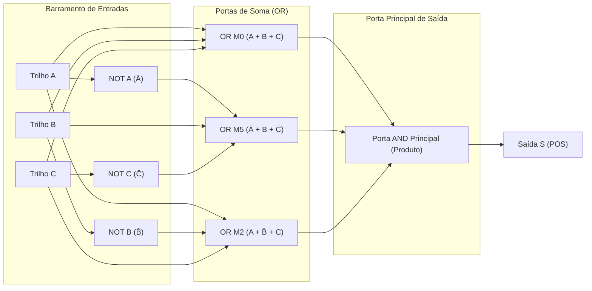
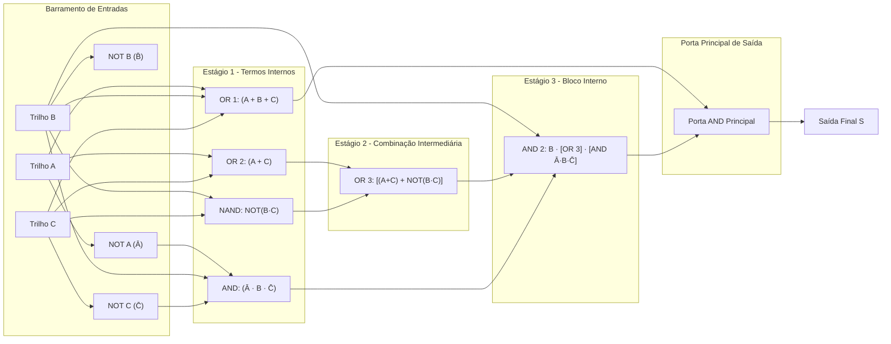

  
⬅️ <b><a href="../index">Hub da Disciplina</a></b>

  
🏠 <b><a href="../index">Visão Geral</a></b>

  
➡️ <b><a href="../index">Aulas</a></b>

# 📝 Aula 01 - Portas Lógicas

> [!info] 📌 Informações da Aula
> - **Docente:** Fabrício Barros Gonçalves
> - **Data da Aula:** 24/08/2026
> - **Tópico Central:** Portas Lógicas Fundamentais, Álgebra Booleana e Circuitos Combinacionais
> - **Status das Anotações:**
>   - [ ] 🟡 Planejando
>   - [ ] 🟠 Em Andamento
>   - [x] 🟢 Concluído

## 📂 Materiais & Recursos Didáticos da Aula

> [!tip] 🔗 Arquivos e Materiais da Disciplina
> - 📄 **Slides do Docente:** *Consulte os anexos vinculados*
> - 📑 **Roteiro / Texto de Apoio:** *Consulte os materiais de aula*
> - 📦 **Exercícios / Anexos:** *Disponíveis no repositório*

## 📋 Sumário Interativo
- [📍 Anotações](#-anotações)
- [🧠 Resumo](#-resumo)
- [📝 Dúvida](#-dúvida)

---

## 📍 Anotações

### 📐 Revisão de Lógica para Computação & Fundamentação Teórica

Nesta aula de **Eletrônica Digital**, estudamos a transição da lógica matemática/proposicional para o ambiente de hardware por meio dos blocos lógicos fundamentais (portas lógicas).

---

### 1. NÃO (NOT - Inversor)

A porta **NOT** realiza a operação lógica de inversão ou complemento.

**Expressão Booleana:**
$$S = \bar{A}$$

**Tabela-Verdade:**

| A | S |
| :---: | :---: |
| 0 | 1 |
| 1 | 0 |

---

### 2. E (AND - Conjunção)

A porta **AND** gera saída alta ($1$) se e somente se todas as suas entradas forem altas ($1$).

**Expressão Booleana:**
$$S = A \cdot B$$

**Tabela-Verdade:**

|  A  |  B  |  S  |     |
| :-: | :-: | :-: | --- |
|  0  |  0  |  0  |     |
|  0  |  1  |  0  |     |
|  1  |  0  |  0  |     |
|  1  |  1  |  1  |     |

---

### 3. OU (OR - Disjunção)

A porta **OR** gera saída alta ($1$) quando pelo menos uma das suas entradas for alta ($1$).

**Expressão Booleana:**
$$S = A + B$$

**Tabela-Verdade:**

| A | B | S |
| :---: | :---: | :---: |
| 0 | 0 | 0 |
| 0 | 1 | 1 |
| 1 | 0 | 1 |
| 1 | 1 | 1 |

---

### 4. OU EXCLUSIVO (XOR)

A porta **XOR** (Ou-Exclusivo) produz saída alta ($1$) se e somente se as entradas forem **diferentes**.

**Expressão Booleana:**
$$S = A \oplus B = \bar{A}B + A\bar{B}$$

**Tabela-Verdade:**

| A | B | S |
| :---: | :---: | :---: |
| 0 | 0 | 0 |
| 0 | 1 | 1 |
| 1 | 0 | 1 |
| 1 | 1 | 0 |

---

### 5. NÃO E (NAND - Porta Universal)

A porta **NAND** é a negação da saída da porta AND. É uma porta **universal**, pois qualquer circuito combinacional pode ser construído apenas com portas NAND.

**Expressão Booleana:**
$$S = \overline{A \cdot B}$$

**Tabela-Verdade:**

| A | B | S |
| :---: | :---: | :---: |
| 0 | 0 | 1 |
| 0 | 1 | 1 |
| 1 | 0 | 1 |
| 1 | 1 | 0 |

---

### 6. NÃO OU (NOR - Porta Universal)

A porta **NOR** é a negação da porta OR. Também possui caráter de **universalidade**.

**Expressão Booleana:**
$$S = \overline{A + B}$$

**Tabela-Verdade:**

| A | B | S |
| :---: | :---: | :---: |
| 0 | 0 | 1 |
| 0 | 1 | 0 |
| 1 | 0 | 0 |
| 1 | 1 | 0 |

---

### 7. NÃO OU EXCLUSIVO (XNOR - Coincidência)

A porta **XNOR** gera saída alta ($1$) quando as entradas forem **iguais** (coincidência).

**Expressão Booleana:**
$$S = \overline{A \oplus B} = A B + \bar{A}\bar{B}$$

**Tabela-Verdade:**

| A | B | S |
| :---: | :---: | :---: |
| 0 | 0 | 1 |
| 0 | 1 | 0 |
| 1 | 0 | 0 |
| 1 | 1 | 1 |

---

### 🧮 Mintermos e Maxtermos

1. **Mintermos (Soma de Produtos - SOP):**
   - Correspondem às combinações da tabela-verdade onde a saída do circuito é $1$.
   - Representados pela notação $\sum m$.
   - ==Na forma de mintermos, a variável direta vale $1$ e a variável complementada/barrada vale $0$.==

2. **Maxtermos (Produto de Somas - POS):**
   - Correspondem às combinações da tabela-verdade onde a saída do circuito é $0$.
   - Representados pela notação $\prod M$.
   - Na forma de maxtermos, a variável direta vale $0$ e a variável complementada/barrada vale $1$.

---

### 📖 Exemplo do Quadro: Diagrama de Trilhos e Portas Lógicas para ABC

Abaixo está o circuito completo com barramento/trilhos de sinal ($A, B, C$) e seus respectivos inversores (NOT), alimentando os mintermos e maxtermos e conectando à porta principal de saída ao final da expressão:

#### 1. Circuito Mintermo (SOP): $S = \bar{A} B C + A \bar{B} C + A B \bar{C}$

---

#### 2. Circuito Maxtermo (POS): $S = (A + B + C) \cdot (\bar{A} + B + \bar{C}) \cdot (A + \bar{B} + C)$

---

#### 3. Leitura e Síntese de Expressão Complexa do Quadro

$$S = (A + B + C) \cdot \left\{ B \left[ (A + C) + \overline{B \cdot C} \right] \cdot (\bar{A} \cdot B \cdot \bar{C}) \right\}$$

---

## 🧠 Resumo

| Tópico | Princípio Central | Atenção Especial / Pegadinha |
| :--- | :--- | :--- |
| **Mintermos ($\sum m$)** | Agrupa as saídas $1$ da tabela | Variáveis sem barra correspondem a $1$ |
| **Maxtermos ($\prod M$)** | Agrupa as saídas $0$ da tabela | Variáveis sem barra correspondem a $0$ |
| **Universalidade NAND/NOR** | Implementa qualquer circuito lógico | Atenção às inversões duplas ao aplicar De Morgan |
| **Diagrama de Trilhos** | Conecta barramentos A, B, C | Passar por portas NOT antes dos blocos AND/OR |

> [!tip] 💡 Dica de Prova do Professor Fabrício
> Em avaliações e no laboratório, dê preferência a trabalhar com **mintermos ($\sum m$)**, pois simplifica a conversão para circuitos AND-OR e facilita a montagem dos diagramas de trilho no **LogiSim**!

---

## 📝 Dúvidas & Exercícios Recomendados

- [x] Testar os circuitos das 7 portas no simulador LogiSim (`logisim-generic-2.7.1.jar`).
- [ ] Resolver a [Lista de Exercícios de Notação Correta em PDF](/assets/disciplinas/6-periodo/eletronica-digital/Lista_Eletronica_Digital_Notacao_Correta.pdf).
- [ ] Desenhar o circuito de mintermos para a função $S(A,B,C) = \sum m(1, 4, 7)$ utilizando os trilhos A, B, C.

  
⬅️ <b><a href="#">Aula Anterior</a></b>

  
🏠 <b><a href="../">Hub da Disciplina</a></b>

  
➡️ <b><a href="#">Próxima Aula</a></b>

