---aliases:
  - index

publish: true
title: Engenharia de Computação
created: 2026-07-22T12:00:00-03:00
modified: 2026-08-29T13:31:22-03:00
tags:
  - matriz-curricular
  - engenharia-de-computacao
  - trancas
  - pre-requisitos
  - iff
order: 1
cssclasses:
  - page-layout
---

# 🎓 Bacharelado em Engenharia de Computação — IFF

Bem-vindo ao portal completo da matriz curricular, ementário, fluxo de períodos e mapeamento de dependências (*trancas*) do curso de **Bacharelado em Engenharia de Computação** do **Instituto Federal Fluminense (IFF) — Campus Bom Jesus do Itabapoana**.

modified: 2026-09-11 12:44
cssclasses:
  - page-layout
---

> [!note] 🏆 Ranking da Matriz Curricular (Top 5 Disciplinas)
> 

>   
> 

> ### 🥇 TOP 5 MELHORES DISCIPLINAS
> - 🥇 **1. Equações Diferenciais** — *Cálculo diferencial avançado e modelagem matemática.*
> - 🥇 **2. Cálculo 1** — *Limites, derivadas, integrais e fundamentação em análise.*
> - 🥇 **3. Cálculo 4 \*** — *Séries numéricas, equações diferenciais parciais e transformadas.*
> - 🥈 **4. Engenharia de Software** — *Arquitetura de sistemas, metodologias ágeis e qualidade.*
> - 🥈 **5. Matemática Discreta** — *Relações de Recorrência, Indução.*

---

> [!info] 🚀 Sistema Acadêmico IFF & Recursos Centrais
> ### 📊 Plataforma Integrada de Gestão Curricular
> - 🔒 **[Mapeamento de Trancas Diretas & Recursivas](#-mapeamento-completo-de-trancas-e-dependências-curriculares)** — *Fluxogramas visuais em Mermaid, cadeias críticas e fecho transitivo.*
> - 📚 **[Matriz Curricular dos 10 Períodos](#-matriz-curricular-geral-90-disciplinas)** — *Grade completa com cargas horárias e componentes obrigatórios/eletivos.*
> - 📁 **[Documentos Oficiais & Ementário Completo](#-fontes-documentos-oficiais--materiais-de-apoio)** — *PPC Completo, relatórios e ementas originais arquivados em materiais.*
> - 💻 **[Repositório no GitHub (Sistema Acadêmico)](https://github.com/pedroiff0/sistema-academico)** — *Código-fonte, APIs e scripts de extração.*
> - 🌐 **[Aplicação Online em Produção](https://planck.dwelf-bull.ts.net)** — *Acesse o sistema em execução no servidor `planck.dwelf-bull.ts.net`.*

---

## 🎨 Carrossel de Períodos Letivos

Navegue interativamente por cada um dos 10 períodos e disciplinas eletivas da grade curricular:

  <a href="/pt-br/resource/engenharia-de-computação/1-periodo" class="carousel-slide">
    
    
1º Período

  </a>
  <a href="/pt-br/resource/engenharia-de-computação/2-periodo" class="carousel-slide">
    
    
2º Período

  </a>
  <a href="/pt-br/resource/engenharia-de-computação/3-periodo" class="carousel-slide">
    
    
3º Período

  </a>
  <a href="/pt-br/resource/engenharia-de-computação/4-periodo" class="carousel-slide">
    
    
4º Período

  </a>
  <a href="/pt-br/resource/engenharia-de-computação/5-periodo" class="carousel-slide">
    
    
5º Período

  </a>
  <a href="/pt-br/resource/engenharia-de-computação/6-periodo" class="carousel-slide">
    
    
6º Período

  </a>
  <a href="/pt-br/resource/engenharia-de-computação/7-periodo" class="carousel-slide">
    
    
7º Período

  </a>
  <a href="/pt-br/resource/engenharia-de-computação/8-periodo" class="carousel-slide">
    
    
8º Período

  </a>
  <a href="/pt-br/resource/engenharia-de-computação/9-periodo" class="carousel-slide">
    
    
9º Período

  </a>
  <a href="/pt-br/resource/engenharia-de-computação/10-periodo" class="carousel-slide">
    
    
10º Período

  </a>
  <a href="/pt-br/resource/engenharia-de-computação/eletivas" class="carousel-slide">
    
    
Eletivas (optativas)

  </a>

---

# 📚 Matriz Curricular Geral (90 Disciplinas)

Estrutura completa das **90 disciplinas** do curso de **Bacharelado em Engenharia de Computação** do **Instituto Federal Fluminense (IFF) — Campus Bom Jesus do Itabapoana**.

> [!info] 📊 Resumo da Estrutura Curricular
> - **Carga Horária Total:** Mais de 3.600 horas
> - **Duração Padrão:** 10 períodos letivos (5 anos)
> - **Grau Acadêmico:** Bacharel em Engenharia de Computação
> - **Atos de Regulação:** Autorizado e reconhecido pelo Ministério da Educação (MEC) / IFF.

---

## 🎓 1º Período Letivo (520 horas)

| Código | Componente Curricular | CH | Pré-Requisitos | Observações |
| :--- | :--- | :---: | :--- | :--- |
| `CSECBJI.1` | [Fundamentos de Computação](<pt-br/resource/Engenharia de Computação/1-periodo/fundamentos-de-computacao/index>) | 40h | *Sem pré-requisito* | Obrigatória |
| `CSECBJI.2` | [Introdução à Engenharia](<pt-br/resource/Engenharia de Computação/1-periodo/introducao-a-engenharia/index>) | 40h | *Sem pré-requisito* | Obrigatória |
| `CSECBJI.3` | [Lógica para Computação](<pt-br/resource/Engenharia de Computação/1-periodo/logica-para-computacao/index>) | 60h | *Sem pré-requisito* | Obrigatória |
| `CSECBJI.4` | [Cálculo I](<pt-br/resource/Engenharia de Computação/1-periodo/calculo-i/index>) | 120h | *Sem pré-requisito* | Obrigatória |
| `CSECBJI.5` | [Álgebra Linear e Geometria Analítica I](<pt-br/resource/Engenharia de Computação/1-periodo/algebra-linear-e-geometria-analitica-i/index>) | 80h | *Sem pré-requisito* | Obrigatória |
| `CSECBJI.6` | [Teoria Geral da Administração](<pt-br/resource/Engenharia de Computação/1-periodo/teoria-geral-da-administracao/index>) | 60h | *Sem pré-requisito* | Obrigatória |
| `CSECBJI.7` | [Desenho Técnico para Engenharia](<pt-br/resource/Engenharia de Computação/1-periodo/desenho-tecnico-para-engenharia/index>) | 80h | *Sem pré-requisito* | Obrigatória |
| `CSECBJI.8` | [Expressão Oral e Escrita](<pt-br/resource/Engenharia de Computação/1-periodo/expressao-oral-e-escrita/index>) | 40h | *Sem pré-requisito* | Obrigatória |

---

## 🎓 2º Período Letivo (500 horas)

| Código | Componente Curricular | CH | Pré-Requisitos | Observações |
| :--- | :--- | :---: | :--- | :--- |
| `CSECBJI.9` | [Cálculo II](<pt-br/resource/Engenharia de Computação/2-periodo/calculo-ii/index>) | 80h | [Cálculo I](<pt-br/resource/Engenharia de Computação/1-periodo/calculo-i/index>) | Obrigatória |
| `CSECBJI.10` | [Álgebra Linear e Geometria Analítica II](<pt-br/resource/Engenharia de Computação/2-periodo/algebra-linear-e-geometria-analitica-ii/index>) | 80h | [Álgebra Linear e Geometria Analítica I](<pt-br/resource/Engenharia de Computação/1-periodo/algebra-linear-e-geometria-analitica-i/index>) | Obrigatória |
| `CSECBJI.11` | [Física I](<pt-br/resource/Engenharia de Computação/2-periodo/fisica-i/index>) | 80h | [Cálculo I](<pt-br/resource/Engenharia de Computação/1-periodo/calculo-i/index>), [Álgebra Linear e Geometria Analítica I](<pt-br/resource/Engenharia de Computação/1-periodo/algebra-linear-e-geometria-analitica-i/index>) | Obrigatória |
| `CSECBJI.12` | [Física Experimental I](<pt-br/resource/Engenharia de Computação/2-periodo/fisica-experimental-i/index>) | 40h | *Sem pré-requisito* | Obrigatória |
| `CSECBJI.13` | [Algoritmos e Técnicas de Programação](<pt-br/resource/Engenharia de Computação/2-periodo/algoritmos-e-tecnicas-de-programacao/index>) | 60h | *Sem pré-requisito* | Obrigatória |
| `CSECBJI.14` | [Matemática Discreta](<pt-br/resource/Engenharia de Computação/2-periodo/matematica-discreta/index>) | 60h | [Lógica para Computação](<pt-br/resource/Engenharia de Computação/1-periodo/logica-para-computacao/index>) | Obrigatória |
| `CSECBJI.15` | [Química](<pt-br/resource/Engenharia de Computação/2-periodo/quimica/index>) | 60h | *Sem pré-requisito* | Obrigatória |
| `CSECBJI.16` | [Química Experimental](<pt-br/resource/Engenharia de Computação/2-periodo/quimica-experimental/index>) | 40h | *Sem pré-requisito* | Obrigatória |

---

## 🎓 3º Período Letivo (520 horas)

| Código | Componente Curricular | CH | Pré-Requisitos | Observações |
| :--- | :--- | :---: | :--- | :--- |
| `CSECBJI.17` | [Cálculo III](<pt-br/resource/Engenharia de Computação/3-periodo/calculo-iii/index>) | 80h | [Cálculo II](<pt-br/resource/Engenharia de Computação/2-periodo/calculo-ii/index>) | Obrigatória |
| `CSECBJI.18` | [Equações Diferenciais](<pt-br/resource/Engenharia de Computação/3-periodo/equacoes-diferenciais/index>) | 80h | [Cálculo I](<pt-br/resource/Engenharia de Computação/1-periodo/calculo-i/index>), [Álgebra Linear e Geometria Analítica I](<pt-br/resource/Engenharia de Computação/1-periodo/algebra-linear-e-geometria-analitica-i/index>) | Obrigatória |
| `CSECBJI.19` | [Física II](<pt-br/resource/Engenharia de Computação/3-periodo/fisica-ii/index>) | 80h | [Cálculo II](<pt-br/resource/Engenharia de Computação/2-periodo/calculo-ii/index>), [Física I](<pt-br/resource/Engenharia de Computação/2-periodo/fisica-i/index>) | Obrigatória |
| `CSECBJI.20` | [Física Experimental II](<pt-br/resource/Engenharia de Computação/3-periodo/fisica-experimental-ii/index>) | 40h | *Sem pré-requisito* | Obrigatória |
| `CSECBJI.21` | [Mecânica dos Sólidos](<pt-br/resource/Engenharia de Computação/3-periodo/mecanica-dos-solidos/index>) | 80h | [Física I](<pt-br/resource/Engenharia de Computação/2-periodo/fisica-i/index>) | Obrigatória |
| `CSECBJI.22` | [Algoritmos e Estruturas de Dados I](<pt-br/resource/Engenharia de Computação/3-periodo/algoritmos-e-estruturas-de-dados-i/index>) | 60h | [Algoritmos e Técnicas de Programação](<pt-br/resource/Engenharia de Computação/2-periodo/algoritmos-e-tecnicas-de-programacao/index>) | Obrigatória |
| `CSECBJI.23` | [Introdução à Ciência dos Materiais](<pt-br/resource/Engenharia de Computação/3-periodo/introducao-a-ciencia-dos-materiais/index>) | 60h | [Química](<pt-br/resource/Engenharia de Computação/2-periodo/quimica/index>) | Obrigatória |
| `CSECBJI.24` | [Ciências do Ambiente](<pt-br/resource/Engenharia de Computação/3-periodo/ciencias-do-ambiente/index>) | 40h | *Sem pré-requisito* | Obrigatória |

---

## 🎓 4º Período Letivo (520 horas)

| Código | Componente Curricular | CH | Pré-Requisitos | Observações |
| :--- | :--- | :---: | :--- | :--- |
| `CSECBJI.25` | [Cálculo Numérico](<pt-br/resource/Engenharia de Computação/4-periodo/calculo-numerico/index>) | 80h | [Algoritmos e Técnicas de Programação](<pt-br/resource/Engenharia de Computação/2-periodo/algoritmos-e-tecnicas-de-programacao/index>) | Obrigatória |
| `CSECBJI.26` | [Física III](<pt-br/resource/Engenharia de Computação/4-periodo/fisica-iii/index>) | 80h | [Cálculo III](<pt-br/resource/Engenharia de Computação/3-periodo/calculo-iii/index>), [Física II](<pt-br/resource/Engenharia de Computação/3-periodo/fisica-ii/index>) | Obrigatória |
| `CSECBJI.27` | [Física Experimental III](<pt-br/resource/Engenharia de Computação/4-periodo/fisica-experimental-iii/index>) | 40h | *Sem pré-requisito* | Obrigatória |
| `CSECBJI.28` | [Fenômenos de Transporte](<pt-br/resource/Engenharia de Computação/4-periodo/fenomenos-de-transporte/index>) | 80h | [Cálculo I](<pt-br/resource/Engenharia de Computação/1-periodo/calculo-i/index>), [Física II](<pt-br/resource/Engenharia de Computação/3-periodo/fisica-ii/index>) | Obrigatória |
| `CSECBJI.29` | [Probabilidade e Estatística](<pt-br/resource/Engenharia de Computação/4-periodo/probabilidade-e-estatistica/index>) | 60h | *Sem pré-requisito* | Obrigatória |
| `CSECBJI.30` | [Algoritmos e Estruturas de Dados II](<pt-br/resource/Engenharia de Computação/4-periodo/algoritmos-e-estruturas-de-dados-ii/index>) | 60h | [Algoritmos e Estruturas de Dados I](<pt-br/resource/Engenharia de Computação/3-periodo/algoritmos-e-estruturas-de-dados-i/index>) | Obrigatória |
| `CSECBJI.31` | [Cálculo IV](<pt-br/resource/Engenharia de Computação/4-periodo/calculo-iv/index>) | 80h | [Cálculo III](<pt-br/resource/Engenharia de Computação/3-periodo/calculo-iii/index>) | Obrigatória |
| `CSECBJI.32` | [Economia](<pt-br/resource/Engenharia de Computação/4-periodo/economia/index>) | 40h | *Sem pré-requisito* | Obrigatória |

---

## 🎓 5º Período Letivo (520 horas)

| Código | Componente Curricular | CH | Pré-Requisitos | Observações |
| :--- | :--- | :---: | :--- | :--- |
| `CSECBJI.33` | [Eletricidade Aplicada](<pt-br/resource/Engenharia de Computação/5-periodo/eletricidade-aplicada/index>) | 60h | [Física III](<pt-br/resource/Engenharia de Computação/4-periodo/fisica-iii/index>) | Obrigatória |
| `CSECBJI.34` | [Projeto e Análise de Algoritmos](<pt-br/resource/Engenharia de Computação/5-periodo/projeto-e-analise-de-algoritmos/index>) | 60h | [Matemática Discreta](<pt-br/resource/Engenharia de Computação/2-periodo/matematica-discreta/index>), [Algoritmos e Estruturas de Dados II](<pt-br/resource/Engenharia de Computação/4-periodo/algoritmos-e-estruturas-de-dados-ii/index>) | Obrigatória |
| `CSECBJI.35` | [Modelagem de Dados](<pt-br/resource/Engenharia de Computação/5-periodo/modelagem-de-dados/index>) | 40h | [Lógica para Computação](<pt-br/resource/Engenharia de Computação/1-periodo/logica-para-computacao/index>) | Obrigatória |
| `CSECBJI.36` | [Engenharia de Software](<pt-br/resource/Engenharia de Computação/5-periodo/engenharia-de-software/index>) | 60h | *Sem pré-requisito* | Obrigatória |
| `CSECBJI.37` | [Eletrônica Analógica](<pt-br/resource/Engenharia de Computação/5-periodo/eletronica-analogica/index>) | 60h | [Física III](<pt-br/resource/Engenharia de Computação/4-periodo/fisica-iii/index>) | Obrigatória |
| `CSECBJI.38` | [Paradigmas de Linguagem de Programação](<pt-br/resource/Engenharia de Computação/5-periodo/paradigmas-de-linguagem-de-programacao/index>) | 60h | [Algoritmos e Técnicas de Programação](<pt-br/resource/Engenharia de Computação/2-periodo/algoritmos-e-tecnicas-de-programacao/index>) | Obrigatória |
| `CSECBJI.39` | [Gestão Ambiental](<pt-br/resource/Engenharia de Computação/5-periodo/gestao-ambiental/index>) | 60h | *Sem pré-requisito* | Obrigatória |
| `CSECBJI.40` | [Linguagens Formais e Autômatos](<pt-br/resource/Engenharia de Computação/5-periodo/linguagens-formais-e-automatos/index>) | 60h | [Matemática Discreta](<pt-br/resource/Engenharia de Computação/2-periodo/matematica-discreta/index>) | Obrigatória |
| `CSECBJI.41` | [Avaliação e Desempenho de Sistemas](<pt-br/resource/Engenharia de Computação/5-periodo/avaliacao-e-desempenho-de-sistemas/index>) | 60h | [Probabilidade e Estatística](<pt-br/resource/Engenharia de Computação/4-periodo/probabilidade-e-estatistica/index>) | Obrigatória |

---

## 🎓 6º Período Letivo (500 horas)

| Código | Componente Curricular | CH | Pré-Requisitos | Observações |
| :--- | :--- | :---: | :--- | :--- |
| `CSECBJI.42` | [Análise de Software Orientada a Objetos](<pt-br/resource/Engenharia de Computação/6-periodo/analise-de-software-orientada-a-objetos/index>) | 60h | [Engenharia de Software](<pt-br/resource/Engenharia de Computação/5-periodo/engenharia-de-software/index>) | Obrigatória |
| `CSECBJI.43` | [Filosofia da Ciência e Tecnologia](<pt-br/resource/Engenharia de Computação/6-periodo/filosofia-da-ciencia-e-tecnologia/index>) | 60h | *Sem pré-requisito* | Obrigatória |
| `CSECBJI.44` | [Banco de Dados](<pt-br/resource/Engenharia de Computação/6-periodo/banco-de-dados/index>) | 60h | [Modelagem de Dados](<pt-br/resource/Engenharia de Computação/5-periodo/modelagem-de-dados/index>) | Obrigatória |
| `CSECBJI.45` | [Programação Orientada a Objetos I](<pt-br/resource/Engenharia de Computação/6-periodo/programacao-orientada-a-objetos-i/index>) | 60h | [Algoritmos e Técnicas de Programação](<pt-br/resource/Engenharia de Computação/2-periodo/algoritmos-e-tecnicas-de-programacao/index>), [Paradigmas de Linguagem de Programação](<pt-br/resource/Engenharia de Computação/5-periodo/paradigmas-de-linguagem-de-programacao/index>) | Obrigatória |
| `CSECBJI.46` | [Eletrônica Digital](<pt-br/resource/Engenharia de Computação/6-periodo/eletronica-digital/index>) | 60h | [Lógica para Computação](<pt-br/resource/Engenharia de Computação/1-periodo/logica-para-computacao/index>), [Eletrônica Analógica](<pt-br/resource/Engenharia de Computação/5-periodo/eletronica-analogica/index>) | Obrigatória |
| `CSECBJI.47` | [Comunicação de Dados](<pt-br/resource/Engenharia de Computação/6-periodo/comunicacao-de-dados/index>) | 60h | *Sem pré-requisito* | Obrigatória |
| `CSECBJI.48` | [Compiladores](<pt-br/resource/Engenharia de Computação/6-periodo/compiladores/index>) | 60h | [Linguagens Formais e Autômatos](<pt-br/resource/Engenharia de Computação/5-periodo/linguagens-formais-e-automatos/index>) | Obrigatória |
| `CSECBJI.49` | [Gestão de Projetos](<pt-br/resource/Engenharia de Computação/6-periodo/gestao-de-projetos/index>) | 80h | *Sem pré-requisito* | Obrigatória |

---

## 🎓 7º Período Letivo (540 horas)

| Código | Componente Curricular | CH | Pré-Requisitos | Observações |
| :--- | :--- | :---: | :--- | :--- |
| `CSECBJI.50` | [Projeto de Software Orientado a Objetos](<pt-br/resource/Engenharia de Computação/7-periodo/projeto-de-software-orientado-a-objetos/index>) | 60h | [Análise de Software Orientada a Objetos](<pt-br/resource/Engenharia de Computação/6-periodo/analise-de-software-orientada-a-objetos/index>) | Obrigatória |
| `CSECBJI.51` | [Programação Orientada a Objetos II](<pt-br/resource/Engenharia de Computação/7-periodo/programacao-orientada-a-objetos-ii/index>) | 60h | [Programação Orientada a Objetos I](<pt-br/resource/Engenharia de Computação/6-periodo/programacao-orientada-a-objetos-i/index>) | Obrigatória |
| `CSECBJI.52` | [Organização de Computadores](<pt-br/resource/Engenharia de Computação/7-periodo/organizacao-de-computadores/index>) | 60h | [Fundamentos de Computação](<pt-br/resource/Engenharia de Computação/1-periodo/fundamentos-de-computacao/index>) | Obrigatória |
| `CSECBJI.53` | [Sistemas Digitais](<pt-br/resource/Engenharia de Computação/7-periodo/sistemas-digitais/index>) | 60h | [Eletrônica Digital](<pt-br/resource/Engenharia de Computação/6-periodo/eletronica-digital/index>) | Obrigatória |
| `CSECBJI.54` | [Computação, Sociedade e Inclusão](<pt-br/resource/Engenharia de Computação/7-periodo/computacao-sociedade-e-inclusao/index>) | 60h | *Sem pré-requisito* | Obrigatória |
| `CSECBJI.55` | [Redes de Computadores I](<pt-br/resource/Engenharia de Computação/7-periodo/redes-de-computadores-i/index>) | 60h | [Comunicação de Dados](<pt-br/resource/Engenharia de Computação/6-periodo/comunicacao-de-dados/index>) | Obrigatória |
| `CSECBJI.56` | [Sistemas Operacionais I](<pt-br/resource/Engenharia de Computação/7-periodo/sistemas-operacionais-i/index>) | 60h | [Fundamentos de Computação](<pt-br/resource/Engenharia de Computação/1-periodo/fundamentos-de-computacao/index>) | Obrigatória |
| `CSECBJI.57` | **Eletiva I (`CSECBJI.57`)** | 60h | *Sem pré-requisito* | Obrigatória |
| `CSECBJI.58` | **Eletiva II (`CSECBJI.58`)** | 60h | *Sem pré-requisito* | Obrigatória |

---

## 🎓 8º Período Letivo (480 horas)

| Código | Componente Curricular | CH | Pré-Requisitos | Observações |
| :--- | :--- | :---: | :--- | :--- |
| `CSECBJI.59` | [Redes de Computadores II](<pt-br/resource/Engenharia de Computação/8-periodo/redes-de-computadores-ii/index>) | 60h | [Redes de Computadores I](<pt-br/resource/Engenharia de Computação/7-periodo/redes-de-computadores-i/index>) | Obrigatória |
| `CSECBJI.60` | [Segurança e Higiene do Trabalho](<pt-br/resource/Engenharia de Computação/8-periodo/seguranca-e-higiene-do-trabalho/index>) | 80h | *Sem pré-requisito* | Obrigatória |
| `CSECBJI.61` | [Arquitetura de Computadores](<pt-br/resource/Engenharia de Computação/8-periodo/arquitetura-de-computadores/index>) | 60h | [Organização de Computadores](<pt-br/resource/Engenharia de Computação/7-periodo/organizacao-de-computadores/index>), [Sistemas Digitais](<pt-br/resource/Engenharia de Computação/7-periodo/sistemas-digitais/index>) | Obrigatória |
| `CSECBJI.62` | [Microcontroladores](<pt-br/resource/Engenharia de Computação/8-periodo/microcontroladores/index>) | 60h | [Organização de Computadores](<pt-br/resource/Engenharia de Computação/7-periodo/organizacao-de-computadores/index>) | Obrigatória |
| `CSECBJI.63` | [Sistemas Operacionais II](<pt-br/resource/Engenharia de Computação/8-periodo/sistemas-operacionais-ii/index>) | 60h | [Sistemas Operacionais I](<pt-br/resource/Engenharia de Computação/7-periodo/sistemas-operacionais-i/index>) | Obrigatória |
| `CSECBJI.64` | [Metodologia Científica e Tecnológica](<pt-br/resource/Engenharia de Computação/8-periodo/metodologia-cientifica-e-tecnologica/index>) | 40h | *Sem pré-requisito* | Obrigatória |
| `CSECBJI.65` | **Eletiva III (`CSECBJI.65`)** | 60h | *Sem pré-requisito* | Obrigatória |
| `CSECBJI.66` | **Eletiva IV (`CSECBJI.66`)** | 60h | *Sem pré-requisito* | Obrigatória |

---

## 🎓 9º Período Letivo (420 horas)

| Código | Componente Curricular | CH | Pré-Requisitos | Observações |
| :--- | :--- | :---: | :--- | :--- |
| `CSECBJI.67` | [Projeto Final de Curso I](<pt-br/resource/Engenharia de Computação/9-periodo/projeto-final-de-curso-i/index>) | 80h | [Metodologia Científica e Tecnológica](<pt-br/resource/Engenharia de Computação/8-periodo/metodologia-cientifica-e-tecnologica/index>) | Obrigatória |
| `CSECBJI.68` | [Empreendedorismo](<pt-br/resource/Engenharia de Computação/9-periodo/empreendedorismo/index>) | 40h | *Sem pré-requisito* | Obrigatória |
| `CSECBJI.69` | [Direito, Ética e Cidadania](<pt-br/resource/Engenharia de Computação/9-periodo/direito-etica-e-cidadania/index>) | 60h | *Sem pré-requisito* | Obrigatória |
| `CSECBJI.70` | [Sistemas Embarcados](<pt-br/resource/Engenharia de Computação/9-periodo/sistemas-embarcados/index>) | 60h | [Microcontroladores](<pt-br/resource/Engenharia de Computação/8-periodo/microcontroladores/index>) | Obrigatória |
| `CSECBJI.71` | [Sistemas Distribuídos](<pt-br/resource/Engenharia de Computação/9-periodo/sistemas-distribuidos/index>) | 60h | [Redes de Computadores I](<pt-br/resource/Engenharia de Computação/7-periodo/redes-de-computadores-i/index>), [Sistemas Operacionais I](<pt-br/resource/Engenharia de Computação/7-periodo/sistemas-operacionais-i/index>) | Obrigatória |
| `CSECBJI.72` | **Eletiva V (`CSECBJI.72`)** | 60h | *Sem pré-requisito* | Obrigatória |
| `CSECBJI.73` | **Eletiva VI (`CSECBJI.73`)** | 60h | *Sem pré-requisito* | Obrigatória |

---

## 🎓 10º Período Letivo (80 horas)

| Código | Componente Curricular | CH | Pré-Requisitos | Observações |
| :--- | :--- | :---: | :--- | :--- |
| `CSECBJI.74` | [Projeto Final de Curso II](<pt-br/resource/Engenharia de Computação/10-periodo/projeto-final-de-curso-ii/index>) | 80h | [Projeto Final de Curso I](<pt-br/resource/Engenharia de Computação/9-periodo/projeto-final-de-curso-i/index>) | Obrigatória |

---

## ⚙️ Disciplinas Eletivas e Optativas

O aluno deve integralizar carga horária optativa escolhendo entre o rol de disciplinas eletivas oferecidas a partir do 7º período:

| Código | Componente Curricular | CH | Pré-Requisitos | Área Temática |
| :--- | :--- | :---: | :--- | :--- |
| `CSECBJI.75` | [Libras](<pt-br/resource/Engenharia de Computação/eletivas/libras/index>) | 60h | *Sem pré-requisito* | Eletiva |
| `CSECBJI.76` | [Sociedade e Tecnologia](<pt-br/resource/Engenharia de Computação/eletivas/sociedade-e-tecnologia/index>) | 60h | *Sem pré-requisito* | Eletiva |
| `CSECBJI.77` | [Computação Gráfica](<pt-br/resource/Engenharia de Computação/eletivas/computacao-grafica/index>) | 60h | [Álgebra Linear e Geometria Analítica II](<pt-br/resource/Engenharia de Computação/2-periodo/algebra-linear-e-geometria-analitica-ii/index>), [Algoritmos e Estruturas de Dados II](<pt-br/resource/Engenharia de Computação/4-periodo/algoritmos-e-estruturas-de-dados-ii/index>) | Eletiva |
| `CSECBJI.78` | [Processamento de Imagens](<pt-br/resource/Engenharia de Computação/eletivas/processamento-de-imagens/index>) | 60h | [Computação Gráfica](<pt-br/resource/Engenharia de Computação/eletivas/computacao-grafica/index>) | Eletiva |
| `CSECBJI.79` | [Desenvolvimento Web](<pt-br/resource/Engenharia de Computação/eletivas/desenvolvimento-web/index>) | 60h | [Programação Orientada a Objetos II](<pt-br/resource/Engenharia de Computação/7-periodo/programacao-orientada-a-objetos-ii/index>) | Eletiva |
| `CSECBJI.80` | [Interconexão de Redes de Computadores](<pt-br/resource/Engenharia de Computação/eletivas/interconexao-de-redes-de-computadores/index>) | 60h | *Sem pré-requisito* | Eletiva |
| `CSECBJI.81` | [Dimensionamento de Redes de Computadores](<pt-br/resource/Engenharia de Computação/eletivas/dimensionamento-de-redes-de-computadores/index>) | 60h | *Sem pré-requisito* | Eletiva |
| `CSECBJI.82` | [Energia e Eficiência Energética](<pt-br/resource/Engenharia de Computação/eletivas/energia-e-eficiencia-energetica/index>) | 60h | [Eletricidade Aplicada](<pt-br/resource/Engenharia de Computação/5-periodo/eletricidade-aplicada/index>) | Eletiva |
| `CSECBJI.83` | [Processamento de Sinais](<pt-br/resource/Engenharia de Computação/eletivas/processamento-de-sinais/index>) | 60h | [Cálculo IV](<pt-br/resource/Engenharia de Computação/4-periodo/calculo-iv/index>), [Comunicação de Dados](<pt-br/resource/Engenharia de Computação/6-periodo/comunicacao-de-dados/index>) | Eletiva |
| `CSECBJI.84` | [Geoprocessamento](<pt-br/resource/Engenharia de Computação/eletivas/geoprocessamento/index>) | 60h | [Projeto e Análise de Algoritmos](<pt-br/resource/Engenharia de Computação/5-periodo/projeto-e-analise-de-algoritmos/index>) | Eletiva |
| `CSECBJI.85` | [Modelagem Ambiental](<pt-br/resource/Engenharia de Computação/eletivas/modelagem-ambiental/index>) | 60h | [Álgebra Linear e Geometria Analítica II](<pt-br/resource/Engenharia de Computação/2-periodo/algebra-linear-e-geometria-analitica-ii/index>), [Equações Diferenciais](<pt-br/resource/Engenharia de Computação/3-periodo/equacoes-diferenciais/index>) | Eletiva |
| `CSECBJI.86` | [Algoritmos Distribuídos](<pt-br/resource/Engenharia de Computação/eletivas/algoritmos-distribuidos/index>) | 60h | [Redes de Computadores I](<pt-br/resource/Engenharia de Computação/7-periodo/redes-de-computadores-i/index>), [Sistemas Operacionais I](<pt-br/resource/Engenharia de Computação/7-periodo/sistemas-operacionais-i/index>) | Eletiva |
| `CSECBJI.87` | [Computação Paralela e Distribuída](<pt-br/resource/Engenharia de Computação/eletivas/computacao-paralela-e-distribuida/index>) | 60h | [Algoritmos Distribuídos](<pt-br/resource/Engenharia de Computação/eletivas/algoritmos-distribuidos/index>) | Eletiva |
| `CSECBJI.88` | [Pesquisa Operacional I](<pt-br/resource/Engenharia de Computação/eletivas/pesquisa-operacional-i/index>) | 60h | [Álgebra Linear e Geometria Analítica II](<pt-br/resource/Engenharia de Computação/2-periodo/algebra-linear-e-geometria-analitica-ii/index>) | Eletiva |
| `CSECBJI.89` | [Pesquisa Operacional II](<pt-br/resource/Engenharia de Computação/eletivas/pesquisa-operacional-ii/index>) | 60h | [Pesquisa Operacional I](<pt-br/resource/Engenharia de Computação/eletivas/pesquisa-operacional-i/index>) | Eletiva |
| `CSECBJI.90` | [Inteligência Artificial](<pt-br/resource/Engenharia de Computação/eletivas/inteligencia-artificial/index>) | 60h | [Projeto e Análise de Algoritmos](<pt-br/resource/Engenharia de Computação/5-periodo/projeto-e-analise-de-algoritmos/index>) | Eletiva |

---

  <a href="/pt-br/resource/engenharia-de-computação" class="btn btn-primary">🏠 Voltar à Página Principal de Engenharia de Computação</a>

---

# 🔒 Mapeamento Completo de Trancas e Dependências Curriculares

Este documento apresenta a estrutura formal de **dependências pedagógicas e pré-requisitos (trancas)** do curso de **Engenharia de Computação do IFF (Campus Bom Jesus do Itabapoana)**.

> [!info] 📌 Como Funcionam as Trancas Curriculares?
> - **Pré-Requisito:** Disciplina que deve ter sido **concluída com aprovação** antes da matrícula na disciplina dependente.
> - **Disciplina Trancada:** Disciplina cujo acesso fica bloqueado caso o aluno não tenha sido aprovado em todos os seus pré-requisitos.
> - Manter o fluxo curricular livre de reprovações nas disciplinas-chave (*Lógica, Cálculo I, Algoritmos, Eletricidade*) evita atrasos em cadeia na formatura.

---

## 📊 Principais Cadeias Críticas de Dependência (Mermaid)

```mermaid
flowchart TD
    subgraph Cadeia_Dados [Cadeia de Banco de Dados]
        LPC["Lógica para Computação (1ºP)"] --> MD["Modelagem de Dados (5ºP)"]
        MD --> BD["Banco de Dados (6ºP)"]
    end

    subgraph Cadeia_Software [Cadeia de Engenharia de Software]
        ES["Engenharia de Software (5ºP)"] --> ASOO["Análise de Software OO (6ºP)"]
        ASOO --> PSOO["Projeto de Software OO (7ºP)"]
    end

    subgraph Cadeia_Programacao [Cadeia de Programação & IA]
        ATP["Algoritmos e Técnicas (2ºP)"] --> AED1["Algoritmos e Estruturas I (3ºP)"]
        AED1 --> AED2["Algoritmos e Estruturas II (4ºP)"]
        AED2 --> PAA["Projeto e Análise de Algoritmos (5ºP)"]
        MDISC["Matemática Discreta (2ºP)"] --> PAA
        PAA --> IA["Inteligência Artificial (Eletiva)"]
        
        ATP --> PLP["Paradigmas de Linguagens (5ºP)"]
        ATP & PLP --> POO1["Programação OO I (6ºP)"]
        POO1 --> POO2["Programação OO II (7ºP)"]
        POO2 --> DWEB["Desenvolvimento Web (Eletiva)"]
    end

    subgraph Cadeia_Hardware [Cadeia de Hardware & Arquitetura]
        FIS3["Física III (4ºP)"] --> ELA["Eletrônica Analógica (5ºP)"]
        LPC & ELA --> ELD["Eletrônica Digital (6ºP)"]
        ELD --> SD["Sistemas Digitais (7ºP)"]
        FC["Fundamentos da Computação (1ºP)"] --> OC["Organização de Computadores (7ºP)"]
        OC & SD --> AC["Arquitetura de Computadores (8ºP)"]
        OC --> MC["Microcontroladores (8ºP)"]
        MC --> SE["Sistemas Embarcados (9ºP)"]
    end

    subgraph Cadeia_Redes [Cadeia de Redes & Sistemas Distribuídos]
        CD["Comunicação de Dados (6ºP)"] --> R1["Redes de Computadores I (7ºP)"]
        R1 --> R2["Redes de Computadores II (8ºP)"]
        FC --> SO1["Sistemas Operacionais I (7ºP)"]
        SO1 --> SO2["Sistemas Operacionais II (8ºP)"]
        R1 & SO1 --> SDIST["Sistemas Distribuídos (9ºP)"]
        R1 & SO1 --> ADIST["Algoritmos Distribuídos (Eletiva)"]
        ADIST --> CPD["Computação Paralela e Distribuída (Eletiva)"]
    end

    subgraph Cadeia_TCC [Cadeia de Conclusão de Curso]
        MCT["Metodologia Científica (8ºP)"] --> PFC1["Projeto Final de Curso I - TCC 1 (9ºP)"]
        PFC1 --> PFC2["Projeto Final de Curso II - TCC 2 (10ºP)"]
    end
```

---

### ⏱️ Linha do Tempo Cronológica: Encadeamento de Trancas Período a Período (1ºP ao 10ºP)

> [!warning] 🚨 Efeito Cascata de Reprovações (Propagação Temporal)
> O diagrama abaixo demonstra a linha do tempo das disciplinas distribuídas pelos **10 períodos acadêmicos**.
> * **Cadeia de Cálculo:** Sem aprovação em **Cálculo I (1ºP)**, o aluno fica impedido de cursar **Cálculo II (2ºP)**, **Cálculo III (3ºP)**, **Cálculo IV (4ºP)**, além de travar **Física I**, **Física II**, **Física III**, **Eletricidade** e **Eletrônica**.
> * **Cadeia de Algoritmos & IA:** Sem **ATP (2ºP)**, trava-se **AED I (3ºP)**, **AED II (4ºP)**, **PAA (5ºP)** e **Inteligência Artificial (Eletiva)**.
> * **Cadeia de Hardware:** Sem **Fundamentos (1ºP)** e **Física III (4ºP)**, trava-se toda a evolução de **Eletrônica Digital**, **Sistemas Digitais**, **Organização**, **Arquitetura**, **Microcontroladores** e **Sistemas Embarcados**.

```mermaid
flowchart TD
    %% ==========================================
    %% CRONOGRAMA DE DEPENDÊNCIAS PERÍODO A PERÍODO
    %% ==========================================

    subgraph P1 ["🗓️ 1º Período"]
        P1_CALC1["Cálculo I (120h)"]
        P1_ALG1["Álgebra Linear I (80h)"]
        P1_LPC["Lógica para Computação (60h)"]
        P1_FC["Fundamentos da Computação (40h)"]
    end

    subgraph P2 ["🗓️ 2º Período"]
        P2_CALC2["Cálculo II (100h)"]
        P2_ALG2["Álgebra Linear II (80h)"]
        P2_FIS1["Física I (100h)"]
        P2_ATP["Algoritmos e Técnicas - ATP (100h)"]
        P2_MDISC["Matemática Discreta (60h)"]
        P2_QUI["Química (60h)"]
    end

    subgraph P3 ["🗓️ 3º Período"]
        P3_CALC3["Cálculo III (100h)"]
        P3_EQDIF["Equações Diferenciais (100h)"]
        P3_FIS2["Física II (100h)"]
        P3_AED1["Algoritmos e Estruturas I (80h)"]
        P3_MEC["Mecânica dos Sólidos (80h)"]
        P3_MAT["Ciência dos Materiais (60h)"]
    end

    subgraph P4 ["🗓️ 4º Período"]
        P4_CALC4["Cálculo IV (80h)"]
        P4_FIS3["Física III (80h)"]
        P4_AED2["Algoritmos e Estruturas II (60h)"]
        P4_FT["Fenômenos de Transporte (80h)"]
        P4_PROB["Probabilidade e Estatística (60h)"]
    end

    subgraph P5 ["🗓️ 5º Período"]
        P5_PAA["Projeto e Análise de Algoritmos (60h)"]
        P5_ES["Engenharia de Software (60h)"]
        P5_MD["Modelagem de Dados (40h)"]
        P5_PLP["Paradigmas de Linguagens (60h)"]
        P5_LFA["Linguagens Formais e Autômatos (60h)"]
        P5_ELET["Eletricidade Aplicada (60h)"]
        P5_EA["Eletrônica Analógica (60h)"]
        P5_ADS["Avaliação e Desempenho (60h)"]
    end

    subgraph P6 ["🗓️ 6º Período"]
        P6_BD["Banco de Dados (60h)"]
        P6_ASOO["Análise de Software OO (60h)"]
        P6_POO1["Programação OO I (60h)"]
        P6_COMP["Compiladores (60h)"]
        P6_ED["Eletrônica Digital (60h)"]
        P6_CD["Comunicação de Dados (60h)"]
    end

    subgraph P7 ["🗓️ 7º Período"]
        P7_PSOO["Projeto de Software OO (60h)"]
        P7_POO2["Programação OO II (60h)"]
        P7_OC["Organização de Computadores (60h)"]
        P7_SD["Sistemas Digitais (60h)"]
        P7_R1["Redes de Computadores I (60h)"]
        P7_SO1["Sistemas Operacionais I (60h)"]
    end

    subgraph P8 ["🗓️ 8º Período"]
        P8_AC["Arquitetura de Computadores (60h)"]
        P8_MC["Microcontroladores (60h)"]
        P8_R2["Redes de Computadores II (60h)"]
        P8_SO2["Sistemas Operacionais II (60h)"]
        P8_MCT["Metodologia Científica (40h)"]
    end

    subgraph P9 ["🗓️ 9º Período"]
        P9_SE["Sistemas Embarcados (60h)"]
        P9_SDIST["Sistemas Distribuídos (60h)"]
        P9_PFC1["Projeto Final de Curso I - TCC 1 (80h)"]
    end

    subgraph P10 ["🗓️ 10º Período"]
        P10_PFC2["Projeto Final de Curso II - TCC 2 (80h)"]
    end

    subgraph PE ["⚙️ Disciplinas Eletivas"]
        PE_IA["Inteligência Artificial"]
        PE_CG["Computação Gráfica"]
        PE_PI["Processamento de Imagens"]
        PE_WEB["Desenvolvimento Web"]
        PE_SINAIS["Processamento de Sinais"]
        PE_ADIST["Algoritmos Distribuídos"]
        PE_CPD["Computação Paralela e Distribuída"]
    end

    %% Encadeamento Cronológico - Matemática & Cálculo
    P1_CALC1 --> P2_CALC2
    P2_CALC2 --> P3_CALC3
    P3_CALC3 --> P4_CALC4
    P4_CALC4 --> PE_SINAIS
    P1_CALC1 --> P3_EQDIF
    P1_CALC1 --> P4_FT
    P1_ALG1 --> P2_ALG2

    %% Encadeamento Cronológico - Física & Hardware
    P1_CALC1 & P1_ALG1 --> P2_FIS1
    P2_FIS1 & P2_CALC2 --> P3_FIS2
    P2_FIS1 & P1_ALG1 --> P3_MEC
    P2_QUI --> P3_MAT
    P3_FIS2 & P3_CALC3 --> P4_FIS3
    P4_FIS3 --> P5_ELET
    P4_FIS3 --> P5_EA
    P5_EA & P1_LPC --> P6_ED
    P6_ED --> P7_SD
    P1_FC --> P7_OC
    P7_OC & P7_SD --> P8_AC
    P7_OC --> P8_MC
    P8_MC --> P9_SE

    %% Encadeamento Cronológico - Programação & Algoritmos
    P1_LPC --> P2_MDISC
    P2_ATP --> P3_AED1
    P3_AED1 --> P4_AED2
    P4_AED2 & P2_MDISC --> P5_PAA
    P5_PAA --> PE_IA
    P4_AED2 --> PE_CG
    PE_CG --> PE_PI

    %% Encadeamento Cronológico - Software & Linguagens
    P1_LPC --> P5_MD
    P5_MD --> P6_BD
    P2_ATP --> P5_PLP
    P2_ATP & P5_PLP --> P6_POO1
    P6_POO1 --> P7_POO2
    P7_POO2 --> PE_WEB
    P5_ES --> P6_ASOO
    P6_ASOO --> P7_PSOO
    P5_LFA --> P6_COMP

    %% Encadeamento Cronológico - Redes, SO & Sistemas Distribuídos
    P4_PROB --> P5_ADS
    P6_CD --> P7_R1
    P7_R1 --> P8_R2
    P1_FC --> P7_SO1
    P7_SO1 --> P8_SO2
    P7_R1 & P7_SO1 --> P9_SDIST
    P7_R1 & P7_SO1 --> PE_ADIST
    PE_ADIST --> PE_CPD

    %% Encadeamento Cronológico - Conclusão de Curso (TCC)
    P8_MCT --> P9_PFC1
    P9_PFC1 --> P10_PFC2

    %% Estilos de destaque para raízes e formatura
    style P1_CALC1 fill:#f97316,stroke:#ea580c,stroke-width:2px,color:#fff
    style P1_ALG1 fill:#f97316,stroke:#ea580c,stroke-width:2px,color:#fff
    style P1_LPC fill:#f97316,stroke:#ea580c,stroke-width:2px,color:#fff
    style P1_FC fill:#f97316,stroke:#ea580c,stroke-width:2px,color:#fff
    style P10_PFC2 fill:#10b981,stroke:#059669,stroke-width:2px,color:#fff
```

---

## 📋 Relação Completa de Disciplinas e o que Elas Trancam

A tabela abaixo lista todas as disciplinas que bloqueiam outras disciplinas posteriores:

| Disciplina de Origem | Período | Carga | Disciplinas que Ficam Trancadas (Dependentes) |
| :--- | :---: | :---: | :--- |
| [Fundamentos de Computação (CSECBJI.1)](<pt-br/resource/Engenharia de Computação/1-periodo/fundamentos-de-computacao/index>) | 1º | 40h | • [Organização de Computadores (CSECBJI.52)](<pt-br/resource/Engenharia de Computação/7-periodo/organizacao-de-computadores/index>) • [Sistemas Operacionais I (CSECBJI.56)](<pt-br/resource/Engenharia de Computação/7-periodo/sistemas-operacionais-i/index>) |
| [Lógica para Computação (CSECBJI.3)](<pt-br/resource/Engenharia de Computação/1-periodo/logica-para-computacao/index>) | 1º | 60h | • [Matemática Discreta (CSECBJI.14)](<pt-br/resource/Engenharia de Computação/2-periodo/matematica-discreta/index>) • [Modelagem de Dados (CSECBJI.35)](<pt-br/resource/Engenharia de Computação/5-periodo/modelagem-de-dados/index>) • [Eletrônica Digital (CSECBJI.46)](<pt-br/resource/Engenharia de Computação/6-periodo/eletronica-digital/index>) |
| [Cálculo I (CSECBJI.4)](<pt-br/resource/Engenharia de Computação/1-periodo/calculo-i/index>) | 1º | 120h | • [Física I (CSECBJI.11)](<pt-br/resource/Engenharia de Computação/2-periodo/fisica-i/index>) • [Cálculo II (CSECBJI.9)](<pt-br/resource/Engenharia de Computação/2-periodo/calculo-ii/index>) • [Equações Diferenciais (CSECBJI.18)](<pt-br/resource/Engenharia de Computação/3-periodo/equacoes-diferenciais/index>) • [Fenômenos de Transporte (CSECBJI.28)](<pt-br/resource/Engenharia de Computação/4-periodo/fenomenos-de-transporte/index>) |
| [Álgebra Linear e Geometria Analítica I (CSECBJI.5)](<pt-br/resource/Engenharia de Computação/1-periodo/algebra-linear-e-geometria-analitica-i/index>) | 1º | 80h | • [Álgebra Linear e Geometria Analítica II (CSECBJI.10)](<pt-br/resource/Engenharia de Computação/2-periodo/algebra-linear-e-geometria-analitica-ii/index>) • [Física I (CSECBJI.11)](<pt-br/resource/Engenharia de Computação/2-periodo/fisica-i/index>) • [Equações Diferenciais (CSECBJI.18)](<pt-br/resource/Engenharia de Computação/3-periodo/equacoes-diferenciais/index>) |
| [Cálculo II (CSECBJI.9)](<pt-br/resource/Engenharia de Computação/2-periodo/calculo-ii/index>) | 2º | 80h | • [Cálculo III (CSECBJI.17)](<pt-br/resource/Engenharia de Computação/3-periodo/calculo-iii/index>) • [Física II (CSECBJI.19)](<pt-br/resource/Engenharia de Computação/3-periodo/fisica-ii/index>) |
| [Álgebra Linear e Geometria Analítica II (CSECBJI.10)](<pt-br/resource/Engenharia de Computação/2-periodo/algebra-linear-e-geometria-analitica-ii/index>) | 2º | 80h | • [Computação Gráfica (CSECBJI.77)](<pt-br/resource/Engenharia de Computação/eletivas/computacao-grafica/index>) • [Modelagem Ambiental (CSECBJI.85)](<pt-br/resource/Engenharia de Computação/eletivas/modelagem-ambiental/index>) • [Pesquisa Operacional I (CSECBJI.88)](<pt-br/resource/Engenharia de Computação/eletivas/pesquisa-operacional-i/index>) |
| [Física I (CSECBJI.11)](<pt-br/resource/Engenharia de Computação/2-periodo/fisica-i/index>) | 2º | 80h | • [Física II (CSECBJI.19)](<pt-br/resource/Engenharia de Computação/3-periodo/fisica-ii/index>) • [Mecânica dos Sólidos (CSECBJI.21)](<pt-br/resource/Engenharia de Computação/3-periodo/mecanica-dos-solidos/index>) |
| [Algoritmos e Técnicas de Programação (CSECBJI.13)](<pt-br/resource/Engenharia de Computação/2-periodo/algoritmos-e-tecnicas-de-programacao/index>) | 2º | 60h | • [Algoritmos e Estruturas de Dados I (CSECBJI.22)](<pt-br/resource/Engenharia de Computação/3-periodo/algoritmos-e-estruturas-de-dados-i/index>) • [Cálculo Numérico (CSECBJI.25)](<pt-br/resource/Engenharia de Computação/4-periodo/calculo-numerico/index>) • [Paradigmas de Linguagem de Programação (CSECBJI.38)](<pt-br/resource/Engenharia de Computação/5-periodo/paradigmas-de-linguagem-de-programacao/index>) • [Programação Orientada a Objetos I (CSECBJI.45)](<pt-br/resource/Engenharia de Computação/6-periodo/programacao-orientada-a-objetos-i/index>) |
| [Matemática Discreta (CSECBJI.14)](<pt-br/resource/Engenharia de Computação/2-periodo/matematica-discreta/index>) | 2º | 60h | • [Projeto e Análise de Algoritmos (CSECBJI.34)](<pt-br/resource/Engenharia de Computação/5-periodo/projeto-e-analise-de-algoritmos/index>) • [Linguagens Formais e Autômatos (CSECBJI.40)](<pt-br/resource/Engenharia de Computação/5-periodo/linguagens-formais-e-automatos/index>) |
| [Química (CSECBJI.15)](<pt-br/resource/Engenharia de Computação/2-periodo/quimica/index>) | 2º | 60h | • [Introdução à Ciência dos Materiais (CSECBJI.23)](<pt-br/resource/Engenharia de Computação/3-periodo/introducao-a-ciencia-dos-materiais/index>) |
| [Cálculo III (CSECBJI.17)](<pt-br/resource/Engenharia de Computação/3-periodo/calculo-iii/index>) | 3º | 80h | • [Física III (CSECBJI.26)](<pt-br/resource/Engenharia de Computação/4-periodo/fisica-iii/index>) • [Cálculo IV (CSECBJI.31)](<pt-br/resource/Engenharia de Computação/4-periodo/calculo-iv/index>) |
| [Equações Diferenciais (CSECBJI.18)](<pt-br/resource/Engenharia de Computação/3-periodo/equacoes-diferenciais/index>) | 3º | 80h | • [Modelagem Ambiental (CSECBJI.85)](<pt-br/resource/Engenharia de Computação/eletivas/modelagem-ambiental/index>) |
| [Física II (CSECBJI.19)](<pt-br/resource/Engenharia de Computação/3-periodo/fisica-ii/index>) | 3º | 80h | • [Física III (CSECBJI.26)](<pt-br/resource/Engenharia de Computação/4-periodo/fisica-iii/index>) • [Fenômenos de Transporte (CSECBJI.28)](<pt-br/resource/Engenharia de Computação/4-periodo/fenomenos-de-transporte/index>) |
| [Algoritmos e Estruturas de Dados I (CSECBJI.22)](<pt-br/resource/Engenharia de Computação/3-periodo/algoritmos-e-estruturas-de-dados-i/index>) | 3º | 60h | • [Algoritmos e Estruturas de Dados II (CSECBJI.30)](<pt-br/resource/Engenharia de Computação/4-periodo/algoritmos-e-estruturas-de-dados-ii/index>) |
| [Física III (CSECBJI.26)](<pt-br/resource/Engenharia de Computação/4-periodo/fisica-iii/index>) | 4º | 80h | • [Eletricidade Aplicada (CSECBJI.33)](<pt-br/resource/Engenharia de Computação/5-periodo/eletricidade-aplicada/index>) • [Eletrônica Analógica (CSECBJI.37)](<pt-br/resource/Engenharia de Computação/5-periodo/eletronica-analogica/index>) |
| [Probabilidade e Estatística (CSECBJI.29)](<pt-br/resource/Engenharia de Computação/4-periodo/probabilidade-e-estatistica/index>) | 4º | 60h | • [Avaliação e Desempenho de Sistemas (CSECBJI.41)](<pt-br/resource/Engenharia de Computação/5-periodo/avaliacao-e-desempenho-de-sistemas/index>) |
| [Algoritmos e Estruturas de Dados II (CSECBJI.30)](<pt-br/resource/Engenharia de Computação/4-periodo/algoritmos-e-estruturas-de-dados-ii/index>) | 4º | 60h | • [Projeto e Análise de Algoritmos (CSECBJI.34)](<pt-br/resource/Engenharia de Computação/5-periodo/projeto-e-analise-de-algoritmos/index>) • [Computação Gráfica (CSECBJI.77)](<pt-br/resource/Engenharia de Computação/eletivas/computacao-grafica/index>) |
| [Cálculo IV (CSECBJI.31)](<pt-br/resource/Engenharia de Computação/4-periodo/calculo-iv/index>) | 4º | 80h | • [Processamento de Sinais (CSECBJI.83)](<pt-br/resource/Engenharia de Computação/eletivas/processamento-de-sinais/index>) |
| [Eletricidade Aplicada (CSECBJI.33)](<pt-br/resource/Engenharia de Computação/5-periodo/eletricidade-aplicada/index>) | 5º | 60h | • [Energia e Eficiência Energética (CSECBJI.82)](<pt-br/resource/Engenharia de Computação/eletivas/energia-e-eficiencia-energetica/index>) |
| [Projeto e Análise de Algoritmos (CSECBJI.34)](<pt-br/resource/Engenharia de Computação/5-periodo/projeto-e-analise-de-algoritmos/index>) | 5º | 60h | • [Geoprocessamento (CSECBJI.84)](<pt-br/resource/Engenharia de Computação/eletivas/geoprocessamento/index>) • [Inteligência Artificial (CSECBJI.90)](<pt-br/resource/Engenharia de Computação/eletivas/inteligencia-artificial/index>) |
| [Modelagem de Dados (CSECBJI.35)](<pt-br/resource/Engenharia de Computação/5-periodo/modelagem-de-dados/index>) | 5º | 40h | • [Banco de Dados (CSECBJI.44)](<pt-br/resource/Engenharia de Computação/6-periodo/banco-de-dados/index>) |
| [Engenharia de Software (CSECBJI.36)](<pt-br/resource/Engenharia de Computação/5-periodo/engenharia-de-software/index>) | 5º | 60h | • [Análise de Software Orientada a Objetos (CSECBJI.42)](<pt-br/resource/Engenharia de Computação/6-periodo/analise-de-software-orientada-a-objetos/index>) |
| [Eletrônica Analógica (CSECBJI.37)](<pt-br/resource/Engenharia de Computação/5-periodo/eletronica-analogica/index>) | 5º | 60h | • [Eletrônica Digital (CSECBJI.46)](<pt-br/resource/Engenharia de Computação/6-periodo/eletronica-digital/index>) |
| [Paradigmas de Linguagem de Programação (CSECBJI.38)](<pt-br/resource/Engenharia de Computação/5-periodo/paradigmas-de-linguagem-de-programacao/index>) | 5º | 60h | • [Programação Orientada a Objetos I (CSECBJI.45)](<pt-br/resource/Engenharia de Computação/6-periodo/programacao-orientada-a-objetos-i/index>) |
| [Linguagens Formais e Autômatos (CSECBJI.40)](<pt-br/resource/Engenharia de Computação/5-periodo/linguagens-formais-e-automatos/index>) | 5º | 60h | • [Compiladores (CSECBJI.48)](<pt-br/resource/Engenharia de Computação/6-periodo/compiladores/index>) |
| [Análise de Software Orientada a Objetos (CSECBJI.42)](<pt-br/resource/Engenharia de Computação/6-periodo/analise-de-software-orientada-a-objetos/index>) | 6º | 60h | • [Projeto de Software Orientado a Objetos (CSECBJI.50)](<pt-br/resource/Engenharia de Computação/7-periodo/projeto-de-software-orientado-a-objetos/index>) |
| [Programação Orientada a Objetos I (CSECBJI.45)](<pt-br/resource/Engenharia de Computação/6-periodo/programacao-orientada-a-objetos-i/index>) | 6º | 60h | • [Programação Orientada a Objetos II (CSECBJI.51)](<pt-br/resource/Engenharia de Computação/7-periodo/programacao-orientada-a-objetos-ii/index>) |
| [Eletrônica Digital (CSECBJI.46)](<pt-br/resource/Engenharia de Computação/6-periodo/eletronica-digital/index>) | 6º | 60h | • [Sistemas Digitais (CSECBJI.53)](<pt-br/resource/Engenharia de Computação/7-periodo/sistemas-digitais/index>) |
| [Comunicação de Dados (CSECBJI.47)](<pt-br/resource/Engenharia de Computação/6-periodo/comunicacao-de-dados/index>) | 6º | 60h | • [Redes de Computadores I (CSECBJI.55)](<pt-br/resource/Engenharia de Computação/7-periodo/redes-de-computadores-i/index>) • [Processamento de Sinais (CSECBJI.83)](<pt-br/resource/Engenharia de Computação/eletivas/processamento-de-sinais/index>) |
| [Programação Orientada a Objetos II (CSECBJI.51)](<pt-br/resource/Engenharia de Computação/7-periodo/programacao-orientada-a-objetos-ii/index>) | 7º | 60h | • [Desenvolvimento Web (CSECBJI.79)](<pt-br/resource/Engenharia de Computação/eletivas/desenvolvimento-web/index>) |
| [Organização de Computadores (CSECBJI.52)](<pt-br/resource/Engenharia de Computação/7-periodo/organizacao-de-computadores/index>) | 7º | 60h | • [Arquitetura de Computadores (CSECBJI.61)](<pt-br/resource/Engenharia de Computação/8-periodo/arquitetura-de-computadores/index>) • [Microcontroladores (CSECBJI.62)](<pt-br/resource/Engenharia de Computação/8-periodo/microcontroladores/index>) |
| [Sistemas Digitais (CSECBJI.53)](<pt-br/resource/Engenharia de Computação/7-periodo/sistemas-digitais/index>) | 7º | 60h | • [Arquitetura de Computadores (CSECBJI.61)](<pt-br/resource/Engenharia de Computação/8-periodo/arquitetura-de-computadores/index>) |
| [Redes de Computadores I (CSECBJI.55)](<pt-br/resource/Engenharia de Computação/7-periodo/redes-de-computadores-i/index>) | 7º | 60h | • [Redes de Computadores II (CSECBJI.59)](<pt-br/resource/Engenharia de Computação/8-periodo/redes-de-computadores-ii/index>) • [Algoritmos Distribuídos (CSECBJI.86)](<pt-br/resource/Engenharia de Computação/eletivas/algoritmos-distribuidos/index>) • [Sistemas Distribuídos (CSECBJI.71)](<pt-br/resource/Engenharia de Computação/9-periodo/sistemas-distribuidos/index>) |
| [Sistemas Operacionais I (CSECBJI.56)](<pt-br/resource/Engenharia de Computação/7-periodo/sistemas-operacionais-i/index>) | 7º | 60h | • [Sistemas Operacionais II (CSECBJI.63)](<pt-br/resource/Engenharia de Computação/8-periodo/sistemas-operacionais-ii/index>) • [Algoritmos Distribuídos (CSECBJI.86)](<pt-br/resource/Engenharia de Computação/eletivas/algoritmos-distribuidos/index>) • [Sistemas Distribuídos (CSECBJI.71)](<pt-br/resource/Engenharia de Computação/9-periodo/sistemas-distribuidos/index>) |
| [Computação Gráfica (CSECBJI.77)](<pt-br/resource/Engenharia de Computação/eletivas/computacao-grafica/index>) | 7º | 60h | • [Processamento de Imagens (CSECBJI.78)](<pt-br/resource/Engenharia de Computação/eletivas/processamento-de-imagens/index>) |
| [Microcontroladores (CSECBJI.62)](<pt-br/resource/Engenharia de Computação/8-periodo/microcontroladores/index>) | 8º | 60h | • [Sistemas Embarcados (CSECBJI.70)](<pt-br/resource/Engenharia de Computação/9-periodo/sistemas-embarcados/index>) |
| [Metodologia Científica e Tecnológica (CSECBJI.64)](<pt-br/resource/Engenharia de Computação/8-periodo/metodologia-cientifica-e-tecnologica/index>) | 8º | 40h | • [Projeto Final de Curso I (CSECBJI.67)](<pt-br/resource/Engenharia de Computação/9-periodo/projeto-final-de-curso-i/index>) |
| [Algoritmos Distribuídos (CSECBJI.86)](<pt-br/resource/Engenharia de Computação/eletivas/algoritmos-distribuidos/index>) | 8º | 60h | • [Computação Paralela e Distribuída (CSECBJI.87)](<pt-br/resource/Engenharia de Computação/eletivas/computacao-paralela-e-distribuida/index>) |
| [Pesquisa Operacional I (CSECBJI.88)](<pt-br/resource/Engenharia de Computação/eletivas/pesquisa-operacional-i/index>) | 8º | 60h | • [Pesquisa Operacional II (CSECBJI.89)](<pt-br/resource/Engenharia de Computação/eletivas/pesquisa-operacional-ii/index>) |
| [Projeto Final de Curso I (CSECBJI.67)](<pt-br/resource/Engenharia de Computação/9-periodo/projeto-final-de-curso-i/index>) | 9º | 80h | • [Projeto Final de Curso II (CSECBJI.74)](<pt-br/resource/Engenharia de Computação/10-periodo/projeto-final-de-curso-ii/index>) |

---

## 🔍 Visão Reversa: Disciplinas e seus Pré-Requisitos Exigidos

Abaixo, todas as disciplinas que exigem pré-requisitos para matrícula:

| Disciplina | Período | Carga | Pré-Requisitos Obrigatórios para Cursar |
| :--- | :---: | :---: | :--- |
| [Cálculo II (CSECBJI.9)](<pt-br/resource/Engenharia de Computação/2-periodo/calculo-ii/index>) | 2º | 80h | • [Cálculo I (CSECBJI.4)](<pt-br/resource/Engenharia de Computação/1-periodo/calculo-i/index>) |
| [Álgebra Linear e Geometria Analítica II (CSECBJI.10)](<pt-br/resource/Engenharia de Computação/2-periodo/algebra-linear-e-geometria-analitica-ii/index>) | 2º | 80h | • [Álgebra Linear e Geometria Analítica I (CSECBJI.5)](<pt-br/resource/Engenharia de Computação/1-periodo/algebra-linear-e-geometria-analitica-i/index>) |
| [Física I (CSECBJI.11)](<pt-br/resource/Engenharia de Computação/2-periodo/fisica-i/index>) | 2º | 80h | • [Cálculo I (CSECBJI.4)](<pt-br/resource/Engenharia de Computação/1-periodo/calculo-i/index>) • [Álgebra Linear e Geometria Analítica I (CSECBJI.5)](<pt-br/resource/Engenharia de Computação/1-periodo/algebra-linear-e-geometria-analitica-i/index>) |
| [Matemática Discreta (CSECBJI.14)](<pt-br/resource/Engenharia de Computação/2-periodo/matematica-discreta/index>) | 2º | 60h | • [Lógica para Computação (CSECBJI.3)](<pt-br/resource/Engenharia de Computação/1-periodo/logica-para-computacao/index>) |
| [Cálculo III (CSECBJI.17)](<pt-br/resource/Engenharia de Computação/3-periodo/calculo-iii/index>) | 3º | 80h | • [Cálculo II (CSECBJI.9)](<pt-br/resource/Engenharia de Computação/2-periodo/calculo-ii/index>) |
| [Equações Diferenciais (CSECBJI.18)](<pt-br/resource/Engenharia de Computação/3-periodo/equacoes-diferenciais/index>) | 3º | 80h | • [Cálculo I (CSECBJI.4)](<pt-br/resource/Engenharia de Computação/1-periodo/calculo-i/index>) • [Álgebra Linear e Geometria Analítica I (CSECBJI.5)](<pt-br/resource/Engenharia de Computação/1-periodo/algebra-linear-e-geometria-analitica-i/index>) |
| [Física II (CSECBJI.19)](<pt-br/resource/Engenharia de Computação/3-periodo/fisica-ii/index>) | 3º | 80h | • [Cálculo II (CSECBJI.9)](<pt-br/resource/Engenharia de Computação/2-periodo/calculo-ii/index>) • [Física I (CSECBJI.11)](<pt-br/resource/Engenharia de Computação/2-periodo/fisica-i/index>) |
| [Mecânica dos Sólidos (CSECBJI.21)](<pt-br/resource/Engenharia de Computação/3-periodo/mecanica-dos-solidos/index>) | 3º | 80h | • [Física I (CSECBJI.11)](<pt-br/resource/Engenharia de Computação/2-periodo/fisica-i/index>) |
| [Algoritmos e Estruturas de Dados I (CSECBJI.22)](<pt-br/resource/Engenharia de Computação/3-periodo/algoritmos-e-estruturas-de-dados-i/index>) | 3º | 60h | • [Algoritmos e Técnicas de Programação (CSECBJI.13)](<pt-br/resource/Engenharia de Computação/2-periodo/algoritmos-e-tecnicas-de-programacao/index>) |
| [Introdução à Ciência dos Materiais (CSECBJI.23)](<pt-br/resource/Engenharia de Computação/3-periodo/introducao-a-ciencia-dos-materiais/index>) | 3º | 60h | • [Química (CSECBJI.15)](<pt-br/resource/Engenharia de Computação/2-periodo/quimica/index>) |
| [Cálculo Numérico (CSECBJI.25)](<pt-br/resource/Engenharia de Computação/4-periodo/calculo-numerico/index>) | 4º | 80h | • [Algoritmos e Técnicas de Programação (CSECBJI.13)](<pt-br/resource/Engenharia de Computação/2-periodo/algoritmos-e-tecnicas-de-programacao/index>) |
| [Física III (CSECBJI.26)](<pt-br/resource/Engenharia de Computação/4-periodo/fisica-iii/index>) | 4º | 80h | • [Cálculo III (CSECBJI.17)](<pt-br/resource/Engenharia de Computação/3-periodo/calculo-iii/index>) • [Física II (CSECBJI.19)](<pt-br/resource/Engenharia de Computação/3-periodo/fisica-ii/index>) |
| [Fenômenos de Transporte (CSECBJI.28)](<pt-br/resource/Engenharia de Computação/4-periodo/fenomenos-de-transporte/index>) | 4º | 80h | • [Cálculo I (CSECBJI.4)](<pt-br/resource/Engenharia de Computação/1-periodo/calculo-i/index>) • [Física II (CSECBJI.19)](<pt-br/resource/Engenharia de Computação/3-periodo/fisica-ii/index>) |
| [Algoritmos e Estruturas de Dados II (CSECBJI.30)](<pt-br/resource/Engenharia de Computação/4-periodo/algoritmos-e-estruturas-de-dados-ii/index>) | 4º | 60h | • [Algoritmos e Estruturas de Dados I (CSECBJI.22)](<pt-br/resource/Engenharia de Computação/3-periodo/algoritmos-e-estruturas-de-dados-i/index>) |
| [Cálculo IV (CSECBJI.31)](<pt-br/resource/Engenharia de Computação/4-periodo/calculo-iv/index>) | 4º | 80h | • [Cálculo III (CSECBJI.17)](<pt-br/resource/Engenharia de Computação/3-periodo/calculo-iii/index>) |
| [Eletricidade Aplicada (CSECBJI.33)](<pt-br/resource/Engenharia de Computação/5-periodo/eletricidade-aplicada/index>) | 5º | 60h | • [Física III (CSECBJI.26)](<pt-br/resource/Engenharia de Computação/4-periodo/fisica-iii/index>) |
| [Projeto e Análise de Algoritmos (CSECBJI.34)](<pt-br/resource/Engenharia de Computação/5-periodo/projeto-e-analise-de-algoritmos/index>) | 5º | 60h | • [Matemática Discreta (CSECBJI.14)](<pt-br/resource/Engenharia de Computação/2-periodo/matematica-discreta/index>) • [Algoritmos e Estruturas de Dados II (CSECBJI.30)](<pt-br/resource/Engenharia de Computação/4-periodo/algoritmos-e-estruturas-de-dados-ii/index>) |
| [Modelagem de Dados (CSECBJI.35)](<pt-br/resource/Engenharia de Computação/5-periodo/modelagem-de-dados/index>) | 5º | 40h | • [Lógica para Computação (CSECBJI.3)](<pt-br/resource/Engenharia de Computação/1-periodo/logica-para-computacao/index>) |
| [Eletrônica Analógica (CSECBJI.37)](<pt-br/resource/Engenharia de Computação/5-periodo/eletronica-analogica/index>) | 5º | 60h | • [Física III (CSECBJI.26)](<pt-br/resource/Engenharia de Computação/4-periodo/fisica-iii/index>) |
| [Paradigmas de Linguagem de Programação (CSECBJI.38)](<pt-br/resource/Engenharia de Computação/5-periodo/paradigmas-de-linguagem-de-programacao/index>) | 5º | 60h | • [Algoritmos e Técnicas de Programação (CSECBJI.13)](<pt-br/resource/Engenharia de Computação/2-periodo/algoritmos-e-tecnicas-de-programacao/index>) |
| [Linguagens Formais e Autômatos (CSECBJI.40)](<pt-br/resource/Engenharia de Computação/5-periodo/linguagens-formais-e-automatos/index>) | 5º | 60h | • [Matemática Discreta (CSECBJI.14)](<pt-br/resource/Engenharia de Computação/2-periodo/matematica-discreta/index>) |
| [Avaliação e Desempenho de Sistemas (CSECBJI.41)](<pt-br/resource/Engenharia de Computação/5-periodo/avaliacao-e-desempenho-de-sistemas/index>) | 5º | 60h | • [Probabilidade e Estatística (CSECBJI.29)](<pt-br/resource/Engenharia de Computação/4-periodo/probabilidade-e-estatistica/index>) |
| [Análise de Software Orientada a Objetos (CSECBJI.42)](<pt-br/resource/Engenharia de Computação/6-periodo/analise-de-software-orientada-a-objetos/index>) | 6º | 60h | • [Engenharia de Software (CSECBJI.36)](<pt-br/resource/Engenharia de Computação/5-periodo/engenharia-de-software/index>) |
| [Banco de Dados (CSECBJI.44)](<pt-br/resource/Engenharia de Computação/6-periodo/banco-de-dados/index>) | 6º | 60h | • [Modelagem de Dados (CSECBJI.35)](<pt-br/resource/Engenharia de Computação/5-periodo/modelagem-de-dados/index>) |
| [Programação Orientada a Objetos I (CSECBJI.45)](<pt-br/resource/Engenharia de Computação/6-periodo/programacao-orientada-a-objetos-i/index>) | 6º | 60h | • [Algoritmos e Técnicas de Programação (CSECBJI.13)](<pt-br/resource/Engenharia de Computação/2-periodo/algoritmos-e-tecnicas-de-programacao/index>) • [Paradigmas de Linguagem de Programação (CSECBJI.38)](<pt-br/resource/Engenharia de Computação/5-periodo/paradigmas-de-linguagem-de-programacao/index>) |
| [Eletrônica Digital (CSECBJI.46)](<pt-br/resource/Engenharia de Computação/6-periodo/eletronica-digital/index>) | 6º | 60h | • [Lógica para Computação (CSECBJI.3)](<pt-br/resource/Engenharia de Computação/1-periodo/logica-para-computacao/index>) • [Eletrônica Analógica (CSECBJI.37)](<pt-br/resource/Engenharia de Computação/5-periodo/eletronica-analogica/index>) |
| [Compiladores (CSECBJI.48)](<pt-br/resource/Engenharia de Computação/6-periodo/compiladores/index>) | 6º | 60h | • [Linguagens Formais e Autômatos (CSECBJI.40)](<pt-br/resource/Engenharia de Computação/5-periodo/linguagens-formais-e-automatos/index>) |
| [Projeto de Software Orientado a Objetos (CSECBJI.50)](<pt-br/resource/Engenharia de Computação/7-periodo/projeto-de-software-orientado-a-objetos/index>) | 7º | 60h | • [Análise de Software Orientada a Objetos (CSECBJI.42)](<pt-br/resource/Engenharia de Computação/6-periodo/analise-de-software-orientada-a-objetos/index>) |
| [Programação Orientada a Objetos II (CSECBJI.51)](<pt-br/resource/Engenharia de Computação/7-periodo/programacao-orientada-a-objetos-ii/index>) | 7º | 60h | • [Programação Orientada a Objetos I (CSECBJI.45)](<pt-br/resource/Engenharia de Computação/6-periodo/programacao-orientada-a-objetos-i/index>) |
| [Organização de Computadores (CSECBJI.52)](<pt-br/resource/Engenharia de Computação/7-periodo/organizacao-de-computadores/index>) | 7º | 60h | • [Fundamentos de Computação (CSECBJI.1)](<pt-br/resource/Engenharia de Computação/1-periodo/fundamentos-de-computacao/index>) |
| [Sistemas Digitais (CSECBJI.53)](<pt-br/resource/Engenharia de Computação/7-periodo/sistemas-digitais/index>) | 7º | 60h | • [Eletrônica Digital (CSECBJI.46)](<pt-br/resource/Engenharia de Computação/6-periodo/eletronica-digital/index>) |
| [Redes de Computadores I (CSECBJI.55)](<pt-br/resource/Engenharia de Computação/7-periodo/redes-de-computadores-i/index>) | 7º | 60h | • [Comunicação de Dados (CSECBJI.47)](<pt-br/resource/Engenharia de Computação/6-periodo/comunicacao-de-dados/index>) |
| [Sistemas Operacionais I (CSECBJI.56)](<pt-br/resource/Engenharia de Computação/7-periodo/sistemas-operacionais-i/index>) | 7º | 60h | • [Fundamentos de Computação (CSECBJI.1)](<pt-br/resource/Engenharia de Computação/1-periodo/fundamentos-de-computacao/index>) |
| [Computação Gráfica (CSECBJI.77)](<pt-br/resource/Engenharia de Computação/eletivas/computacao-grafica/index>) | 7º | 60h | • [Álgebra Linear e Geometria Analítica II (CSECBJI.10)](<pt-br/resource/Engenharia de Computação/2-periodo/algebra-linear-e-geometria-analitica-ii/index>) • [Algoritmos e Estruturas de Dados II (CSECBJI.30)](<pt-br/resource/Engenharia de Computação/4-periodo/algoritmos-e-estruturas-de-dados-ii/index>) |
| [Energia e Eficiência Energética (CSECBJI.82)](<pt-br/resource/Engenharia de Computação/eletivas/energia-e-eficiencia-energetica/index>) | 7º | 60h | • [Eletricidade Aplicada (CSECBJI.33)](<pt-br/resource/Engenharia de Computação/5-periodo/eletricidade-aplicada/index>) |
| [Processamento de Sinais (CSECBJI.83)](<pt-br/resource/Engenharia de Computação/eletivas/processamento-de-sinais/index>) | 7º | 60h | • [Cálculo IV (CSECBJI.31)](<pt-br/resource/Engenharia de Computação/4-periodo/calculo-iv/index>) • [Comunicação de Dados (CSECBJI.47)](<pt-br/resource/Engenharia de Computação/6-periodo/comunicacao-de-dados/index>) |
| [Geoprocessamento (CSECBJI.84)](<pt-br/resource/Engenharia de Computação/eletivas/geoprocessamento/index>) | 7º | 60h | • [Projeto e Análise de Algoritmos (CSECBJI.34)](<pt-br/resource/Engenharia de Computação/5-periodo/projeto-e-analise-de-algoritmos/index>) |
| [Redes de Computadores II (CSECBJI.59)](<pt-br/resource/Engenharia de Computação/8-periodo/redes-de-computadores-ii/index>) | 8º | 60h | • [Redes de Computadores I (CSECBJI.55)](<pt-br/resource/Engenharia de Computação/7-periodo/redes-de-computadores-i/index>) |
| [Arquitetura de Computadores (CSECBJI.61)](<pt-br/resource/Engenharia de Computação/8-periodo/arquitetura-de-computadores/index>) | 8º | 60h | • [Organização de Computadores (CSECBJI.52)](<pt-br/resource/Engenharia de Computação/7-periodo/organizacao-de-computadores/index>) • [Sistemas Digitais (CSECBJI.53)](<pt-br/resource/Engenharia de Computação/7-periodo/sistemas-digitais/index>) |
| [Microcontroladores (CSECBJI.62)](<pt-br/resource/Engenharia de Computação/8-periodo/microcontroladores/index>) | 8º | 60h | • [Organização de Computadores (CSECBJI.52)](<pt-br/resource/Engenharia de Computação/7-periodo/organizacao-de-computadores/index>) |
| [Sistemas Operacionais II (CSECBJI.63)](<pt-br/resource/Engenharia de Computação/8-periodo/sistemas-operacionais-ii/index>) | 8º | 60h | • [Sistemas Operacionais I (CSECBJI.56)](<pt-br/resource/Engenharia de Computação/7-periodo/sistemas-operacionais-i/index>) |
| [Processamento de Imagens (CSECBJI.78)](<pt-br/resource/Engenharia de Computação/eletivas/processamento-de-imagens/index>) | 8º | 60h | • [Computação Gráfica (CSECBJI.77)](<pt-br/resource/Engenharia de Computação/eletivas/computacao-grafica/index>) |
| [Modelagem Ambiental (CSECBJI.85)](<pt-br/resource/Engenharia de Computação/eletivas/modelagem-ambiental/index>) | 8º | 60h | • [Álgebra Linear e Geometria Analítica II (CSECBJI.10)](<pt-br/resource/Engenharia de Computação/2-periodo/algebra-linear-e-geometria-analitica-ii/index>) • [Equações Diferenciais (CSECBJI.18)](<pt-br/resource/Engenharia de Computação/3-periodo/equacoes-diferenciais/index>) |
| [Algoritmos Distribuídos (CSECBJI.86)](<pt-br/resource/Engenharia de Computação/eletivas/algoritmos-distribuidos/index>) | 8º | 60h | • [Redes de Computadores I (CSECBJI.55)](<pt-br/resource/Engenharia de Computação/7-periodo/redes-de-computadores-i/index>) • [Sistemas Operacionais I (CSECBJI.56)](<pt-br/resource/Engenharia de Computação/7-periodo/sistemas-operacionais-i/index>) |
| [Pesquisa Operacional I (CSECBJI.88)](<pt-br/resource/Engenharia de Computação/eletivas/pesquisa-operacional-i/index>) | 8º | 60h | • [Álgebra Linear e Geometria Analítica II (CSECBJI.10)](<pt-br/resource/Engenharia de Computação/2-periodo/algebra-linear-e-geometria-analitica-ii/index>) |
| [Projeto Final de Curso I (CSECBJI.67)](<pt-br/resource/Engenharia de Computação/9-periodo/projeto-final-de-curso-i/index>) | 9º | 80h | • [Metodologia Científica e Tecnológica (CSECBJI.64)](<pt-br/resource/Engenharia de Computação/8-periodo/metodologia-cientifica-e-tecnologica/index>) |
| [Sistemas Embarcados (CSECBJI.70)](<pt-br/resource/Engenharia de Computação/9-periodo/sistemas-embarcados/index>) | 9º | 60h | • [Microcontroladores (CSECBJI.62)](<pt-br/resource/Engenharia de Computação/8-periodo/microcontroladores/index>) |
| [Sistemas Distribuídos (CSECBJI.71)](<pt-br/resource/Engenharia de Computação/9-periodo/sistemas-distribuidos/index>) | 9º | 60h | • [Redes de Computadores I (CSECBJI.55)](<pt-br/resource/Engenharia de Computação/7-periodo/redes-de-computadores-i/index>) • [Sistemas Operacionais I (CSECBJI.56)](<pt-br/resource/Engenharia de Computação/7-periodo/sistemas-operacionais-i/index>) |
| [Desenvolvimento Web (CSECBJI.79)](<pt-br/resource/Engenharia de Computação/eletivas/desenvolvimento-web/index>) | 9º | 60h | • [Programação Orientada a Objetos II (CSECBJI.51)](<pt-br/resource/Engenharia de Computação/7-periodo/programacao-orientada-a-objetos-ii/index>) |
| [Computação Paralela e Distribuída (CSECBJI.87)](<pt-br/resource/Engenharia de Computação/eletivas/computacao-paralela-e-distribuida/index>) | 9º | 60h | • [Algoritmos Distribuídos (CSECBJI.86)](<pt-br/resource/Engenharia de Computação/eletivas/algoritmos-distribuidos/index>) |
| [Pesquisa Operacional II (CSECBJI.89)](<pt-br/resource/Engenharia de Computação/eletivas/pesquisa-operacional-ii/index>) | 9º | 60h | • [Pesquisa Operacional I (CSECBJI.88)](<pt-br/resource/Engenharia de Computação/eletivas/pesquisa-operacional-i/index>) |
| [Inteligência Artificial (CSECBJI.90)](<pt-br/resource/Engenharia de Computação/eletivas/inteligencia-artificial/index>) | 9º | 60h | • [Projeto e Análise de Algoritmos (CSECBJI.34)](<pt-br/resource/Engenharia de Computação/5-periodo/projeto-e-analise-de-algoritmos/index>) |
| [Projeto Final de Curso II (CSECBJI.74)](<pt-br/resource/Engenharia de Computação/10-periodo/projeto-final-de-curso-ii/index>) | 10º | 80h | • [Projeto Final de Curso I (CSECBJI.67)](<pt-br/resource/Engenharia de Computação/9-periodo/projeto-final-de-curso-i/index>) |

---

## 🏆 Ranking das Disciplinas Mais Bloqueantes (Maior Impacto de Tranca)

As disciplinas abaixo são as mais críticas do curso em termos de dependências diretas geradas:

| Posição | Disciplina | Período | Total de Disciplinas Trancadas Diretamente |
| :---: | :--- | :---: | :---: |
| 1º | [Cálculo I (CSECBJI.4)](<pt-br/resource/Engenharia de Computação/1-periodo/calculo-i/index>) | 1º | **4 disciplinas** |
| 2º | [Algoritmos e Técnicas de Programação (CSECBJI.13)](<pt-br/resource/Engenharia de Computação/2-periodo/algoritmos-e-tecnicas-de-programacao/index>) | 2º | **4 disciplinas** |
| 3º | [Lógica para Computação (CSECBJI.3)](<pt-br/resource/Engenharia de Computação/1-periodo/logica-para-computacao/index>) | 1º | **3 disciplinas** |
| 4º | [Álgebra Linear e Geometria Analítica I (CSECBJI.5)](<pt-br/resource/Engenharia de Computação/1-periodo/algebra-linear-e-geometria-analitica-i/index>) | 1º | **3 disciplinas** |
| 5º | [Álgebra Linear e Geometria Analítica II (CSECBJI.10)](<pt-br/resource/Engenharia de Computação/2-periodo/algebra-linear-e-geometria-analitica-ii/index>) | 2º | **3 disciplinas** |
| 6º | [Redes de Computadores I (CSECBJI.55)](<pt-br/resource/Engenharia de Computação/7-periodo/redes-de-computadores-i/index>) | 7º | **3 disciplinas** |
| 7º | [Sistemas Operacionais I (CSECBJI.56)](<pt-br/resource/Engenharia de Computação/7-periodo/sistemas-operacionais-i/index>) | 7º | **3 disciplinas** |
| 8º | [Fundamentos de Computação (CSECBJI.1)](<pt-br/resource/Engenharia de Computação/1-periodo/fundamentos-de-computacao/index>) | 1º | **2 disciplinas** |
| 9º | [Física I (CSECBJI.11)](<pt-br/resource/Engenharia de Computação/2-periodo/fisica-i/index>) | 2º | **2 disciplinas** |
| 10º | [Matemática Discreta (CSECBJI.14)](<pt-br/resource/Engenharia de Computação/2-periodo/matematica-discreta/index>) | 2º | **2 disciplinas** |
| 11º | [Cálculo II (CSECBJI.9)](<pt-br/resource/Engenharia de Computação/2-periodo/calculo-ii/index>) | 2º | **2 disciplinas** |
| 12º | [Cálculo III (CSECBJI.17)](<pt-br/resource/Engenharia de Computação/3-periodo/calculo-iii/index>) | 3º | **2 disciplinas** |
| 13º | [Física II (CSECBJI.19)](<pt-br/resource/Engenharia de Computação/3-periodo/fisica-ii/index>) | 3º | **2 disciplinas** |
| 14º | [Física III (CSECBJI.26)](<pt-br/resource/Engenharia de Computação/4-periodo/fisica-iii/index>) | 4º | **2 disciplinas** |
| 15º | [Algoritmos e Estruturas de Dados II (CSECBJI.30)](<pt-br/resource/Engenharia de Computação/4-periodo/algoritmos-e-estruturas-de-dados-ii/index>) | 4º | **2 disciplinas** |
| 16º | [Projeto e Análise de Algoritmos (CSECBJI.34)](<pt-br/resource/Engenharia de Computação/5-periodo/projeto-e-analise-de-algoritmos/index>) | 5º | **2 disciplinas** |
| 17º | [Comunicação de Dados (CSECBJI.47)](<pt-br/resource/Engenharia de Computação/6-periodo/comunicacao-de-dados/index>) | 6º | **2 disciplinas** |
| 18º | [Organização de Computadores (CSECBJI.52)](<pt-br/resource/Engenharia de Computação/7-periodo/organizacao-de-computadores/index>) | 7º | **2 disciplinas** |
| 19º | [Química (CSECBJI.15)](<pt-br/resource/Engenharia de Computação/2-periodo/quimica/index>) | 2º | **1 disciplinas** |
| 20º | [Equações Diferenciais (CSECBJI.18)](<pt-br/resource/Engenharia de Computação/3-periodo/equacoes-diferenciais/index>) | 3º | **1 disciplinas** |
| 21º | [Algoritmos e Estruturas de Dados I (CSECBJI.22)](<pt-br/resource/Engenharia de Computação/3-periodo/algoritmos-e-estruturas-de-dados-i/index>) | 3º | **1 disciplinas** |
| 22º | [Probabilidade e Estatística (CSECBJI.29)](<pt-br/resource/Engenharia de Computação/4-periodo/probabilidade-e-estatistica/index>) | 4º | **1 disciplinas** |
| 23º | [Cálculo IV (CSECBJI.31)](<pt-br/resource/Engenharia de Computação/4-periodo/calculo-iv/index>) | 4º | **1 disciplinas** |
| 24º | [Eletricidade Aplicada (CSECBJI.33)](<pt-br/resource/Engenharia de Computação/5-periodo/eletricidade-aplicada/index>) | 5º | **1 disciplinas** |
| 25º | [Modelagem de Dados (CSECBJI.35)](<pt-br/resource/Engenharia de Computação/5-periodo/modelagem-de-dados/index>) | 5º | **1 disciplinas** |
| 26º | [Engenharia de Software (CSECBJI.36)](<pt-br/resource/Engenharia de Computação/5-periodo/engenharia-de-software/index>) | 5º | **1 disciplinas** |
| 27º | [Eletrônica Analógica (CSECBJI.37)](<pt-br/resource/Engenharia de Computação/5-periodo/eletronica-analogica/index>) | 5º | **1 disciplinas** |
| 28º | [Paradigmas de Linguagem de Programação (CSECBJI.38)](<pt-br/resource/Engenharia de Computação/5-periodo/paradigmas-de-linguagem-de-programacao/index>) | 5º | **1 disciplinas** |
| 29º | [Linguagens Formais e Autômatos (CSECBJI.40)](<pt-br/resource/Engenharia de Computação/5-periodo/linguagens-formais-e-automatos/index>) | 5º | **1 disciplinas** |
| 30º | [Análise de Software Orientada a Objetos (CSECBJI.42)](<pt-br/resource/Engenharia de Computação/6-periodo/analise-de-software-orientada-a-objetos/index>) | 6º | **1 disciplinas** |
| 31º | [Programação Orientada a Objetos I (CSECBJI.45)](<pt-br/resource/Engenharia de Computação/6-periodo/programacao-orientada-a-objetos-i/index>) | 6º | **1 disciplinas** |
| 32º | [Eletrônica Digital (CSECBJI.46)](<pt-br/resource/Engenharia de Computação/6-periodo/eletronica-digital/index>) | 6º | **1 disciplinas** |
| 33º | [Programação Orientada a Objetos II (CSECBJI.51)](<pt-br/resource/Engenharia de Computação/7-periodo/programacao-orientada-a-objetos-ii/index>) | 7º | **1 disciplinas** |
| 34º | [Sistemas Digitais (CSECBJI.53)](<pt-br/resource/Engenharia de Computação/7-periodo/sistemas-digitais/index>) | 7º | **1 disciplinas** |
| 35º | [Computação Gráfica (CSECBJI.77)](<pt-br/resource/Engenharia de Computação/eletivas/computacao-grafica/index>) | 7º | **1 disciplinas** |
| 36º | [Microcontroladores (CSECBJI.62)](<pt-br/resource/Engenharia de Computação/8-periodo/microcontroladores/index>) | 8º | **1 disciplinas** |
| 37º | [Metodologia Científica e Tecnológica (CSECBJI.64)](<pt-br/resource/Engenharia de Computação/8-periodo/metodologia-cientifica-e-tecnologica/index>) | 8º | **1 disciplinas** |
| 38º | [Algoritmos Distribuídos (CSECBJI.86)](<pt-br/resource/Engenharia de Computação/eletivas/algoritmos-distribuidos/index>) | 8º | **1 disciplinas** |
| 39º | [Pesquisa Operacional I (CSECBJI.88)](<pt-br/resource/Engenharia de Computação/eletivas/pesquisa-operacional-i/index>) | 8º | **1 disciplinas** |
| 40º | [Projeto Final de Curso I (CSECBJI.67)](<pt-br/resource/Engenharia de Computação/9-periodo/projeto-final-de-curso-i/index>) | 9º | **1 disciplinas** |

---

  <a href="/pt-br/resource/engenharia-de-computação" class="btn btn-primary">🏠 Voltar à Página Principal de Engenharia de Computação</a>

---

# 🔄 Relatório de Trancas Recursivas (Fecho Transitivo)

O relatório a seguir mapeia o **impacto acumulado em cascata** de cada disciplina. Quando uma matéria é reprovada ou não cursada, ela tranca não apenas os seus dependentes imediatos, mas todas as disciplinas subsequentes ao longo dos 10 períodos da graduação:

Relatório gerado automaticamente: para cada disciplina, lista as disciplinas que ela tranca direta ou indiretamente (fecho transitivo).

- **`1 - Fundamentos da Computação (CSECBJI.1)`** tranca recursivamente: `52 - Organização de Computadores (CSECBJI.52)`, `56 - Sistemas Operacionais I (CSECBJI.56)`, `61 - Arquitetura de Computadores (CSECBJI.61)`, `62 - Microcontroladores (CSECBJI.62)`, `63 - Sistemas Operacionais II (CSECBJI.63)`, `70 - Sistemas Embarcados (CSECBJI.70)`, `71 - Sistemas Distribuídos (CSECBJI.71)`, `86 - Algoritmos Distribuídos (CSECBJI.86)`, `87 - Computação Paralela e Distribuída (CSECBJI.87)`
- **`3 - Lógica para Computação (CSECBJI.3)`** tranca recursivamente: `14 - Matemática Discreta (CSECBJI.14)`, `34 - Projeto e Análise de Algoritmos (CSECBJI.34)`, `35 - Modelagem de Dados (CSECBJI.35)`, `40 - Linguagens Formais e Autômatos (CSECBJI.40)`, `44 - Banco de Dados (CSECBJI.44)`, `46 - Eletrônica Digital (CSECBJI.46)`, `48 - Compiladores (CSECBJI.48)`, `53 - Sistemas Digitais (CSECBJI.53)`, `61 - Arquitetura de Computadores (CSECBJI.61)`, `84 - Geoprocessamento (CSECBJI.84)`, `90 - Inteligência Artificial (CSECBJI.90)`
- **`4 - Cálculo I (CSECBJI.4)`** tranca recursivamente: `9 - Cálculo II (CSECBJI.9)`, `11 - Física I (CSECBJI.11)`, `17 - Cálculo III (CSECBJI.17)`, `18 - Equações Diferenciais (CSECBJI.18)`, `19 - Física II (CSECBJI.19)`, `21 - Mecânica dos Sólidos (CSECBJI.21)`, `26 - Física III (CSECBJI.26)`, `28 - Fenômenos de Transporte (CSECBJI.28)`, `31 - Cálculo IV (CSECBJI.31)`, `33 - Eletricidade Aplicada (CSECBJI.33)`, `37 - Eletrônica Analógica (CSECBJI.37)`, `46 - Eletrônica Digital (CSECBJI.46)`, `53 - Sistemas Digitais (CSECBJI.53)`, `61 - Arquitetura de Computadores (CSECBJI.61)`, `82 - Energia e Eficiência Energética (CSECBJI.82)`, `83 - Processamento de Sinais (CSECBJI.83)`, `85 - Modelagem Ambiental (CSECBJI.85)`
- **`5 - Álgebra Linear e Geometria Analítica I (CSECBJI.5)`** tranca recursivamente: `10 - Álgebra Linear e Geometria Analítica II (CSECBJI.10)`, `11 - Física I (CSECBJI.11)`, `18 - Equações Diferenciais (CSECBJI.18)`, `19 - Física II (CSECBJI.19)`, `21 - Mecânica dos Sólidos (CSECBJI.21)`, `26 - Física III (CSECBJI.26)`, `28 - Fenômenos de Transporte (CSECBJI.28)`, `33 - Eletricidade Aplicada (CSECBJI.33)`, `37 - Eletrônica Analógica (CSECBJI.37)`, `46 - Eletrônica Digital (CSECBJI.46)`, `53 - Sistemas Digitais (CSECBJI.53)`, `61 - Arquitetura de Computadores (CSECBJI.61)`, `77 - Computação Gráfica (CSECBJI.77)`, `78 - Processamento de Imagens (CSECBJI.78)`, `82 - Energia e Eficiência Energética (CSECBJI.82)`, `85 - Modelagem Ambiental (CSECBJI.85)`, `88 - Pesquisa Operacional I (CSECBJI.88)`, `89 - Pesquisa Operacional II (CSECBJI.89)`
- **`9 - Cálculo II (CSECBJI.9)`** tranca recursivamente: `17 - Cálculo III (CSECBJI.17)`, `19 - Física II (CSECBJI.19)`, `26 - Física III (CSECBJI.26)`, `28 - Fenômenos de Transporte (CSECBJI.28)`, `31 - Cálculo IV (CSECBJI.31)`, `33 - Eletricidade Aplicada (CSECBJI.33)`, `37 - Eletrônica Analógica (CSECBJI.37)`, `46 - Eletrônica Digital (CSECBJI.46)`, `53 - Sistemas Digitais (CSECBJI.53)`, `61 - Arquitetura de Computadores (CSECBJI.61)`, `82 - Energia e Eficiência Energética (CSECBJI.82)`, `83 - Processamento de Sinais (CSECBJI.83)`
- **`10 - Álgebra Linear e Geometria Analítica II (CSECBJI.10)`** tranca recursivamente: `77 - Computação Gráfica (CSECBJI.77)`, `78 - Processamento de Imagens (CSECBJI.78)`, `85 - Modelagem Ambiental (CSECBJI.85)`, `88 - Pesquisa Operacional I (CSECBJI.88)`, `89 - Pesquisa Operacional II (CSECBJI.89)`
- **`11 - Física I (CSECBJI.11)`** tranca recursivamente: `19 - Física II (CSECBJI.19)`, `21 - Mecânica dos Sólidos (CSECBJI.21)`, `26 - Física III (CSECBJI.26)`, `28 - Fenômenos de Transporte (CSECBJI.28)`, `33 - Eletricidade Aplicada (CSECBJI.33)`, `37 - Eletrônica Analógica (CSECBJI.37)`, `46 - Eletrônica Digital (CSECBJI.46)`, `53 - Sistemas Digitais (CSECBJI.53)`, `61 - Arquitetura de Computadores (CSECBJI.61)`, `82 - Energia e Eficiência Energética (CSECBJI.82)`
- **`13 - Algoritmos e Técnicas de Programação (CSECBJI.13)`** tranca recursivamente: `22 - Algoritmos e Estruturas de Dados I (CSECBJI.22)`, `25 - Cálculo Numérico (CSECBJI.25)`, `30 - Algoritmos e Estruturas de Dados II (CSECBJI.30)`, `34 - Projeto e Análise de Algoritmos (CSECBJI.34)`, `38 - Paradigmas de Linguagem de Programação (CSECBJI.38)`, `45 - Programação Orientada a Objetos I (CSECBJI.45)`, `51 - Programação Orientada a Objetos II (CSECBJI.51)`, `77 - Computação Gráfica (CSECBJI.77)`, `78 - Processamento de Imagens (CSECBJI.78)`, `79 - Desenvolvimento Web (CSECBJI.79)`, `84 - Geoprocessamento (CSECBJI.84)`, `90 - Inteligência Artificial (CSECBJI.90)`
- **`14 - Matemática Discreta (CSECBJI.14)`** tranca recursivamente: `34 - Projeto e Análise de Algoritmos (CSECBJI.34)`, `40 - Linguagens Formais e Autômatos (CSECBJI.40)`, `48 - Compiladores (CSECBJI.48)`, `84 - Geoprocessamento (CSECBJI.84)`, `90 - Inteligência Artificial (CSECBJI.90)`
- **`15 - Química (CSECBJI.15)`** tranca recursivamente: `23 - Introdução à Ciência dos Materiais (CSECBJI.23)`
- **`17 - Cálculo III (CSECBJI.17)`** tranca recursivamente: `26 - Física III (CSECBJI.26)`, `31 - Cálculo IV (CSECBJI.31)`, `33 - Eletricidade Aplicada (CSECBJI.33)`, `37 - Eletrônica Analógica (CSECBJI.37)`, `46 - Eletrônica Digital (CSECBJI.46)`, `53 - Sistemas Digitais (CSECBJI.53)`, `61 - Arquitetura de Computadores (CSECBJI.61)`, `82 - Energia e Eficiência Energética (CSECBJI.82)`, `83 - Processamento de Sinais (CSECBJI.83)`
- **`18 - Equações Diferenciais (CSECBJI.18)`** tranca recursivamente: `85 - Modelagem Ambiental (CSECBJI.85)`
- **`19 - Física II (CSECBJI.19)`** tranca recursivamente: `26 - Física III (CSECBJI.26)`, `28 - Fenômenos de Transporte (CSECBJI.28)`, `33 - Eletricidade Aplicada (CSECBJI.33)`, `37 - Eletrônica Analógica (CSECBJI.37)`, `46 - Eletrônica Digital (CSECBJI.46)`, `53 - Sistemas Digitais (CSECBJI.53)`, `61 - Arquitetura de Computadores (CSECBJI.61)`, `82 - Energia e Eficiência Energética (CSECBJI.82)`
- **`21 - Mecânica dos Sólidos (CSECBJI.21)`** não tranca nada.
- **`22 - Algoritmos e Estruturas de Dados I (CSECBJI.22)`** tranca recursivamente: `30 - Algoritmos e Estruturas de Dados II (CSECBJI.30)`, `34 - Projeto e Análise de Algoritmos (CSECBJI.34)`, `77 - Computação Gráfica (CSECBJI.77)`, `78 - Processamento de Imagens (CSECBJI.78)`, `84 - Geoprocessamento (CSECBJI.84)`, `90 - Inteligência Artificial (CSECBJI.90)`
- **`23 - Introdução à Ciência dos Materiais (CSECBJI.23)`** não tranca nada.
- **`25 - Cálculo Numérico (CSECBJI.25)`** não tranca nada.
- **`26 - Física III (CSECBJI.26)`** tranca recursivamente: `33 - Eletricidade Aplicada (CSECBJI.33)`, `37 - Eletrônica Analógica (CSECBJI.37)`, `46 - Eletrônica Digital (CSECBJI.46)`, `53 - Sistemas Digitais (CSECBJI.53)`, `61 - Arquitetura de Computadores (CSECBJI.61)`, `82 - Energia e Eficiência Energética (CSECBJI.82)`
- **`28 - Fenômenos de Transporte (CSECBJI.28)`** não tranca nada.
- **`29 - Probabilidade e Estatística (CSECBJI.29)`** tranca recursivamente: `41 - Avaliação e Desempenho de Sistemas (CSECBJI.41)`
- **`30 - Algoritmos e Estruturas de Dados II (CSECBJI.30)`** tranca recursivamente: `34 - Projeto e Análise de Algoritmos (CSECBJI.34)`, `77 - Computação Gráfica (CSECBJI.77)`, `78 - Processamento de Imagens (CSECBJI.78)`, `84 - Geoprocessamento (CSECBJI.84)`, `90 - Inteligência Artificial (CSECBJI.90)`
- **`31 - Cálculo IV (CSECBJI.31)`** tranca recursivamente: `83 - Processamento de Sinais (CSECBJI.83)`
- **`33 - Eletricidade Aplicada (CSECBJI.33)`** tranca recursivamente: `82 - Energia e Eficiência Energética (CSECBJI.82)`
- **`34 - Projeto e Análise de Algoritmos (CSECBJI.34)`** tranca recursivamente: `84 - Geoprocessamento (CSECBJI.84)`, `90 - Inteligência Artificial (CSECBJI.90)`
- **`35 - Modelagem de Dados (CSECBJI.35)`** tranca recursivamente: `44 - Banco de Dados (CSECBJI.44)`
- **`36 - Engenharia de Software (CSECBJI.36)`** tranca recursivamente: `42 - Análise de Software Orientado a Objetos (CSECBJI.42)`, `50 - Projeto de Software Orientado a Objetos (CSECBJI.50)`
- **`37 - Eletrônica Analógica (CSECBJI.37)`** tranca recursivamente: `46 - Eletrônica Digital (CSECBJI.46)`, `53 - Sistemas Digitais (CSECBJI.53)`, `61 - Arquitetura de Computadores (CSECBJI.61)`
- **`38 - Paradigmas de Linguagem de Programação (CSECBJI.38)`** tranca recursivamente: `45 - Programação Orientada a Objetos I (CSECBJI.45)`, `51 - Programação Orientada a Objetos II (CSECBJI.51)`, `79 - Desenvolvimento Web (CSECBJI.79)`
- **`40 - Linguagens Formais e Autômatos (CSECBJI.40)`** tranca recursivamente: `48 - Compiladores (CSECBJI.48)`
- **`41 - Avaliação e Desempenho de Sistemas (CSECBJI.41)`** não tranca nada.
- **`42 - Análise de Software Orientado a Objetos (CSECBJI.42)`** tranca recursivamente: `50 - Projeto de Software Orientado a Objetos (CSECBJI.50)`
- **`44 - Banco de Dados (CSECBJI.44)`** não tranca nada.
- **`45 - Programação Orientada a Objetos I (CSECBJI.45)`** tranca recursivamente: `51 - Programação Orientada a Objetos II (CSECBJI.51)`, `79 - Desenvolvimento Web (CSECBJI.79)`
- **`46 - Eletrônica Digital (CSECBJI.46)`** tranca recursivamente: `53 - Sistemas Digitais (CSECBJI.53)`, `61 - Arquitetura de Computadores (CSECBJI.61)`
- **`47 - Comunicação de Dados (CSECBJI.47)`** tranca recursivamente: `55 - Redes de Computadores I (CSECBJI.55)`, `59 - Redes de Computadores II (CSECBJI.59)`, `71 - Sistemas Distribuídos (CSECBJI.71)`, `83 - Processamento de Sinais (CSECBJI.83)`, `86 - Algoritmos Distribuídos (CSECBJI.86)`, `87 - Computação Paralela e Distribuída (CSECBJI.87)`
- **`48 - Compiladores (CSECBJI.48)`** não tranca nada.
- **`50 - Projeto de Software Orientado a Objetos (CSECBJI.50)`** não tranca nada.
- **`51 - Programação Orientada a Objetos II (CSECBJI.51)`** tranca recursivamente: `79 - Desenvolvimento Web (CSECBJI.79)`
- **`52 - Organização de Computadores (CSECBJI.52)`** tranca recursivamente: `61 - Arquitetura de Computadores (CSECBJI.61)`, `62 - Microcontroladores (CSECBJI.62)`, `70 - Sistemas Embarcados (CSECBJI.70)`
- **`53 - Sistemas Digitais (CSECBJI.53)`** tranca recursivamente: `61 - Arquitetura de Computadores (CSECBJI.61)`
- **`55 - Redes de Computadores I (CSECBJI.55)`** tranca recursivamente: `59 - Redes de Computadores II (CSECBJI.59)`, `71 - Sistemas Distribuídos (CSECBJI.71)`, `86 - Algoritmos Distribuídos (CSECBJI.86)`, `87 - Computação Paralela e Distribuída (CSECBJI.87)`
- **`56 - Sistemas Operacionais I (CSECBJI.56)`** tranca recursivamente: `63 - Sistemas Operacionais II (CSECBJI.63)`, `71 - Sistemas Distribuídos (CSECBJI.71)`, `86 - Algoritmos Distribuídos (CSECBJI.86)`, `87 - Computação Paralela e Distribuída (CSECBJI.87)`
- **`59 - Redes de Computadores II (CSECBJI.59)`** não tranca nada.
- **`61 - Arquitetura de Computadores (CSECBJI.61)`** não tranca nada.
- **`62 - Microcontroladores (CSECBJI.62)`** tranca recursivamente: `70 - Sistemas Embarcados (CSECBJI.70)`
- **`63 - Sistemas Operacionais II (CSECBJI.63)`** não tranca nada.
- **`64 - Metodologia Cientifica e Tecnológica (CSECBJI.64)`** tranca recursivamente: `67 - Projeto Final de Curso I (CSECBJI.67)`, `74 - Projeto Final de Curso II (CSECBJI.74)`
- **`67 - Projeto Final de Curso I (CSECBJI.67)`** tranca recursivamente: `74 - Projeto Final de Curso II (CSECBJI.74)`
- **`70 - Sistemas Embarcados (CSECBJI.70)`** não tranca nada.
- **`71 - Sistemas Distribuídos (CSECBJI.71)`** não tranca nada.
- **`74 - Projeto Final de Curso II (CSECBJI.74)`** não tranca nada.
- **`77 - Computação Gráfica (CSECBJI.77)`** tranca recursivamente: `78 - Processamento de Imagens (CSECBJI.78)`
- **`78 - Processamento de Imagens (CSECBJI.78)`** não tranca nada.
- **`79 - Desenvolvimento Web (CSECBJI.79)`** não tranca nada.
- **`82 - Energia e Eficiência Energética (CSECBJI.82)`** não tranca nada.
- **`83 - Processamento de Sinais (CSECBJI.83)`** não tranca nada.
- **`84 - Geoprocessamento (CSECBJI.84)`** não tranca nada.
- **`85 - Modelagem Ambiental (CSECBJI.85)`** não tranca nada.
- **`86 - Algoritmos Distribuídos (CSECBJI.86)`** tranca recursivamente: `87 - Computação Paralela e Distribuída (CSECBJI.87)`
- **`87 - Computação Paralela e Distribuída (CSECBJI.87)`** não tranca nada.
- **`88 - Pesquisa Operacional I (CSECBJI.88)`** tranca recursivamente: `89 - Pesquisa Operacional II (CSECBJI.89)`
- **`89 - Pesquisa Operacional II (CSECBJI.89)`** não tranca nada.
- **`90 - Inteligência Artificial (CSECBJI.90)`** não tranca nada.

---

# 📁 Fontes, Documentos Oficiais & Materiais de Apoio

Todos os arquivos fonte, projeto pedagógico do curso (PPC), matrizes brutas e certificados estão organizados de forma não-pública na pasta de materiais:

- 📄 **[[_materiais/documentos/PPC_EngComp_Completo_Ementario|PPC Completo de Engenharia de Computação & Ementário]]** — *Documento oficial de criação e reconhecimento do curso.*
- 📊 **[[_materiais/documentos/trancas_professores_map|Mapeamento de Docentes e Disciplinas]]**
- 📋 **[[_materiais/documentos/trancas_relatorio_detalhado|Relatório Detalhado de Dependências]]**
- 🏆 **[[_materiais/documentos/Certificados|Certificados e Documentos Históricos]]**
