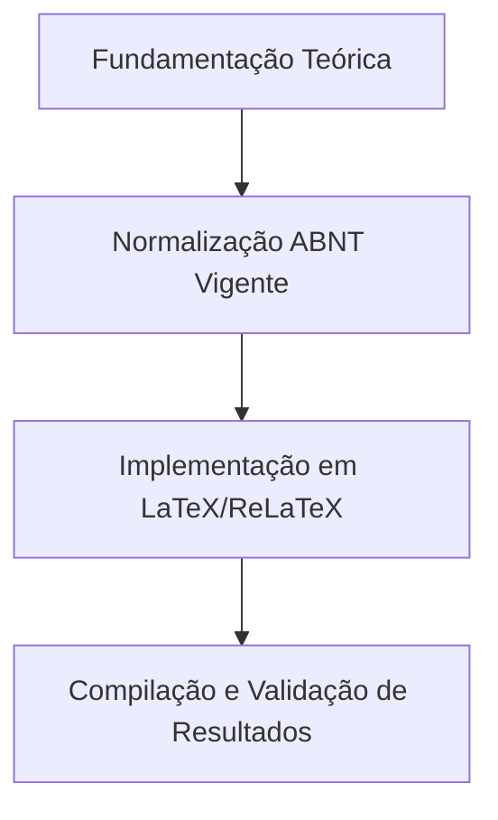

  
⬅️ <b><a href="/pt-br/resource">Aula Anterior</a></b>

  
🏠 <b><a href="/pt-br/resource">Anotações da Disciplina</a></b>

  
➡️ <b><a href="/pt-br/resource/latex/aula-02-objetivos-taxonomia-de-bloom-e-justificativa">Próxima Aula</a></b>

> [!note] 📦 Material Didático e Recursos da Aula
> ### 📑 Material da Aula
> - 📄 **[Slides LaTeX — Modelo Branco (PDF)](/assets/biblioteca/latex-escrita/slides-latex/aula-01-branco.pdf)** — *Apresentação visual institucional em tema claro.*
> - 📄 **[Slides LaTeX — Modelo Preto (PDF)](/assets/biblioteca/latex-escrita/slides-latex/aula-01-preto.pdf)** — *Apresentação visual institucional em tema escuro.*
> - 📝 **[Notas de Aula Institucionais (PDF)](/assets/biblioteca/latex-escrita/notes-latex/aula-01.pdf)** — *Apostila técnica completa em LaTeX.*
> 
> ### 🌐 Links Externos de Apoio
> - **[CTAN (Comprehensive TeX Archive Network)](https://ctan.org/)** — *Repositório mundial de pacotes TeX.*
> - **[ABNT — Catálogo de Normas Técnicas](https://www.abnt.org.br/)** — *Portal oficial de normas NBR 14724, 10520 e 6023.*
> - **[Overleaf Documentation](https://www.overleaf.com/learn)** — *Guias interativos de compilação TeX.*

## 📋 Sumário Interativo
- [📍 1. Fundamentos e Contextualização](#-1-fundamentos-e-contextualização)
- [📍 2. Conceitos-Chave e Normas ABNT](#-2-conceitos-chave-e-normas-abnt)
- [📍 3. Aplicação Prática no Ecossistema ReLaTeX](#-3-aplicação-prática-no-ecossistema-relatex)
- [🔗 Aulas Correlatas & Conexões](#-aulas-correlatas--conexões)
- [📚 Referências Bibliográficas](#-referências-bibliográficas)

## 📖 Conteúdo da Aula

Esta aula inaugura a formação estabelecendo os fundamentos epistemológicos da pesquisa científica. Aborda-se a transição do senso comum para o conhecimento científico, a formulação rigorosa da problematização e a construção de hipóteses testáveis.

### 📍 1. Fundamentos Epistemológicos e Método Científico

A ciência caracteriza-se pela busca sistemática da verdade por meio de métodos verificáveis e reprodutíveis. Investigam-se as correntes epistemológicas (empirismo, racionalismo, positivismo e falseacionismo de Karl Popper) e a estrutura lógica do raciocínio dedutivo e indutivo aplicado à Engenharia de Computação.

### 📍 2. Problematização e Explicitação da Lacuna de Pesquisa (*Research Gap*)

Um problema de pesquisa científico não se confunde com uma dificuldade operacional. Deve ser formulado sob a forma de pergunta clara, delimitada no tempo e no espaço, e fundamentada na literatura existente. A lacuna de pesquisa representa a fronteira do conhecimento que o trabalho busca expandir.

### 📍 3. Formulação e Testabilidade de Hipóteses

As hipóteses são respostas provisórias ao problema formulado. Em projetos tecnológicos, as hipóteses definem as premissas de desempenho, acurácia ou eficiência de um algoritmo ou arquitetura de hardware/software, devendo obrigatoriamente ser empiricamente testáveis.

### 📊 Fluxograma Metodológico da Aula (Mermaid)

## 🔗 Aulas Correlatas & Conexões

Esta aula conecta-se transversalmente aos seguintes tópicos da formação em LaTeX & Escrita Acadêmica:

- 🔗 **[[pt-br/resource/latex/aula-02-objetivos-taxonomia-de-bloom-e-justificativa|Aula 02: Objetivos, Taxonomia de Bloom e Justificativa]]**
- 🔗 **[[pt-br/resource/latex/aula-05-introducao-contextualizacao-e-lacuna-de-pesquisa|Aula 05: Introdução e Lacuna de Pesquisa (*Research Gap*)]]**

## 📚 Referências Bibliográficas

- ASSOCIAÇÃO BRASILEIRA DE NORMAS TÉCNICAS. **ABNT NBR 14724**: Informação e documentação — Trabalhos acadêmicos — Apresentação. Rio de Janeiro: ABNT, 2011.
- ASSOCIAÇÃO BRASILEIRA DE NORMAS TÉCNICAS. **ABNT NBR 10520**: Informação e documentação — Citações em documentos — Apresentação. Rio de Janeiro: ABNT, 2023.
- ASSOCIAÇÃO BRASILEIRA DE NORMAS TÉCNICAS. **ABNT NBR 6023**: Informação e documentação — Referências — Elaboração. Rio de Janeiro: ABNT, 2018.

  
⬅️ <b><a href="/pt-br/resource">Aula Anterior</a></b>

  
🏠 <b><a href="/pt-br/resource">Anotações da Disciplina</a></b>

  
➡️ <b><a href="/pt-br/resource/latex/aula-02-objetivos-taxonomia-de-bloom-e-justificativa">Próxima Aula</a></b>

