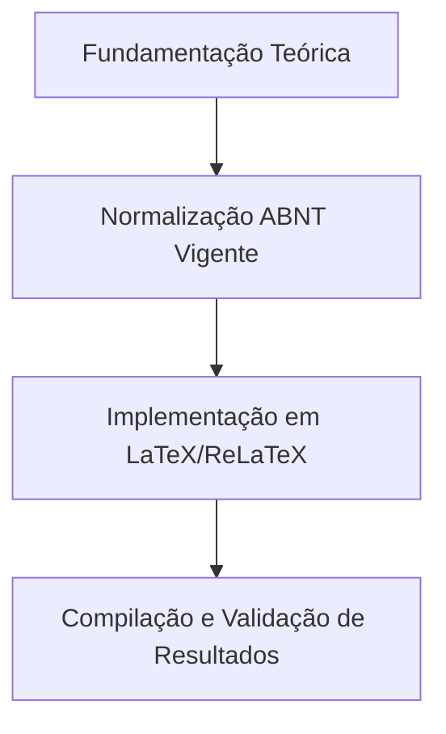

  
⬅️ <b><a href="/pt-br/resource/latex/aula-01-epistemologia-problematizacao-e-hipoteses">Aula Anterior</a></b>

  
🏠 <b><a href="/pt-br/resource">Anotações da Disciplina</a></b>

  
➡️ <b><a href="/pt-br/resource/latex/aula-03-resumo-abstract-e-palavras-chave-nbr-6028">Próxima Aula</a></b>

> [!note] 📦 Material Didático e Recursos da Aula
> ### 📑 Material da Aula
> - 📄 **[Slides LaTeX — Modelo Branco (PDF)](/assets/biblioteca/latex-escrita/slides-latex/aula-02-branco.pdf)** — *Apresentação visual institucional em tema claro.*
> - 📄 **[Slides LaTeX — Modelo Preto (PDF)](/assets/biblioteca/latex-escrita/slides-latex/aula-02-preto.pdf)** — *Apresentação visual institucional em tema escuro.*
> - 📝 **[Notas de Aula Institucionais (PDF)](/assets/biblioteca/latex-escrita/notes-latex/aula-02.pdf)** — *Apostila técnica completa em LaTeX.*
> 
> ### 🌐 Links Externos de Apoio
> - **[CTAN (Comprehensive TeX Archive Network)](https://ctan.org/)** — *Repositório mundial de pacotes TeX.*
> - **[ABNT — Catálogo de Normas Técnicas](https://www.abnt.org.br/)** — *Portal oficial de normas NBR 14724, 10520 e 6023.*
> - **[Overleaf Documentation](https://www.overleaf.com/learn)** — *Guias interativos de compilação TeX.*

## 📋 Sumário Interativo
- [📍 1. Fundamentos e Contextualização](#-1-fundamentos-e-contextualização)
- [📍 2. Conceitos-Chave e Normas ABNT](#-2-conceitos-chave-e-normas-abnt)
- [📍 3. Aplicação Prática no Ecossistema ReLaTeX](#-3-aplicação-prática-no-ecossistema-relatex)
- [🔗 Aulas Correlatas & Conexões](#-aulas-correlatas--conexões)
- [📚 Referências Bibliográficas](#-referências-bibliográficas)

## 📖 Conteúdo da Aula

Análise analítica da estruturação do Objetivo Geral e Objetivos Específicos. Utilização dos domínios cognitivos da Taxonomia de Bloom Revisada (Marzano/Bloom) e construção da justificativa com impactos científico, tecnológico e socioeconômico.

### 📍 1. Definição do Objetivo Geral e Escopo da Investigação

O objetivo geral síntese o propósito central do trabalho e responde diretamente à problematização formulada. Deve iniciar obrigatoriamente com um verbo no infinitivo no nível cognitivo mais elevado pretendido pela pesquisa (ex: *Desenvolver*, *Analisar*, *Propor*).

### 📍 2. Taxonomia de Bloom Revisada e Níveis Cognitivos

A Taxonomia de Bloom categoriza os verbos em seis níveis de complexidade crescente: *Lembrar*, *Entender*, *Aplicar*, *Analisar*, *Avaliar* e *Criar*. Os objetivos específicos devem refletir a sequência lógica do método (ex: mapear a literatura, projetar a arquitetura, implementar o protótipo, validar os resultados).

### 📍 3. Construção da Justificativa da Pesquisa

A justificativa demonstra a relevância teórica e prática do projeto. Em Engenharia, deve explicitar a viabilidade técnica, o impacto socioeconômico, a inovação tecnológica e o alinhamento com as linhas de pesquisa institucionais do IFF.

### 📊 Fluxograma Metodológico da Aula (Mermaid)

## 🔗 Aulas Correlatas & Conexões

Esta aula conecta-se transversalmente aos seguintes tópicos da formação em LaTeX & Escrita Acadêmica:

- 🔗 **[[pt-br/resource/latex/aula-01-epistemologia-problematizacao-e-hipoteses|Aula 01: Epistemologia, Problematização e Hipóteses]]**
- 🔗 **[[pt-br/resource/latex/aula-05-introducao-contextualizacao-e-lacuna-de-pesquisa|Aula 05: Introdução e Lacuna de Pesquisa (*Research Gap*)]]**

## 📚 Referências Bibliográficas

- ASSOCIAÇÃO BRASILEIRA DE NORMAS TÉCNICAS. **ABNT NBR 14724**: Informação e documentação — Trabalhos acadêmicos — Apresentação. Rio de Janeiro: ABNT, 2011.
- ASSOCIAÇÃO BRASILEIRA DE NORMAS TÉCNICAS. **ABNT NBR 10520**: Informação e documentação — Citações em documentos — Apresentação. Rio de Janeiro: ABNT, 2023.
- ASSOCIAÇÃO BRASILEIRA DE NORMAS TÉCNICAS. **ABNT NBR 6023**: Informação e documentação — Referências — Elaboração. Rio de Janeiro: ABNT, 2018.

  
⬅️ <b><a href="/pt-br/resource/latex/aula-01-epistemologia-problematizacao-e-hipoteses">Aula Anterior</a></b>

  
🏠 <b><a href="/pt-br/resource">Anotações da Disciplina</a></b>

  
➡️ <b><a href="/pt-br/resource/latex/aula-03-resumo-abstract-e-palavras-chave-nbr-6028">Próxima Aula</a></b>

