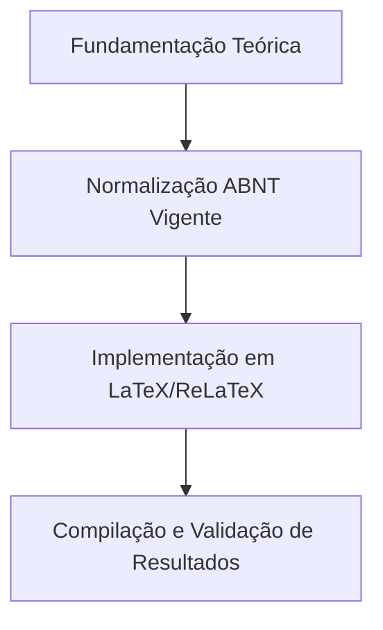

  
⬅️ <b><a href="/pt-br/resource/latex/aula-02-objetivos-taxonomia-de-bloom-e-justificativa">Aula Anterior</a></b>

  
🏠 <b><a href="/pt-br/resource">Anotações da Disciplina</a></b>

  
➡️ <b><a href="/pt-br/resource/latex/aula-04-elementos-pre-textuais-nbr-14724">Próxima Aula</a></b>

> [!note] 📦 Material Didático e Recursos da Aula
> ### 📑 Material da Aula
> - 📄 **[Slides LaTeX — Modelo Branco (PDF)](/assets/biblioteca/latex-escrita/slides-latex/aula-03-branco.pdf)** — *Apresentação visual institucional em tema claro.*
> - 📄 **[Slides LaTeX — Modelo Preto (PDF)](/assets/biblioteca/latex-escrita/slides-latex/aula-03-preto.pdf)** — *Apresentação visual institucional em tema escuro.*
> - 📝 **[Notas de Aula Institucionais (PDF)](/assets/biblioteca/latex-escrita/notes-latex/aula-03.pdf)** — *Apostila técnica completa em LaTeX.*
> 
> ### 🌐 Links Externos de Apoio
> - **[CTAN (Comprehensive TeX Archive Network)](https://ctan.org/)** — *Repositório mundial de pacotes TeX.*
> - **[ABNT — Catálogo de Normas Técnicas](https://www.abnt.org.br/)** — *Portal oficial de normas NBR 14724, 10520 e 6023.*
> - **[Overleaf Documentation](https://www.overleaf.com/learn)** — *Guias interativos de compilação TeX.*

## 📋 Sumário Interativo
- [📍 1. Fundamentos e Contextualização](#-1-fundamentos-e-contextualização)
- [📍 2. Conceitos-Chave e Normas ABNT](#-2-conceitos-chave-e-normas-abnt)
- [📍 3. Aplicação Prática no Ecossistema ReLaTeX](#-3-aplicação-prática-no-ecossistema-relatex)
- [🔗 Aulas Correlatas & Conexões](#-aulas-correlatas--conexões)
- [📚 Referências Bibliográficas](#-referências-bibliográficas)

## 📖 Conteúdo da Aula

Estudo aprofundado das exigências formais da ABNT NBR 6028:2021 para redação de resumos acadêmicos (informativos e estruturados), tradução para o inglês (*Abstract*) e seleção vocabular de palavras-chave baseadas em vocabulários controlados.

### 📍 1. Estrutura Canônica do Resumo Informativo (ABNT NBR 6028)

O resumo informativo deve conter de 150 a 500 palavras em parágrafo único, sem recuo de primeira linha, utilizando voz ativa e terceira pessoa do singular. Deve contemplar obrigatoriamente: Contexto/Problema, Objetivo Geral, Metodologia Utilizada, Principais Resultados e Conclusão.

### 📍 2. Versão em Língua Estrangeira (Abstract / Resumen)

O *Abstract* é a versão fiel do resumo em inglês. Discute-se a sobriedade sintática, terminologia técnica em computação e a proibição de tradutores automáticos literais sem revisão conceitual discente.

### 📍 3. Seleção de Palavras-Chave e Vocabulários Controlados

As palavras-chave devem ser separadas entre si por ponto e vírgula (;) e finalizadas por ponto (ex: *LaTeX; Escrita Científica; Automação Documental.*). Recomenda-se o uso de descritores estabelecidos na área de Ciência da Computação.

### 📊 Fluxograma Metodológico da Aula (Mermaid)

## 🔗 Aulas Correlatas & Conexões

Esta aula conecta-se transversalmente aos seguintes tópicos da formação em LaTeX & Escrita Acadêmica:

- 🔗 **[[pt-br/resource/latex/aula-04-elementos-pre-textuais-nbr-14724|Aula 04: Elementos Pré-Textuais NBR 14724]]**
- 🔗 **[[pt-br/resource/latex/aula-10-discussao-citacoes-nbr-10520-e-referencias-nbr-6023|Aula 10: Discussão, Citações (10520) e Referências (6023)]]**

## 📚 Referências Bibliográficas

- ASSOCIAÇÃO BRASILEIRA DE NORMAS TÉCNICAS. **ABNT NBR 14724**: Informação e documentação — Trabalhos acadêmicos — Apresentação. Rio de Janeiro: ABNT, 2011.
- ASSOCIAÇÃO BRASILEIRA DE NORMAS TÉCNICAS. **ABNT NBR 10520**: Informação e documentação — Citações em documentos — Apresentação. Rio de Janeiro: ABNT, 2023.
- ASSOCIAÇÃO BRASILEIRA DE NORMAS TÉCNICAS. **ABNT NBR 6023**: Informação e documentação — Referências — Elaboração. Rio de Janeiro: ABNT, 2018.

  
⬅️ <b><a href="/pt-br/resource/latex/aula-02-objetivos-taxonomia-de-bloom-e-justificativa">Aula Anterior</a></b>

  
🏠 <b><a href="/pt-br/resource">Anotações da Disciplina</a></b>

  
➡️ <b><a href="/pt-br/resource/latex/aula-04-elementos-pre-textuais-nbr-14724">Próxima Aula</a></b>

