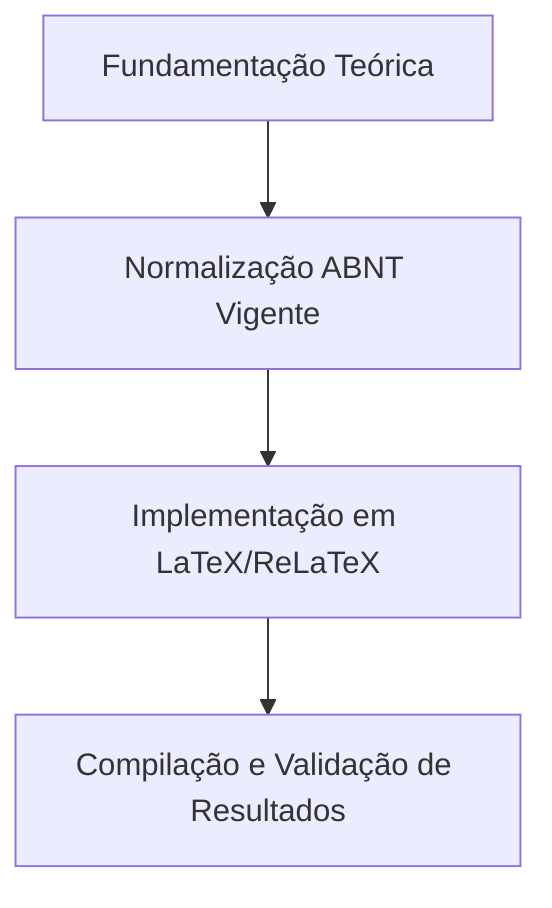

  
⬅️ <b><a href="/pt-br/resource/latex/aula-03-resumo-abstract-e-palavras-chave-nbr-6028">Aula Anterior</a></b>

  
🏠 <b><a href="/pt-br/resource">Anotações da Disciplina</a></b>

  
➡️ <b><a href="/pt-br/resource/latex/aula-05-introducao-contextualizacao-e-lacuna-de-pesquisa">Próxima Aula</a></b>

> [!note] 📦 Material Didático e Recursos da Aula
> ### 📑 Material da Aula
> - 📄 **[Slides LaTeX — Modelo Branco (PDF)](/assets/biblioteca/latex-escrita/slides-latex/aula-04-branco.pdf)** — *Apresentação visual institucional em tema claro.*
> - 📄 **[Slides LaTeX — Modelo Preto (PDF)](/assets/biblioteca/latex-escrita/slides-latex/aula-04-preto.pdf)** — *Apresentação visual institucional em tema escuro.*
> - 📝 **[Notas de Aula Institucionais (PDF)](/assets/biblioteca/latex-escrita/notes-latex/aula-04.pdf)** — *Apostila técnica completa em LaTeX.*
> 
> ### 🌐 Links Externos de Apoio
> - **[CTAN (Comprehensive TeX Archive Network)](https://ctan.org/)** — *Repositório mundial de pacotes TeX.*
> - **[ABNT — Catálogo de Normas Técnicas](https://www.abnt.org.br/)** — *Portal oficial de normas NBR 14724, 10520 e 6023.*
> - **[Overleaf Documentation](https://www.overleaf.com/learn)** — *Guias interativos de compilação TeX.*

## 📋 Sumário Interativo
- [📍 1. Fundamentos e Contextualização](#-1-fundamentos-e-contextualização)
- [📍 2. Conceitos-Chave e Normas ABNT](#-2-conceitos-chave-e-normas-abnt)
- [📍 3. Aplicação Prática no Ecossistema ReLaTeX](#-3-aplicação-prática-no-ecossistema-relatex)
- [🔗 Aulas Correlatas & Conexões](#-aulas-correlatas--conexões)
- [📚 Referências Bibliográficas](#-referências-bibliográficas)

## 📖 Conteúdo da Aula

Engenharia de construção dos elementos pré-textuais da monografia: Capa, Folha de Rosto, Folha de Aprovação, Dedicatória, Agradecimentos, Epígrafe, Listas (Figuras, Tabelas, Algoritmos, Siglas) e Sumário.

### 📍 1. Elementos Obrigatórios vs. Opcionais

A ABNT NBR 14724 especifica rigorosamente a ordem dos elementos pré-textuais. São obrigatórios: Capa, Folha de Rosto, Folha de Aprovação, Resumo, Abstract e Sumário. Os demais elementos (Lombada, Errata, Dedicatória, Agradecimentos, Listas) são opcionais ou condicionais.

### 📍 2. Formatação da Folha de Rosto e Aprovação na `ifftese.cls`

A folha de rosto deve conter a natureza do trabalho, objetivo, nome da instituição e área de concentração alinhados a partir do meio da página à direita. A classe `ifftese.cls` automatiza essa diagramação via metadados.

### 📍 3. Geração Automática do Sumário (NBR 6027)

O sumário reflete a divisão das seções primárias, secundárias e terciárias com a numeração progressiva (NBR 6024). Em LaTeX, é gerado dinamicamente com o comando `\tableofcontents`.

### 📊 Fluxograma Metodológico da Aula (Mermaid)

## 🔗 Aulas Correlatas & Conexões

Esta aula conecta-se transversalmente aos seguintes tópicos da formação em LaTeX & Escrita Acadêmica:

- 🔗 **[[pt-br/resource/latex/aula-03-resumo-abstract-e-palavras-chave-nbr-6028|Aula 03: Resumo, Abstract e Palavras-Chave (NBR 6028:2021)]]**
- 🔗 **[[pt-br/resource/latex/aula-17-engenharia-da-classe-ifftese-cls|Aula 17: Engenharia de Classes .cls - Anatomia da ifftese e abntex2]]**

## 📚 Referências Bibliográficas

- ASSOCIAÇÃO BRASILEIRA DE NORMAS TÉCNICAS. **ABNT NBR 14724**: Informação e documentação — Trabalhos acadêmicos — Apresentação. Rio de Janeiro: ABNT, 2011.
- ASSOCIAÇÃO BRASILEIRA DE NORMAS TÉCNICAS. **ABNT NBR 10520**: Informação e documentação — Citações em documentos — Apresentação. Rio de Janeiro: ABNT, 2023.
- ASSOCIAÇÃO BRASILEIRA DE NORMAS TÉCNICAS. **ABNT NBR 6023**: Informação e documentação — Referências — Elaboração. Rio de Janeiro: ABNT, 2018.

  
⬅️ <b><a href="/pt-br/resource/latex/aula-03-resumo-abstract-e-palavras-chave-nbr-6028">Aula Anterior</a></b>

  
🏠 <b><a href="/pt-br/resource">Anotações da Disciplina</a></b>

  
➡️ <b><a href="/pt-br/resource/latex/aula-05-introducao-contextualizacao-e-lacuna-de-pesquisa">Próxima Aula</a></b>

