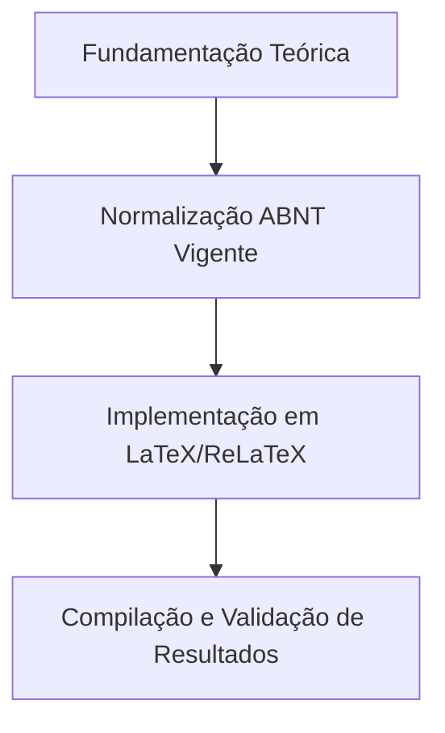

  
⬅️ <b><a href="/pt-br/resource/latex/aula-06-revisao-sistematica-da-literatura-e-protocolo-prisma">Aula Anterior</a></b>

  
🏠 <b><a href="/pt-br/resource">Anotações da Disciplina</a></b>

  
➡️ <b><a href="/pt-br/resource/latex/aula-08-etica-plataforma-brasil-e-uso-de-ia">Próxima Aula</a></b>

> [!note] 📦 Material Didático e Recursos da Aula
> ### 📑 Material da Aula
> - 📄 **[Slides LaTeX — Modelo Branco (PDF)](/assets/biblioteca/latex-escrita/slides-latex/aula-07-branco.pdf)** — *Apresentação visual institucional em tema claro.*
> - 📄 **[Slides LaTeX — Modelo Preto (PDF)](/assets/biblioteca/latex-escrita/slides-latex/aula-07-preto.pdf)** — *Apresentação visual institucional em tema escuro.*
> - 📝 **[Notas de Aula Institucionais (PDF)](/assets/biblioteca/latex-escrita/notes-latex/aula-07.pdf)** — *Apostila técnica completa em LaTeX.*
> 
> ### 🌐 Links Externos de Apoio
> - **[CTAN (Comprehensive TeX Archive Network)](https://ctan.org/)** — *Repositório mundial de pacotes TeX.*
> - **[ABNT — Catálogo de Normas Técnicas](https://www.abnt.org.br/)** — *Portal oficial de normas NBR 14724, 10520 e 6023.*
> - **[Overleaf Documentation](https://www.overleaf.com/learn)** — *Guias interativos de compilação TeX.*

## 📋 Sumário Interativo
- [📍 1. Fundamentos e Contextualização](#-1-fundamentos-e-contextualização)
- [📍 2. Conceitos-Chave e Normas ABNT](#-2-conceitos-chave-e-normas-abnt)
- [📍 3. Aplicação Prática no Ecossistema ReLaTeX](#-3-aplicação-prática-no-ecossistema-relatex)
- [🔗 Aulas Correlatas & Conexões](#-aulas-correlatas--conexões)
- [📚 Referências Bibliográficas](#-referências-bibliográficas)

## 📖 Conteúdo da Aula

Redação da Seção de Metodologia/Materiais e Métodos. Princípios de reprodutibilidade científica, detalhamento de bancadas de teste, conjuntos de dados (*datasets*), métricas de avaliação e arquitetura de hardware e software.

### 📍 1. Caracterização da Pesquisa e Tipologia Metodológica

Classificação quanto à natureza (básica/aplicada), abordagem (qualitativa/quantitativa), objetivos (exploratória/descritiva/explicativa) e procedimentos (experimental, estudo de caso, pesquisa-ação).

### 📍 2. Descrição de Materiais, Equipamentos e Datasets

Detalhamento de especificações técnicas de hardware (processadores, memória, placas gráficas GPU), software (versões de sistemas operacionais, linguagens de programação, bibliotecas) e conjuntos de dados abertos.

### 📍 3. Métricas de Desempenho e Validação Reprodutível

Definição formal das métricas matemáticas de avaliação (Acurácia, Precisão, Pontuação F1, Tempo de Execução, Consumo de Memória, Throughput) e protocolo de replicação experimental.

### 📊 Fluxograma Metodológico da Aula (Mermaid)

## 🔗 Aulas Correlatas & Conexões

Esta aula conecta-se transversalmente aos seguintes tópicos da formação em LaTeX & Escrita Acadêmica:

- 🔗 **[[pt-br/resource/latex/aula-06-revisao-sistematica-da-literatura-e-protocolo-prisma|Aula 06: Revisão Sistemática da Literatura e Protocolo PRISMA 2020]]**
- 🔗 **[[pt-br/resource/latex/aula-09-resultados-tabelas-ibge-vs-quadros-abnt|Aula 09: Resultados: Tabelas IBGE vs. Quadros ABNT]]**

## 📚 Referências Bibliográficas

- ASSOCIAÇÃO BRASILEIRA DE NORMAS TÉCNICAS. **ABNT NBR 14724**: Informação e documentação — Trabalhos acadêmicos — Apresentação. Rio de Janeiro: ABNT, 2011.
- ASSOCIAÇÃO BRASILEIRA DE NORMAS TÉCNICAS. **ABNT NBR 10520**: Informação e documentação — Citações em documentos — Apresentação. Rio de Janeiro: ABNT, 2023.
- ASSOCIAÇÃO BRASILEIRA DE NORMAS TÉCNICAS. **ABNT NBR 6023**: Informação e documentação — Referências — Elaboração. Rio de Janeiro: ABNT, 2018.

  
⬅️ <b><a href="/pt-br/resource/latex/aula-06-revisao-sistematica-da-literatura-e-protocolo-prisma">Aula Anterior</a></b>

  
🏠 <b><a href="/pt-br/resource">Anotações da Disciplina</a></b>

  
➡️ <b><a href="/pt-br/resource/latex/aula-08-etica-plataforma-brasil-e-uso-de-ia">Próxima Aula</a></b>

