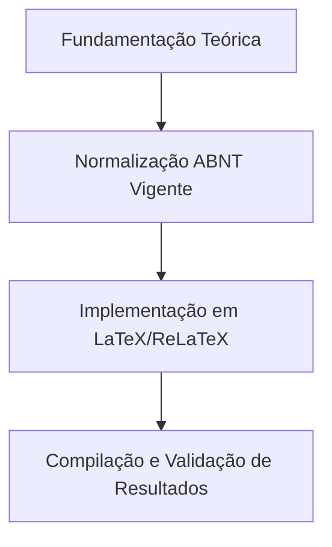

  
⬅️ <b><a href="/pt-br/resource/latex/aula-07-metodologia-materiais-e-reprodutibilidade">Aula Anterior</a></b>

  
🏠 <b><a href="/pt-br/resource">Anotações da Disciplina</a></b>

  
➡️ <b><a href="/pt-br/resource/latex/aula-09-resultados-tabelas-ibge-vs-quadros-abnt">Próxima Aula</a></b>

> [!note] 📦 Material Didático e Recursos da Aula
> ### 📑 Material da Aula
> - 📄 **[Slides LaTeX — Modelo Branco (PDF)](/assets/biblioteca/latex-escrita/slides-latex/aula-08-branco.pdf)** — *Apresentação visual institucional em tema claro.*
> - 📄 **[Slides LaTeX — Modelo Preto (PDF)](/assets/biblioteca/latex-escrita/slides-latex/aula-08-preto.pdf)** — *Apresentação visual institucional em tema escuro.*
> - 📝 **[Notas de Aula Institucionais (PDF)](/assets/biblioteca/latex-escrita/notes-latex/aula-08.pdf)** — *Apostila técnica completa em LaTeX.*
> 
> ### 🌐 Links Externos de Apoio
> - **[CTAN (Comprehensive TeX Archive Network)](https://ctan.org/)** — *Repositório mundial de pacotes TeX.*
> - **[ABNT — Catálogo de Normas Técnicas](https://www.abnt.org.br/)** — *Portal oficial de normas NBR 14724, 10520 e 6023.*
> - **[Overleaf Documentation](https://www.overleaf.com/learn)** — *Guias interativos de compilação TeX.*

## 📋 Sumário Interativo
- [📍 1. Fundamentos e Contextualização](#-1-fundamentos-e-contextualização)
- [📍 2. Conceitos-Chave e Normas ABNT](#-2-conceitos-chave-e-normas-abnt)
- [📍 3. Aplicação Prática no Ecossistema ReLaTeX](#-3-aplicação-prática-no-ecossistema-relatex)
- [🔗 Aulas Correlatas & Conexões](#-aulas-correlatas--conexões)
- [📚 Referências Bibliográficas](#-referências-bibliográficas)

## 📖 Conteúdo da Aula

Aspectos éticos da investigação científica em seres humanos e processamento de dados discentes/usuarios. Tramitação na Plataforma Brasil (CEP/CONEP) e regimento institucional de uso transparente de Inteligência Artificial Generativa.

### 📍 1. Comitê de Ética em Pesquisa (CEP/CONEP) e Termo TCLE

Regulamentação das pesquisas envolvendo seres humanos (testes de usabilidade, questionários, testes de interface de software). Confecção do Termo de Consentimento Livre e Esclarecido (TCLE).

### 📍 2. Integridade Acadêmica: Prevenção ao Plágio e Autoplágio

Análise jurídica e acadêmica sobre violação de direitos autorais. Ferramentas automatizadas de detecção de similaridade e técnicas de paráfrase com citação compulsória.

### 📍 3. Diretrizes Institucionais para Uso de IA (LLMs)

Regramento do uso de modelos de linguagem (ChatGPT, Claude, Gemini) na escrita acadêmica: proibição de autoria por IA, obrigatoriedade de declaração de uso na metodologia e atribuição dos resultados gerados.

### 📊 Fluxograma Metodológico da Aula (Mermaid)

## 🔗 Aulas Correlatas & Conexões

Esta aula conecta-se transversalmente aos seguintes tópicos da formação em LaTeX & Escrita Acadêmica:

- 🔗 **[[pt-br/resource/latex/aula-01-epistemologia-problematizacao-e-hipoteses|Aula 01: Epistemologia, Problematização e Hipóteses]]**
- 🔗 **[[pt-br/resource/latex/aula-10-discussao-citacoes-nbr-10520-e-referencias-nbr-6023|Aula 10: Discussão, Citações (10520) e Referências (6023)]]**

## 📚 Referências Bibliográficas

- ASSOCIAÇÃO BRASILEIRA DE NORMAS TÉCNICAS. **ABNT NBR 14724**: Informação e documentação — Trabalhos acadêmicos — Apresentação. Rio de Janeiro: ABNT, 2011.
- ASSOCIAÇÃO BRASILEIRA DE NORMAS TÉCNICAS. **ABNT NBR 10520**: Informação e documentação — Citações em documentos — Apresentação. Rio de Janeiro: ABNT, 2023.
- ASSOCIAÇÃO BRASILEIRA DE NORMAS TÉCNICAS. **ABNT NBR 6023**: Informação e documentação — Referências — Elaboração. Rio de Janeiro: ABNT, 2018.

  
⬅️ <b><a href="/pt-br/resource/latex/aula-07-metodologia-materiais-e-reprodutibilidade">Aula Anterior</a></b>

  
🏠 <b><a href="/pt-br/resource">Anotações da Disciplina</a></b>

  
➡️ <b><a href="/pt-br/resource/latex/aula-09-resultados-tabelas-ibge-vs-quadros-abnt">Próxima Aula</a></b>

