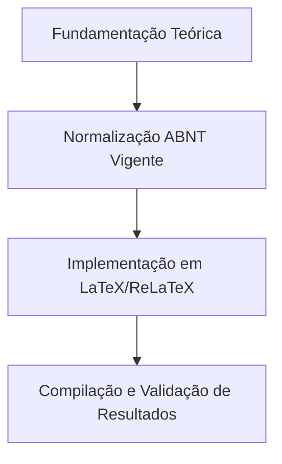

  
⬅️ <b><a href="/pt-br/resource/latex/aula-09-resultados-tabelas-ibge-vs-quadros-abnt">Aula Anterior</a></b>

  
🏠 <b><a href="/pt-br/resource">Anotações da Disciplina</a></b>

  
➡️ <b><a href="/pt-br/resource/latex/aula-11-arquitetura-latex-motores-tex-e-preambulo-tex">Próxima Aula</a></b>

> [!note] 📦 Material Didático e Recursos da Aula
> ### 📑 Material da Aula
> - 📄 **[Slides LaTeX — Modelo Branco (PDF)](/assets/biblioteca/latex-escrita/slides-latex/aula-10-branco.pdf)** — *Apresentação visual institucional em tema claro.*
> - 📄 **[Slides LaTeX — Modelo Preto (PDF)](/assets/biblioteca/latex-escrita/slides-latex/aula-10-preto.pdf)** — *Apresentação visual institucional em tema escuro.*
> - 📝 **[Notas de Aula Institucionais (PDF)](/assets/biblioteca/latex-escrita/notes-latex/aula-10.pdf)** — *Apostila técnica completa em LaTeX.*
> 
> ### 🌐 Links Externos de Apoio
> - **[CTAN (Comprehensive TeX Archive Network)](https://ctan.org/)** — *Repositório mundial de pacotes TeX.*
> - **[ABNT — Catálogo de Normas Técnicas](https://www.abnt.org.br/)** — *Portal oficial de normas NBR 14724, 10520 e 6023.*
> - **[Overleaf Documentation](https://www.overleaf.com/learn)** — *Guias interativos de compilação TeX.*

## 📋 Sumário Interativo
- [📍 1. Fundamentos e Contextualização](#-1-fundamentos-e-contextualização)
- [📍 2. Conceitos-Chave e Normas ABNT](#-2-conceitos-chave-e-normas-abnt)
- [📍 3. Aplicação Prática no Ecossistema ReLaTeX](#-3-aplicação-prática-no-ecossistema-relatex)
- [🔗 Aulas Correlatas & Conexões](#-aulas-correlatas--conexões)
- [📚 Referências Bibliográficas](#-referências-bibliográficas)

## 📖 Conteúdo da Aula

Sintaxe e regras atualizadas de Citações (ABNT NBR 10520:2023) e Elaboração de Referências Bibliográficas (ABNT NBR 6023:2018). Citações diretas curtas/longas, indiretas e citação de citação (*apud*).

### 📍 1. Atualizações da ABNT NBR 10520:2023 (Citações)

A nova norma padronizou o autor entre parênteses em caixa mista: `(Silva, 2023)` em vez do antigo `(SILVA, 2023)`. Citações diretas com mais de 3 linhas devem ter recuo de 4 cm da margem esquerda, fonte menor e sem aspas.

### 📍 2. Tipologias de Citação: Indireta e Citação de Citação (*apud*)

A citação indireta reproduz a ideia do autor com palavras próprias do discente. A citação de citação (*apud*) deve ser evitada e utilizada estritamente quando o documento original for inacessível.

### 📍 3. Elaboração de Referências Bibliográficas (ABNT NBR 6023:2018)

Regras de ordenação alfabética, elementos essenciais (Autor, Título em negrito, Edição, Local, Editora, Data) e complementares (DOI, URL de acesso e data de citação).

### 📊 Fluxograma Metodológico da Aula (Mermaid)

## 🔗 Aulas Correlatas & Conexões

Esta aula conecta-se transversalmente aos seguintes tópicos da formação em LaTeX & Escrita Acadêmica:

- 🔗 **[[pt-br/resource/latex/aula-03-resumo-abstract-e-palavras-chave-nbr-6028|Aula 03: Resumo, Abstract e Palavras-Chave (NBR 6028:2021)]]**
- 🔗 **[[pt-br/resource/latex/aula-13-modularizacao-multi-arquivo-e-biblatex-biber|Aula 13: Modularização Multi-arquivo e Gestão Bibliográfica com biblatex-biber]]**

## 📚 Referências Bibliográficas

- ASSOCIAÇÃO BRASILEIRA DE NORMAS TÉCNICAS. **ABNT NBR 14724**: Informação e documentação — Trabalhos acadêmicos — Apresentação. Rio de Janeiro: ABNT, 2011.
- ASSOCIAÇÃO BRASILEIRA DE NORMAS TÉCNICAS. **ABNT NBR 10520**: Informação e documentação — Citações em documentos — Apresentação. Rio de Janeiro: ABNT, 2023.
- ASSOCIAÇÃO BRASILEIRA DE NORMAS TÉCNICAS. **ABNT NBR 6023**: Informação e documentação — Referências — Elaboração. Rio de Janeiro: ABNT, 2018.

  
⬅️ <b><a href="/pt-br/resource/latex/aula-09-resultados-tabelas-ibge-vs-quadros-abnt">Aula Anterior</a></b>

  
🏠 <b><a href="/pt-br/resource">Anotações da Disciplina</a></b>

  
➡️ <b><a href="/pt-br/resource/latex/aula-11-arquitetura-latex-motores-tex-e-preambulo-tex">Próxima Aula</a></b>

