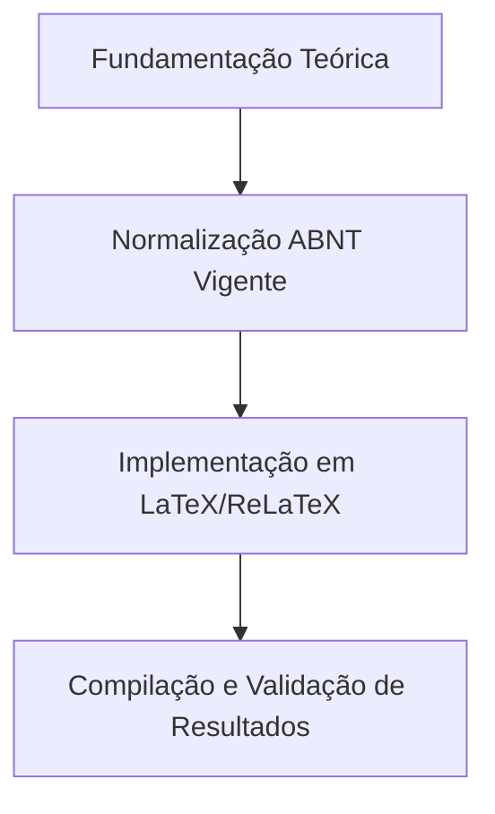

  
⬅️ <b><a href="/pt-br/resource/latex/aula-11-arquitetura-latex-motores-tex-e-preambulo-tex">Aula Anterior</a></b>

  
🏠 <b><a href="/pt-br/resource">Anotações da Disciplina</a></b>

  
➡️ <b><a href="/pt-br/resource/latex/aula-13-modularizacao-multi-arquivo-e-biblatex-biber">Próxima Aula</a></b>

> [!note] 📦 Material Didático e Recursos da Aula
> ### 📑 Material da Aula
> - 📄 **[Slides LaTeX — Modelo Branco (PDF)](/assets/biblioteca/latex-escrita/slides-latex/aula-12-branco.pdf)** — *Apresentação visual institucional em tema claro.*
> - 📄 **[Slides LaTeX — Modelo Preto (PDF)](/assets/biblioteca/latex-escrita/slides-latex/aula-12-preto.pdf)** — *Apresentação visual institucional em tema escuro.*
> - 📝 **[Notas de Aula Institucionais (PDF)](/assets/biblioteca/latex-escrita/notes-latex/aula-12.pdf)** — *Apostila técnica completa em LaTeX.*
> 
> ### 🌐 Links Externos de Apoio
> - **[CTAN (Comprehensive TeX Archive Network)](https://ctan.org/)** — *Repositório mundial de pacotes TeX.*
> - **[ABNT — Catálogo de Normas Técnicas](https://www.abnt.org.br/)** — *Portal oficial de normas NBR 14724, 10520 e 6023.*
> - **[Overleaf Documentation](https://www.overleaf.com/learn)** — *Guias interativos de compilação TeX.*

## 📋 Sumário Interativo
- [📍 1. Fundamentos e Contextualização](#-1-fundamentos-e-contextualização)
- [📍 2. Conceitos-Chave e Normas ABNT](#-2-conceitos-chave-e-normas-abnt)
- [📍 3. Aplicação Prática no Ecossistema ReLaTeX](#-3-aplicação-prática-no-ecossistema-relatex)
- [🔗 Aulas Correlatas & Conexões](#-aulas-correlatas--conexões)
- [📚 Referências Bibliográficas](#-referências-bibliográficas)

## 📖 Conteúdo da Aula

Tipografia matemática de alta precisão. Ambientes `amsmath` (`equation`, `align`, `gather`, `bmatrix`), comandos `mathtools` e construção de tabelas tipograficamente elegantes com o pacote `booktabs` (`\toprule`, `\midrule`, `\bottomrule`).

### 📍 1. Ambientes Matemáticos com `amsmath` e `mathtools`

Formatação de equações numeradas, alinhamento de sistemas com `align` e matrizes com `bmatrix`. Uso de subequações e operadores personalizados com `\DeclareMathOperator`.

### 📍 2. Tabelas Tipográficas Profissionais com `booktabs`

Substituição das bordas verticais pesadas por linhas horizontais com espessura calibrada (`\toprule`, `\midrule`, `\bottomrule`), atendendo rigorosamente às Normas Tabulares do IBGE.

### 📍 3. Alinhamento Numérico com `siunitx`

Formatação de unidades de medida no Sistema Internacional (SI) e alinhamento de decimais em colunas numéricas complexas.

### 📊 Fluxograma Metodológico da Aula (Mermaid)

## 🔗 Aulas Correlatas & Conexões

Esta aula conecta-se transversalmente aos seguintes tópicos da formação em LaTeX & Escrita Acadêmica:

- 🔗 **[[pt-br/resource/latex/aula-09-resultados-tabelas-ibge-vs-quadros-abnt|Aula 09: Resultados: Tabelas IBGE vs. Quadros ABNT]]**
- 🔗 **[[pt-br/resource/latex/aula-14-graficos-vetoriais-tikz-e-pgfplots|Aula 14: Computação Gráfica Vetorial Programável com TikZ e Gráficos PGFPlots]]**

## 📚 Referências Bibliográficas

- ASSOCIAÇÃO BRASILEIRA DE NORMAS TÉCNICAS. **ABNT NBR 14724**: Informação e documentação — Trabalhos acadêmicos — Apresentação. Rio de Janeiro: ABNT, 2011.
- ASSOCIAÇÃO BRASILEIRA DE NORMAS TÉCNICAS. **ABNT NBR 10520**: Informação e documentação — Citações em documentos — Apresentação. Rio de Janeiro: ABNT, 2023.
- ASSOCIAÇÃO BRASILEIRA DE NORMAS TÉCNICAS. **ABNT NBR 6023**: Informação e documentação — Referências — Elaboração. Rio de Janeiro: ABNT, 2018.

  
⬅️ <b><a href="/pt-br/resource/latex/aula-11-arquitetura-latex-motores-tex-e-preambulo-tex">Aula Anterior</a></b>

  
🏠 <b><a href="/pt-br/resource">Anotações da Disciplina</a></b>

  
➡️ <b><a href="/pt-br/resource/latex/aula-13-modularizacao-multi-arquivo-e-biblatex-biber">Próxima Aula</a></b>

