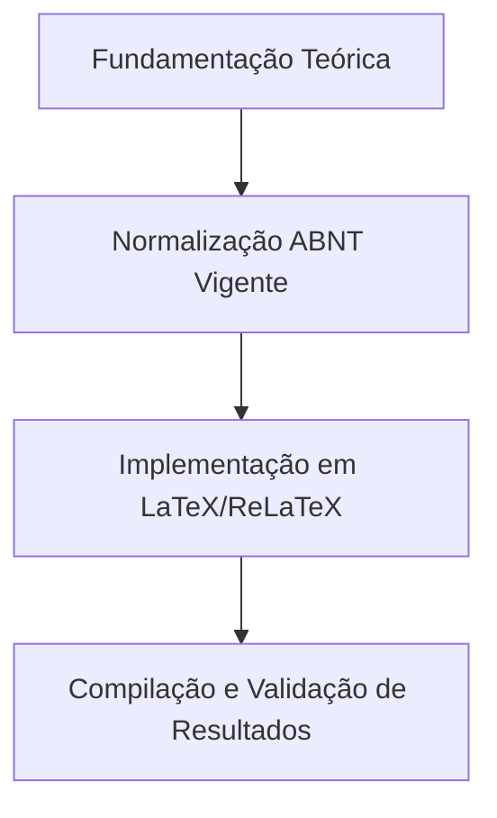

  
⬅️ <b><a href="/pt-br/resource/latex/aula-16-desenvolvimento-de-pacotes-e-macros-sty">Aula Anterior</a></b>

  
🏠 <b><a href="/pt-br/resource">Anotações da Disciplina</a></b>

  
➡️ <b><a href="/pt-br/resource/latex/aula-18-customizacao-de-floats-fancyhdr-e-nbr-6027">Próxima Aula</a></b>

> [!note] 📦 Material Didático e Recursos da Aula
> ### 📑 Material da Aula
> - 📄 **[Slides LaTeX — Modelo Branco (PDF)](/assets/biblioteca/latex-escrita/slides-latex/aula-17-branco.pdf)** — *Apresentação visual institucional em tema claro.*
> - 📄 **[Slides LaTeX — Modelo Preto (PDF)](/assets/biblioteca/latex-escrita/slides-latex/aula-17-preto.pdf)** — *Apresentação visual institucional em tema escuro.*
> - 📝 **[Notas de Aula Institucionais (PDF)](/assets/biblioteca/latex-escrita/notes-latex/aula-17.pdf)** — *Apostila técnica completa em LaTeX.*
> 
> ### 🌐 Links Externos de Apoio
> - **[CTAN (Comprehensive TeX Archive Network)](https://ctan.org/)** — *Repositório mundial de pacotes TeX.*
> - **[ABNT — Catálogo de Normas Técnicas](https://www.abnt.org.br/)** — *Portal oficial de normas NBR 14724, 10520 e 6023.*
> - **[Overleaf Documentation](https://www.overleaf.com/learn)** — *Guias interativos de compilação TeX.*

## 📋 Sumário Interativo
- [📍 1. Fundamentos e Contextualização](#-1-fundamentos-e-contextualização)
- [📍 2. Conceitos-Chave e Normas ABNT](#-2-conceitos-chave-e-normas-abnt)
- [📍 3. Aplicação Prática no Ecossistema ReLaTeX](#-3-aplicação-prática-no-ecossistema-relatex)
- [🔗 Aulas Correlatas & Conexões](#-aulas-correlatas--conexões)
- [📚 Referências Bibliográficas](#-referências-bibliográficas)

## 📖 Conteúdo da Aula

Análise técnica detalhada da engenharia de classes `.cls`. Herança da classe base `abntex2`, sobrescrita de comandos de folha de rosto, personalização de elementos pré-textuais e alinhamento às diretrizes do IFF.

### 📍 1. Arquitetura de Herança de Classe (`\LoadClass`)

Entendimento de como a classe `ifftese.cls` herda as funcionalidades da classe nacional `abntex2` estendendo-a com a identidade visual e regras próprias do IFF Campus Bom Jesus.

### 📍 2. Customização dos Elementos Pré-Textuais Institucionais

Sobrescrita dos métodos `\imprimircapa`, `\imprimirfolhaderosto` e `\imprimirfolhadeaprovacao` com posicionamento preciso de brasões institucionais e caixas de texto.

### 📍 3. Distribuição e Manutenibilidade da Classe

Boas práticas de versionamento da classe institucional no ecossistema ReLaTeX para garantir compatibilidade retroativa entre turmas de graduação.

### 📊 Fluxograma Metodológico da Aula (Mermaid)

## 🔗 Aulas Correlatas & Conexões

Esta aula conecta-se transversalmente aos seguintes tópicos da formação em LaTeX & Escrita Acadêmica:

- 🔗 **[[pt-br/resource/latex/aula-04-elementos-pre-textuais-nbr-14724|Aula 04: Elementos Pré-Textuais NBR 14724]]**
- 🔗 **[[pt-br/resource/latex/aula-15-engenharia-do-arquivo-de-metadados-sty|Aula 15: Engenharia de Metadados: Estrutura de metadados.sty, Escopo e Flexão de Gênero]]**

## 📚 Referências Bibliográficas

- ASSOCIAÇÃO BRASILEIRA DE NORMAS TÉCNICAS. **ABNT NBR 14724**: Informação e documentação — Trabalhos acadêmicos — Apresentação. Rio de Janeiro: ABNT, 2011.
- ASSOCIAÇÃO BRASILEIRA DE NORMAS TÉCNICAS. **ABNT NBR 10520**: Informação e documentação — Citações em documentos — Apresentação. Rio de Janeiro: ABNT, 2023.
- ASSOCIAÇÃO BRASILEIRA DE NORMAS TÉCNICAS. **ABNT NBR 6023**: Informação e documentação — Referências — Elaboração. Rio de Janeiro: ABNT, 2018.

  
⬅️ <b><a href="/pt-br/resource/latex/aula-16-desenvolvimento-de-pacotes-e-macros-sty">Aula Anterior</a></b>

  
🏠 <b><a href="/pt-br/resource">Anotações da Disciplina</a></b>

  
➡️ <b><a href="/pt-br/resource/latex/aula-18-customizacao-de-floats-fancyhdr-e-nbr-6027">Próxima Aula</a></b>

