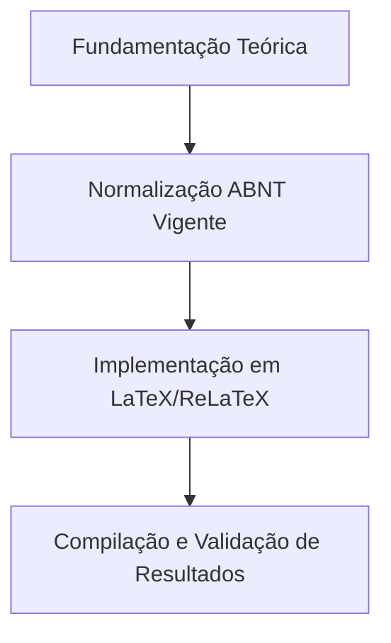

  
⬅️ <b><a href="/pt-br/resource/latex/aula-17-engenharia-da-classe-ifftese-cls">Aula Anterior</a></b>

  
🏠 <b><a href="/pt-br/resource">Anotações da Disciplina</a></b>

  
➡️ <b><a href="/pt-br/resource/latex/aula-19-classes-especializadas-if-beamer-iffposter-relatoriocorp">Próxima Aula</a></b>

> [!note] 📦 Material Didático e Recursos da Aula
> ### 📑 Material da Aula
> - 📄 **[Slides LaTeX — Modelo Branco (PDF)](/assets/biblioteca/latex-escrita/slides-latex/aula-18-branco.pdf)** — *Apresentação visual institucional em tema claro.*
> - 📄 **[Slides LaTeX — Modelo Preto (PDF)](/assets/biblioteca/latex-escrita/slides-latex/aula-18-preto.pdf)** — *Apresentação visual institucional em tema escuro.*
> - 📝 **[Notas de Aula Institucionais (PDF)](/assets/biblioteca/latex-escrita/notes-latex/aula-18.pdf)** — *Apostila técnica completa em LaTeX.*
> 
> ### 🌐 Links Externos de Apoio
> - **[CTAN (Comprehensive TeX Archive Network)](https://ctan.org/)** — *Repositório mundial de pacotes TeX.*
> - **[ABNT — Catálogo de Normas Técnicas](https://www.abnt.org.br/)** — *Portal oficial de normas NBR 14724, 10520 e 6023.*
> - **[Overleaf Documentation](https://www.overleaf.com/learn)** — *Guias interativos de compilação TeX.*

## 📋 Sumário Interativo
- [📍 1. Fundamentos e Contextualização](#-1-fundamentos-e-contextualização)
- [📍 2. Conceitos-Chave e Normas ABNT](#-2-conceitos-chave-e-normas-abnt)
- [📍 3. Aplicação Prática no Ecossistema ReLaTeX](#-3-aplicação-prática-no-ecossistema-relatex)
- [🔗 Aulas Correlatas & Conexões](#-aulas-correlatas--conexões)
- [📚 Referências Bibliográficas](#-referências-bibliográficas)

## 📖 Conteúdo da Aula

Gestão e posicionamento de elementos flutuantes (*floats*: figuras, tabelas, quadros, algoritmos) e controle preciso de cabeçalhos e rodapés com `fancyhdr` conforme a ABNT NBR 6027.

### 📍 1. Mecanismo de Flutuantes do TeX (`[htbp]`)

Parâmetros de posicionamento de figuras e tabelas, controle do parâmetro `\clearpage` e prevenção do problema de acúmulo de flutuantes no final dos capítulos com o pacote `placeins` (`\FloatBarrier`).

### 📍 2. Customização de Cabeçalhos e Rodapés com `fancyhdr`

Formatação das páginas pré-textuais (sem cabeçalho visível, com contagem oculta) e textuais (cabeçalho com número de página alinhado à margem externa direita).

### 📍 3. Criação de Novos Tipos de Flutuantes (`\newfloat`)

Criação de ambientes de flutuantes personalizados para Listas de Algoritmos, Listas de Códigos Fonte (*Listings*) e Listas de Equações.

### 📊 Fluxograma Metodológico da Aula (Mermaid)

## 🔗 Aulas Correlatas & Conexões

Esta aula conecta-se transversalmente aos seguintes tópicos da formação em LaTeX & Escrita Acadêmica:

- 🔗 **[[pt-br/resource/latex/aula-09-resultados-tabelas-ibge-vs-quadros-abnt|Aula 09: Resultados: Tabelas IBGE vs. Quadros ABNT]]**
- 🔗 **[[pt-br/resource/latex/aula-12-sintaxe-matematica-amsmath-e-tabelas-booktabs|Aula 12: Sintaxe Canônica, Ambientes Matemáticos Avançados (amsmath) e Tabelas (booktabs)]]**

## 📚 Referências Bibliográficas

- ASSOCIAÇÃO BRASILEIRA DE NORMAS TÉCNICAS. **ABNT NBR 14724**: Informação e documentação — Trabalhos acadêmicos — Apresentação. Rio de Janeiro: ABNT, 2011.
- ASSOCIAÇÃO BRASILEIRA DE NORMAS TÉCNICAS. **ABNT NBR 10520**: Informação e documentação — Citações em documentos — Apresentação. Rio de Janeiro: ABNT, 2023.
- ASSOCIAÇÃO BRASILEIRA DE NORMAS TÉCNICAS. **ABNT NBR 6023**: Informação e documentação — Referências — Elaboração. Rio de Janeiro: ABNT, 2018.

  
⬅️ <b><a href="/pt-br/resource/latex/aula-17-engenharia-da-classe-ifftese-cls">Aula Anterior</a></b>

  
🏠 <b><a href="/pt-br/resource">Anotações da Disciplina</a></b>

  
➡️ <b><a href="/pt-br/resource/latex/aula-19-classes-especializadas-if-beamer-iffposter-relatoriocorp">Próxima Aula</a></b>

