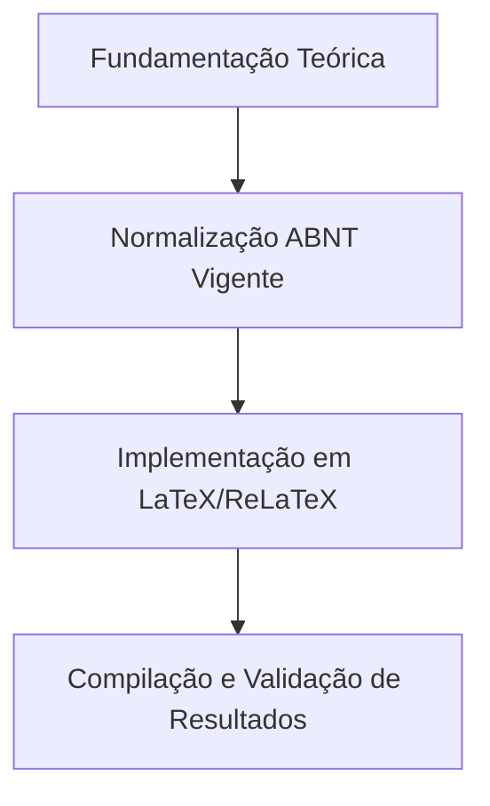

  
⬅️ <b><a href="/pt-br/resource/latex/aula-19-classes-especializadas-if-beamer-iffposter-relatoriocorp">Aula Anterior</a></b>

  
🏠 <b><a href="/pt-br/resource">Anotações da Disciplina</a></b>

  
➡️ <b><a href="/pt-br/resource/latex/codigo-de-conduta-e-diretrizes">Próxima Aula</a></b>

> [!note] 📦 Material Didático e Recursos da Aula
> ### 📑 Material da Aula
> - 📄 **[Slides LaTeX — Modelo Branco (PDF)](/assets/biblioteca/latex-escrita/slides-latex/aula-20-branco.pdf)** — *Apresentação visual institucional em tema claro.*
> - 📄 **[Slides LaTeX — Modelo Preto (PDF)](/assets/biblioteca/latex-escrita/slides-latex/aula-20-preto.pdf)** — *Apresentação visual institucional em tema escuro.*
> - 📝 **[Notas de Aula Institucionais (PDF)](/assets/biblioteca/latex-escrita/notes-latex/aula-20.pdf)** — *Apostila técnica completa em LaTeX.*
> 
> ### 🌐 Links Externos de Apoio
> - **[CTAN (Comprehensive TeX Archive Network)](https://ctan.org/)** — *Repositório mundial de pacotes TeX.*
> - **[ABNT — Catálogo de Normas Técnicas](https://www.abnt.org.br/)** — *Portal oficial de normas NBR 14724, 10520 e 6023.*
> - **[Overleaf Documentation](https://www.overleaf.com/learn)** — *Guias interativos de compilação TeX.*

## 📋 Sumário Interativo
- [📍 1. Fundamentos e Contextualização](#-1-fundamentos-e-contextualização)
- [📍 2. Conceitos-Chave e Normas ABNT](#-2-conceitos-chave-e-normas-abnt)
- [📍 3. Aplicação Prática no Ecossistema ReLaTeX](#-3-aplicação-prática-no-ecossistema-relatex)
- [🔗 Aulas Correlatas & Conexões](#-aulas-correlatas--conexões)
- [📚 Referências Bibliográficas](#-referências-bibliográficas)

## 📖 Conteúdo da Aula

Consolidação da automação tipográfica. Uso do `latexmk` com configurações avançadas (`.latexmkrc`), controle de versão de projetos TeX com Git e pipelines de Integração Contínua (CI/CD) no GitHub Actions para compilação e publicação automática de PDFs.

### 📍 1. Automação de Build com `latexmk` e `.latexmkrc`

Configuração de rotinas de compilação em um único comando (`latexmk -pdf`), gerenciamento de limpeza de temporários (`latexmk -c`) e suporte a LuaLaTeX.

### 📍 2. Boas Práticas de Controle de Versão com Git

Regras de `.gitignore` para ignorar arquivos temporários TeX (`.aux`, `.log`, `.out`, `.toc`, `.bbl`), resolução de conflitos em arquivos de texto e convenções de commit.

### 📍 3. Pipelines de CI/CD para Compilação Automática no GitHub

Criação de workflows GitHub Actions para compilação automatizada da monografia a cada `git push` e disponibilização dos PDFs compilados nos *releases* do repositório.

### 📊 Fluxograma Metodológico da Aula (Mermaid)

## 🔗 Aulas Correlatas & Conexões

Esta aula conecta-se transversalmente aos seguintes tópicos da formação em LaTeX & Escrita Acadêmica:

- 🔗 **[[pt-br/resource/latex/aula-13-modularizacao-multi-arquivo-e-biblatex-biber|Aula 13: Modularização Multi-arquivo e Gestão Bibliográfica com biblatex-biber]]**
- 🔗 **[[pt-br/resource/latex/aula-19-classes-especializadas-if-beamer-iffposter-relatoriocorp|Aula 19: Classes Especializadas (Beamer, Poster e Relatório)]]**

## 📚 Referências Bibliográficas

- ASSOCIAÇÃO BRASILEIRA DE NORMAS TÉCNICAS. **ABNT NBR 14724**: Informação e documentação — Trabalhos acadêmicos — Apresentação. Rio de Janeiro: ABNT, 2011.
- ASSOCIAÇÃO BRASILEIRA DE NORMAS TÉCNICAS. **ABNT NBR 10520**: Informação e documentação — Citações em documentos — Apresentação. Rio de Janeiro: ABNT, 2023.
- ASSOCIAÇÃO BRASILEIRA DE NORMAS TÉCNICAS. **ABNT NBR 6023**: Informação e documentação — Referências — Elaboração. Rio de Janeiro: ABNT, 2018.

  
⬅️ <b><a href="/pt-br/resource/latex/aula-19-classes-especializadas-if-beamer-iffposter-relatoriocorp">Aula Anterior</a></b>

  
🏠 <b><a href="/pt-br/resource">Anotações da Disciplina</a></b>

  
➡️ <b><a href="/pt-br/resource/latex/codigo-de-conduta-e-diretrizes">Próxima Aula</a></b>

