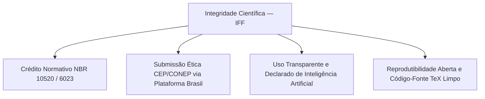

# 📜 Código de Conduta, Ética na Pesquisa e Diretrizes Acadêmicas

> **Instituição:** Instituto Federal Fluminense (IFF) — Campus Bom Jesus do Itabapoana  
> **Disciplina:** LaTeX & Escrita Acadêmica (Período: 24/08/2026 a 20/12/2026 — Terças-feiras, 14h30 às 17h30)  
> **Professor Responsável:** Prof. Dr. Pedro Henrique Rocha de Andrade  
> **Objetivo:** Estabelecer o padrão institucional de excelência, integridade científica e conduta ética no ecossistema acadêmico ReLaTeX.  

---

## 🏛️ 1. Compromisso Institucional com a Integridade Científica

A formação de pesquisadores, profissionais de Engenharia e autores técnicos no **Instituto Federal Fluminense (IFF)** assenta-se na rigorosa honestidade intelectual. Todos os trabalhos acadêmicos, monografias, artigos, relatórios técnicos e apresentações devem representar fielmente a observação autônoma, a verificação metodológica e o crédito escrupuloso às fontes referenciais.

---

## 🚫 2. Política Zero Tolerância a Plágio e Autoplágio

O plágio — definido como a apropriação indevida de ideias, dados, trechos textuais ou figuras sem a citação expressa e normatizada de sua autoria — constitui infração grave às diretrizes institucionais do IFF:

1. **Citações Diretas e Indiretas:** Toda ideia extraída de literatura externa deve ser referenciada em estrita conformidade com a norma **ABNT NBR 10520:2023** (sistema autor-data), remetendo obrigatoriamente a uma entrada bibliográfica completa segundo a **ABNT NBR 6023:2018/2020**.
2. **Autoplágio e Reciclagem de Trabalhos:** É vedada a reapresentação substancial de trabalhos anteriores do próprio estudante sem a devida contextualização e autorização prévia, garantindo a originalidade das submissões avaliativas de cada bimestre.
3. **Detecção e Sanções:** Os artefatos entregues serão auditados sistematicamente. A constatação de violação autoral implicará a invalidação do trabalho avaliado e encaminhamento ao conselho acadêmico de graduação/pós-graduação.

---

## 🤖 3. Diretrizes Institucionais para Uso de IA Generativa (LLMs)

O uso de Modelos de Linguagem de Grande Escala (LLMs, tais como ChatGPT, Gemini, Claude ou DeepSeek) é reconhecido como ferramenta auxiliar de pesquisa, revisão gramatical e suporte de codificação LaTeX, desde que governado pelos seguintes princípios:

- **Proibição de Geração Textual Primária:** É estritamente vedado submeter textos acadêmicos teóricos, revisões bibliográficas, metodologias ou discussões geradas primariamente por modelos de IA como de autoria própria.
- **Transparência e Declaração Metodológica:** Sempre que ferramentas de inteligência artificial generativa forem utilizadas para ideação, refatoração gramatical ou estruturação de código LaTeX, tal uso deverá ser **explicitamente declarado** em nota de rodapé ou na seção de Metodologia do trabalho.
- **Responsabilidade Autoral Irrestrita:** O aluno/autor assume responsabilidade integral pela precisão científica, verificabilidade bibliográfica e ausência de alucinações empíricas em qualquer trecho do documento submetido.

---

## 🏥 4. Ética na Pesquisa Envolvendo Seres Humanos (Plataforma Brasil)

Investigações e estudos empíricos que envolvam intervenção, entrevistas, questionários ou coleta de dados biológicos/comportamentais de seres humanos submetem-se à **Resolução CNS nº 466/2012** e normas complementares:

- **Submissão ao CEP/CONEP:** Todo projeto dessa natureza deve ser submetido à Plataforma Brasil e aprovado por Comitê de Ética em Pesquisa (CEP) **antes** do início de qualquer coleta de dados.
- **Termo de Consentimento Livre e Esclarecido (TCLE):** O documento original deverá incorporar menção expressa ao número de parecer ético de aprovação, salvaguardando a dignidade e autonomia dos participantes da pesquisa.

---

## 💻 5. Boas Práticas de Laboratório e Ecossistema ReLaTeX

Durante os encontros letivos presenciais às **terças-feiras (14h30 às 17h30)** e na produção assíncrona, espera-se cooperação técnica e respeito ao ecossistema institucional:

- **Padrão Normativo Canônico:** Utilize exclusivamente as classes oficiais institucionalizadas (**`ifftese.cls`**, **`slidesiffmodelo.cls`**, **`iffposter.cls`** e **`relatoriocorp.cls`**) disponíveis na biblioteca do curso.
- **Versionamento Git Limpo:** Ao compartilhar projetos em repositórios, mantenha arquivo `.gitignore` ativo para suprimir arquivos temporários de build (`.aux`, `.log`, `.bbl`, `.bcf`), preservando o código-fonte `.tex`, `.cls`, `.sty` e `.bib` limpos e auditáveis.
