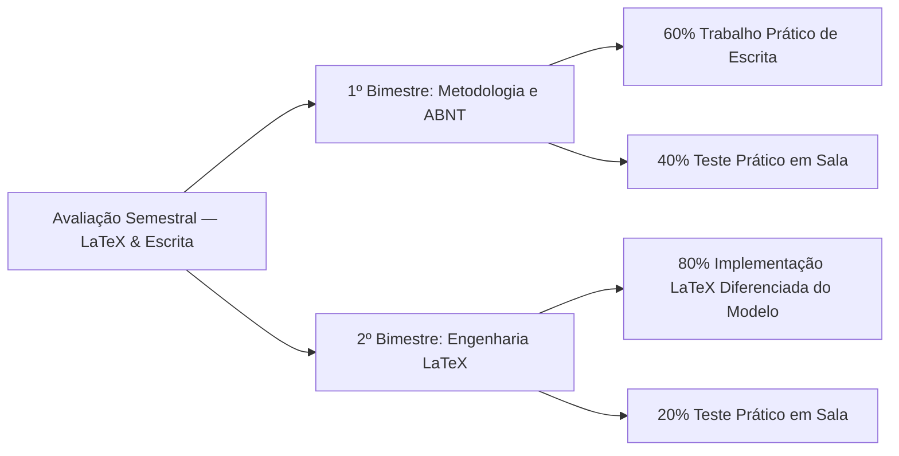

# 📅 Planejamento Letivo e Cronograma de Atividades

> **Instituição:** Instituto Federal Fluminense (IFF) — Campus Bom Jesus do Itabapoana  
> **Professor Responsável:** Prof. Dr. Pedro Henrique Rocha de Andrade  
> **Período Letivo:** **24/08/2026 a 20/12/2026**  
> **Horário de Encontros:** **Toda Terça-feira, das 14h30 às 17h30** (4 tempos de 50 minutos)  
> **Modalidade:** Presencial / Prática de Laboratório com Ecossistema ReLaTeX  

---

## 🎯 Apresentação do Planejamento e Eixos Didáticos

O curso de **LaTeX & Escrita Acadêmica** está estruturado em 20 Aulas (encontros letivos semanais de 3h de duração prática) distribuídas entre **24 de agosto de 2026 e 20 de dezembro de 2026**. O planejamento articula teoria, normalização bibliográfica e programação documental em dois grandes blocos:

1. **Eixo I — Metodologia Científica e Normalização ABNT (Aulas 01 a 10):** Focado na construção argumentativa, rigor metodológico e aplicação integral das normas ABNT vigentes (NBR 14724, NBR 10520:2023, NBR 6023:2018/2020, NBR 6027, NBR 6028), além do Protocolo PRISMA 2020 e normas de apresentação tabular do IBGE (1993).
2. **Eixo II — Arquitetura Documental e Engenharia ReLaTeX (Aulas 11 a 20):** Focado na programação TeX, domínio de motores (PDFLaTeX, LuaLaTeX, XeLaTeX), customização de pacotes (`.sty`), classes (`.cls`), computação gráfica vetorial com `TikZ` e automatização bibliográfica e de versionamento.

---

## 📊 Forma de Avaliação em Dois Bimestres

A avaliação do curso é contínua e somativa, dividida em dois bimestres temáticos com focos avaliativos distintos. **Os pesos e datas apresentados são flexíveis**, podendo ser adaptados pelo professor conforme a dinâmica de aprendizado e evolução prática da turma em laboratório:

### 🔹 1º Bimestre — Metodologia Científica, Normalização e ABNT (Aulas 01 a 10)
- **60% — Trabalho Prático de Escrita:** Elaboração fundamentada de elementos pré-textuais, introdução (lacuna de pesquisa), revisão sistemática da literatura (PRISMA 2020) e metodologia científica alinhadas às normas canônicas ABNT.
- **40% — Teste Prático em Aula:** Resolução individual em sala/laboratório de exercícios de verificação de normalização, citações ABNT NBR 10520:2023 e estruturação tabular IBGE 1993.

### 🔹 2º Bimestre — Domínio TeX, Implementação e Automação ReLaTeX (Aulas 11 a 20)
- **80% — Implementação Diferenciada e Customizada em LaTeX:** Desenvolvimento de documento acadêmico ou projeto científico estendido a partir da **base do modelo institucional do professor** (`ifftese.cls` ou `slidesiffmodelo.cls`), demonstrando originalidade, criação de macros customizadas (`macros.sty`), tabelas `booktabs` e gráficos vetoriais `TikZ`.
- **20% — Teste Prático em Aula:** Avaliação de laboratório envolvendo compilação ao vivo, resolução de conflitos bibliográficos com Biber, depuração de preâmbulo e automatização com `latexmkrc`.

---

## 🏛️ Cronograma Analítico por Encontro (Terças-feiras, 14h30 às 17h30)

### 📘 Módulo I — Epistemologia, Metodologia Científica e Elementos Pré-Textuais
- **Aula 01 — 25/08/2026:** [[pt-br/resource/latex/aula-01-epistemologia-problematizacao-e-hipoteses|Epistemologia, Problematização e Hipóteses]]  
  *Escopo:* Ruptura epistemológica, Falsificacionismo de Popper e formulação de hipóteses científicas.
- **Aula 02 — 01/09/2026:** [[pt-br/resource/latex/aula-02-objetivos-taxonomia-de-bloom-e-justificativa|Objetivos, Taxonomia de Bloom e Justificativa]]  
  *Escopo:* Verbos cognitivos de Bloom e estruturação de justificativa social, acadêmica e técnica.
- **Aula 03 — 08/09/2026:** [[pt-br/resource/latex/aula-03-resumo-abstract-e-palavras-chave-nbr-6028|Resumo, Abstract e Palavras-Chave (NBR 6028)]]  
  *Escopo:* Estrutura uniparágrafo informativa e vocabulários controlados (**ABNT NBR 6028:2021**).
- **Aula 04 — 15/09/2026:** [[pt-br/resource/latex/aula-04-elementos-pre-textuais-nbr-14724|Elementos Pré-Textuais na NBR 14724]]  
  *Escopo:* Capa, folha de rosto, aprovação, dedicatória, agradecimentos e epígrafe (**ABNT NBR 14724**).

---

### 📘 Módulo II — Estrutura Textual, Introdução, PRISMA e Metodologia
- **Aula 05 — 22/09/2026:** [[pt-br/resource/latex/aula-05-introducao-contextualizacao-e-lacuna-de-pesquisa|Introdução e Lacuna de Pesquisa (*Research Gap*)]]  
  *Escopo:* Técnica do funil argumentativo e delimitação precisa do problema científico.
- **Aula 06 — 29/09/2026:** [[pt-br/resource/latex/aula-06-revisao-sistematica-da-literatura-e-protocolo-prisma|Revisão Sistemática da Literatura e Protocolo PRISMA]]  
  *Escopo:* Estratégias boolianas (Scopus/WoS/IEEE) e fluxograma **PRISMA 2020**.
- **Aula 07 — 06/10/2026:** [[pt-br/resource/latex/aula-07-metodologia-materiais-e-reprodutibilidade|Metodologia, Materiais e Reprodutibilidade]]  
  *Escopo:* Delineamento experimental, amostragem e reprodutibilidade (**ABNT NBR 14724**).
- **Aula 08 — 13/10/2026:** [[pt-br/resource/latex/aula-08-etica-plataforma-brasil-e-uso-de-ia|Ética na Pesquisa (Plataforma Brasil) e IA]]  
  *Escopo:* Submissão ao CEP/CONEP via Plataforma Brasil e uso ético de LLMs na escrita.

---

### 📘 Módulo III — Resultados, Discussão, Citações NBR 10520 e Referências NBR 6023
- **Aula 09 — 20/10/2026:** [[pt-br/resource/latex/aula-09-resultados-tabelas-ibge-vs-quadros-abnt|Resultados e Apresentação de Dados (IBGE vs ABNT)]]  
  *Escopo:* Diferenciação técnica entre Tabelas (**IBGE 1993**) e Quadros (**ABNT NBR 14724**).
- **Aula 10 — 27/10/2026:** [[pt-br/resource/latex/aula-10-discussao-citacoes-nbr-10520-e-referencias-nbr-6023|Discussão, Citações NBR 10520 e Referências NBR 6023]]  
  *Escopo:* Sistema autor-data (**ABNT NBR 10520:2023**) e referências (**ABNT NBR 6023:2018/2020**).

---

### 📗 Módulo IV — Arquitetura LaTeX (.tex), Motores, Sintaxe, Tabelas e Gráficos
- **Aula 11 — 03/11/2026:** [[pt-br/resource/latex/aula-11-arquitetura-latex-motores-tex-e-preambulo-tex|Arquitetura LaTeX, Motores TeX e Preâmbulo .tex]]  
  *Escopo:* Kernel LaTeX2e, motores PDFLaTeX/LuaLaTeX/XeLaTeX e preâmbulo multi-idioma.
- **Aula 12 — 10/11/2026:** [[pt-br/resource/latex/aula-12-sintaxe-matematica-amsmath-e-tabelas-booktabs|Sintaxe Matemática amsmath e Tabelas booktabs]]  
  *Escopo:* Ambientes matemáticos avançados e tabelas profissionais com `booktabs`.
- **Aula 13 — 17/11/2026:** [[pt-br/resource/latex/aula-13-modularizacao-multi-arquivo-e-biblatex-biber|Modularização Multi-arquivo e BibLaTeX Biber]]  
  *Escopo:* Divisão de projetos com `\input`/`\include` e bibliografia `biblatex-abnt`.
- **Aula 14 — 24/11/2026:** [[pt-br/resource/latex/aula-14-graficos-vetoriais-tikz-e-pgfplots|Gráficos Vetoriais com TikZ e PGFPlots]]  
  *Escopo:* Desenho programado em coordenadas vetoriais para diagramas e gráficos 2D/3D.

---

### 📗 Módulo V — Engenharia ReLaTeX (.cls e .sty), Metadados, Macros e Automação
- **Aula 15 — 01/12/2026:** [[pt-br/resource/latex/aula-15-engenharia-do-arquivo-de-metadados-sty|Engenharia do Arquivo de Metadados sty]]  
  *Escopo:* Estrutura de `metadados.sty`, escopo de variáveis e flexão gramatical.
- **Aula 16 — 08/12/2026:** [[pt-br/resource/latex/aula-16-desenvolvimento-de-pacotes-e-macros-sty|Desenvolvimento de Pacotes e Macros sty]]  
  *Escopo:* Programação TeX, comandos customizados, teoremas em `macros.sty`.
- **Aula 17 — 15/12/2026:** [[pt-br/resource/latex/aula-17-engenharia-da-classe-ifftese-cls|Engenharia da Classe ifftese.cls]]  
  *Escopo:* Anatomia da classe canônica, herança de `abntex2` e conformidade **NBR 14724**.
- **Aula 18 — 22/12/2026:** [[pt-br/resource/latex/aula-18-customizacao-de-floats-fancyhdr-e-nbr-6027|Customização de Floats e NBR 6027]]  
  *Escopo:* Cabeçalhos `fancyhdr`, listas customizadas (LOQ/LOA) e sumário **NBR 6027**.
- **Aula 19 — 29/12/2026:** [[pt-br/resource/latex/aula-19-classes-especializadas-if-beamer-iffposter-relatoriocorp|Classes Especializadas: Beamer, Poster e Relatório]]  
  *Escopo:* Apresentações institucionais (`slidesiffmodelo.cls`), pôsteres A0 (`iffposter.cls`) e relatórios.
- **Aula 20 — Entregas Finais:** [[pt-br/resource/latex/aula-20-automacao-latexmkrc-git-e-integracao-continua|Automação com latexmkrc, Git e CI/CD]]  
  *Escopo:* Build automatizado, controle de versão (`.gitignore`) e pipelines no GitHub.
