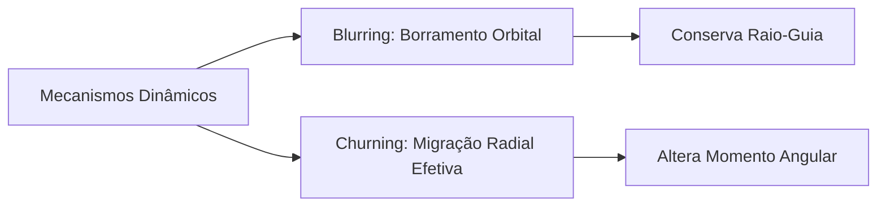

  
⬅<b><a href="/pt-br/resource/curso-on/aula-00-[SLUG]">Aula Anterior</a></b>

  
<b><a href="/pt-br/resource/curso-on">Anotações da Disciplina</a></b>

  
<b><a href="/pt-br/resource/curso-on/aula-02-[SLUG]">Próxima Aula</a></b>

# Aula 01 — [TÍTULO DA AULA]

> [!note] Resumo
> A metalicidade e estrutura estelar da galáxia não é uniforme: apresentamos o modelo teórico de formação *inside-out*, a evolução química interestelar e a dinâmica orbital envolvida.

> [!info] Informações da aula
> **Disciplina:** [NOME DO CURSO / ESPECIALIZAÇÃO]  
> **Instituição:** Observatório Nacional (ON) / Instituto Federal Fluminense (IFF)  
> **Professor:** [NOME DO PROFESSOR]  
> **Fonte:** Slides oficiais da disciplina — "[NOME DO SLIDE/APRESENTAÇÃO]"

---

## 1. Formatação Teórica e Formulação Matemática

Desde as primeiras estimativas observacionais até os levantamentos espectroscópicos modernos (GAIA, APOGEE, GALAH), observa-se um gradiente estrutural bem definido:

$$\frac{\partial[\text{Fe/H}]}{\partial R} \approx -0{,}06\ \text{dex/kpc}$$

---

## 2. Mecanismos Dinâmicos e Oscilações Orbitais

Dois mecanismos fundamentais atuam na evolução estrutural:

- **Blurring:** Oscilação radial decorrente da excentricidade orbital estelar (sem alterar o raio-guia médio).
- **Churning:** Migração radial efetiva causada por troca de momento angular com braços espirais e ressonâncias de barra.

---

## 3. Discussão Histórica e Modelos de Enriquecimento

> [!warning] O Problema da Relação Idade-Metalicidade (AMR)
> Modelos simples de evolução química previam um crescimento monotônico e estrito da metalicidade com o tempo. Trabalhos como **Edvardsson et al. (1993)** e **Chiappini et al. (1997, 2001)** demonstraram uma dispersão substancial explicada pelo modelo *Two-Infall*.

---

## Conceitos-Chave

- **Gradiente Radial:** $\partial[\text{Fe/H}]/\partial R \approx -0{,}06\,$dex/kpc — mais rico no centro, mais pobre nas bordas.
- **Blurring vs. Churning:** Borramento estático orbital vs. migração radial ativa por troca de momento angular.
- **Modelo Two-Infall:** Dois episódios de queda de gás (halo/disco espesso e disco fino tardio).

---

## Referências e Correlatos

- Edvardsson et al. (1993) — Descoberta da dispersão na AMR.
- Chiappini et al. (1997, 2001) — Modelo *Two-Infall*.
- [[pt-br/resource/curso-on|Curso ON — Visão Geral]]

  
⬅<b><a href="/pt-br/resource/curso-on/aula-00-[SLUG]">Aula Anterior</a></b>

  
<b><a href="/pt-br/resource/curso-on">Anotações da Disciplina</a></b>

  
<b><a href="/pt-br/resource/curso-on/aula-02-[SLUG]">Próxima Aula</a></b>

