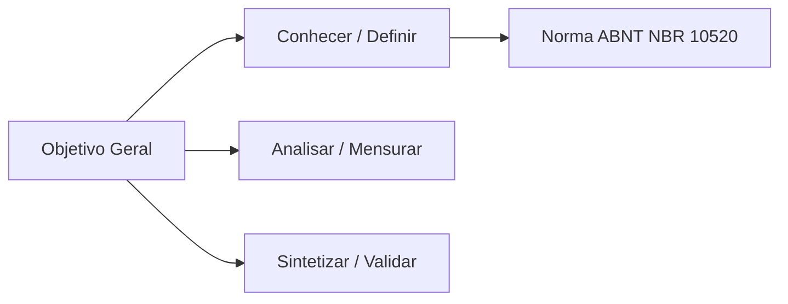

# Aula 02: Fundamentos Metodológicos e Prática

> [!IMPORTANT] Acesso Restrito Institucional
> Este material pedagógico, bem como seus slides em **LaTeX (.pdf)** e **PowerPoint (.pptx)**, são de uso exclusivo dos estudantes do Instituto Federal Fluminense (*Campus* Bom Jesus do Itabapoana) e estão protegidos com senha institucional.

**Carga Horária Equivalente:** 2 horas/aula diárias.  
**Professor Responsável:** Prof. Dr. Pedro Henrique Rocha de Andrade

---

## 1. Fundamentos Metodológicos

Nesta aula, aprofundamos a aplicação da **Taxonomia de Bloom** na formulação de objetivos gerais e específicos, além da articulação com a justificativa técnica e social do projeto.



---

## 2. Normas Técnicas e Padrões Aplicáveis

- **ABNT NBR 10520:2023**: Citações em documentos — Apresentação.

---

## 3. Código LaTeX Canônico dos Slides (Beamer)

```latex
\documentclass{if-beamer}
\usepackage[utf8]{inputenc}

\title{Aula 02: Fundamentos Metodológicos e Prática}
\author{Prof. Dr. Pedro Henrique Rocha de Andrade}
\date{\today}

\begin{document}
\begin{frame}
  \titlepage
\end{frame}
\end{document}
```

---

## 4. Referências Bibliográficas

- ABNT. **NBR 10520**: Informação e documentação — Citações em documentos — Apresentação. Rio de Janeiro: ABNT, 2023.


## Recursos Adicionais e Material Suplementar

- **[[pt-br/resource/latex/modelos-de-documento|Guia Oficial de Modelos, Classes e Pacotes ReLaTeX]]** — Exemplos canônicos de código, classes (`ifftese.cls`, `slidesiffmodelo.cls`) e documentação interna.
- **[[pt-br/resource/latex/planejamento-e-cronograma|Planejamento Letivo e Cronograma de Atividades]]** — Matriz analítica de 80h (Terças, 14h30-17h30) e avaliação em 2 bimestres.
- **[[pt-br/resource/latex/codigo-de-conduta-e-diretrizes|Código de Conduta e Diretrizes Acadêmicas]]** — Regimento ético, normas CEP/CONEP e uso transparente de IA.
- **[CTAN (Comprehensive TeX Archive Network)](https://ctan.org/)** — Portal oficial mundial de pacotes LaTeX2e.
- **[ABNT Catálogo de Normas](https://www.abnt.org.br/)** — Acesso e consulta às normas técnicas vigentes.
- **[Overleaf Documentation](https://www.overleaf.com/learn)** — Base de conhecimento e guias práticos sobre compilação TeX.

